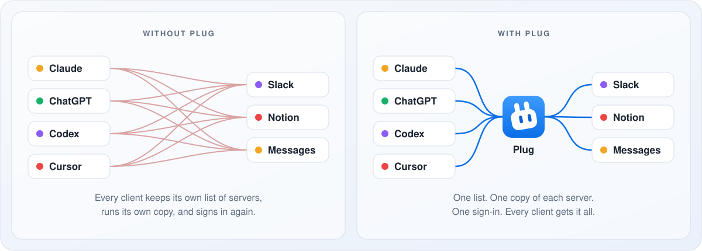

<p align="center">
  
</p>
<h1 align="center">Plug</h1>
<p align="center">
  <b>One place on your Mac that holds every tool and gives it to every client.</b>
</p>
<p align="center">
  <a href="https://github.com/cyberpapiii/plug/releases/latest"></a>
  
  <a href="LICENSE"></a>
</p>

<p align="center">
  <picture>
    <source media="(prefers-color-scheme: dark)" srcset="docs/assets/readme-hero-dark.svg">
    
  </picture>
</p>

Plug is a free Mac app for anyone who uses more than one AI client. Add your
[MCP](https://modelcontextprotocol.io) servers, the programs that give an AI
client tools like Slack, Notion, or your files, to Plug once. Claude,
ChatGPT, Codex, Cursor, and every other client you use then get all of those
tools, on this Mac or from your phone. Plug keeps the servers running, signs
you in once, and shows you every call.

It lives in the menu bar. It is open source, with no account, no Docker, and
no cloud service. Nothing can reach it from outside your Mac until you turn
that on.

## Why Plug

Every AI client keeps its own list of tools, in its own settings file, in its
own format. Add Slack and you add it to Claude, then to Cursor, then to
Codex. Each one starts its own copy and asks you to sign in again. When a new
client comes out, you start over. And tools that only work on your Mac, like
Messages or your files, are out of reach from your phone.

<p align="center">
  <picture>
    <source media="(prefers-color-scheme: dark)" srcset="docs/assets/readme-before-after-dark.svg">
    
  </picture>
</p>

Plug is the one list. Your tools live with you, not inside any one client,
so you can switch clients, or use five at once, and bring everything along.

## Install

Download `Plug` from [Releases](https://github.com/cyberpapiii/plug/releases/latest),
move it to Applications, and open it. Or:

```sh
brew install --cask cyberpapiii/tap/plug-app
```

Plug needs macOS 14 or later. It keeps running in the background and updates
itself.

## Get started

Open Plug. The first run walks you through three steps:

1. **Add a server.** Bring over the ones your clients already use, or add a
   new one.
2. **Connect a client.** Pick Claude, Codex, Cursor, or another. Plug adds
   one entry for itself to that client's settings. Restart the client.
3. **Use a tool.** Ask your client to do something. The call shows up in
   Activity.

That is all. Every connected client now has every server.

The question mark in the toolbar opens these steps again. To have an agent
set Plug up for you, give it
[docs/guides/agent-setup.md](docs/guides/agent-setup.md).

## What you can do with it

**Use every client with the same tools.** Claude Code in the morning, Codex in
the afternoon, a new client tomorrow: each has every tool the moment you
connect it.

**Use your Mac's tools from anywhere.** Servers for Messages, Contacts,
Notes, and your files only work on your Mac. Give Plug a public address, for example
through a tunnel, and ChatGPT or Claude on the web and on your phone can use
them too. No client gets in until you approve it with Touch ID or a passkey.
[How to set it up](docs/OPERATOR-GUIDE.md).

**Give each client only what it needs.** Let your coding agent use GitHub and
your docs but not your email. Each client has its own page with a switch for
every server and tool.

**Keep work and personal apart.** A work Slack beside a personal one, or two
Google accounts: add a second account to the same server.

**See what your agents did.** Activity lists every call: which client, which
tool, how long it took, and whether it worked.

**Hear about changes without asking.** Point Plug at a tool, such as unread
mail, and it tells a subscribed client when the result changes. For now
this reaches only remote clients that support the newest version of MCP, and
few do yet.
[More about events](docs/events.md).

## What Plug takes care of

| | |
|---|---|
| **Your tools, unchanged** | Clients see each server's real tools, prompts, and resources, with their descriptions as written. Plug only puts the server's name in front, as in `Slack__channels_list`, so two servers never clash. |
| **One copy of each server** | Plug runs each server once and shares it with every client. |
| **Sign-in** | Plug signs in to services that need it and renews the sign-in. Sign-ins, and any key you type into Plug, are kept in the Keychain instead of a file. |
| **Staying up** | Plug restarts a server that stops and recovers by itself after sleep or a network change. One broken server never takes the others down. |
| **Clients with tool limits** | A client that can hold only a few tools can be given one search tool instead, and loads the real ones as it finds them. |
| **Untrusted servers** | Turn on the macOS sandbox for a server that runs on your Mac, and it can reach only the folders you choose, with no network. |
| **Telling you** | The menu bar icon shows how Plug is doing, and Plug says what to fix when something needs you. |

## The app

The menu bar panel says whether everything is working, has an on/off switch
for Plug, and lists the latest tool calls. The window has four sections:

<p align="center">
  <picture>
    <source media="(prefers-color-scheme: dark)" srcset="docs/assets/readme-sections-dark.svg">
    
  </picture>
</p>

- **Servers.** Whether each is working, its sign-in, and its tools. Switch
  off any tool you do not want.
- **Clients.** Give each a name and an icon, and choose which servers and
  tools it may use.
- **Events.** Tell a client when something happens, so it does not have to
  keep asking.
- **Activity.** Which client called which tool, and how it went.

## Clients

**On this Mac.** Plug sets these up for you: Claude Code, Claude Desktop,
Codex, Cursor, VS Code Copilot, GitHub Copilot CLI, Gemini CLI, Zed, Warp,
OpenCode, Goose, Cline, Kiro, Amp, Pi, and more. Any other client that speaks
MCP works too; Plug gives you the settings to paste.

**Over the network.** ChatGPT and Claude on the web or phone reach Plug at an
address you set up. The client signs in, and you approve it with a passkey.
See [docs/OPERATOR-GUIDE.md](docs/OPERATOR-GUIDE.md).

## The command line

Everything the app does is also in the `plug` command, for agents and scripts.
Add `--output json` to any command.

```sh
plug status     # Is Plug running, and does anything need you
plug servers    # The servers Plug holds
plug tools      # The tools those servers provide
plug clients    # The clients that use them
plug events     # Tell a client when a tool's result changes
plug doctor     # Check the whole setup and say what to fix

plug setup                      # Bring servers over and connect your clients
plug server add                 # Add one server
plug link                       # Connect a client
plug auth login --server slack  # Sign in to a server
```

`plug help` lists the rest.

## Questions

**What is MCP?** The [Model Context Protocol](https://modelcontextprotocol.io)
is how AI clients use outside tools. A server provides tools, such as "send
a Slack message"; a client, such as Claude, calls them.

**Does anything leave my Mac?** Plug has no account and collects nothing. It
checks GitHub for updates and fetches each server's icon from that service's
website. Your servers talk to their own services, as they would without Plug.
Nothing is reachable from outside your Mac until you set up remote access.

**Does my Mac have to stay on?** For clients on this Mac, no. For your phone
or the web to reach Plug, yes: your Mac is where the tools run.

**Is it for teams?** No. Plug is a personal tool for one person's Mac. There
are no organizations, roles, or hosted version.

**Windows or Linux?** No. Plug is a Mac app. The code builds on Linux, but
nothing there keeps it running for you.

**Where are its files?** Settings are in
`~/Library/Application Support/plug/config.toml`, and logs in
`~/Library/Logs/plug/`. Most people never open the settings file; it is
described in [docs/SETTINGS.md](docs/SETTINGS.md).

## More

| | |
|---|---|
| [docs/VISION.md](docs/VISION.md) | What Plug is for, and the words it uses |
| [docs/STATUS.md](docs/STATUS.md) | What is being worked on |
| [CHANGELOG.md](CHANGELOG.md) | What changed, release by release |
| [docs/SETTINGS.md](docs/SETTINGS.md) | The settings file |
| [docs/CLIENT-COMPAT.md](docs/CLIENT-COMPAT.md) | Notes on each client |
| [docs/OPERATOR-GUIDE.md](docs/OPERATOR-GUIDE.md) | Remote access and sign-in |
| [docs/events.md](docs/events.md) | Events |
| [docs/ARCHITECTURE.md](docs/ARCHITECTURE.md) | How it is built |
| [docs/BRAND.md](docs/BRAND.md) | The icon, its colours, and how it moves |
| [CONTRIBUTING.md](CONTRIBUTING.md) | Build it and change it |
| [SECURITY.md](SECURITY.md) | Report a security problem |

## License

Apache-2.0. See [LICENSE](LICENSE).
