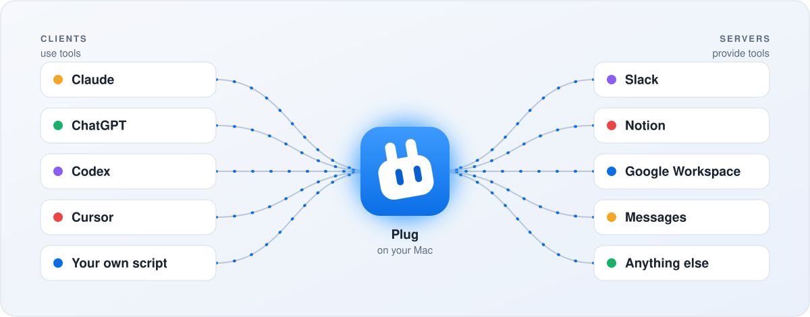
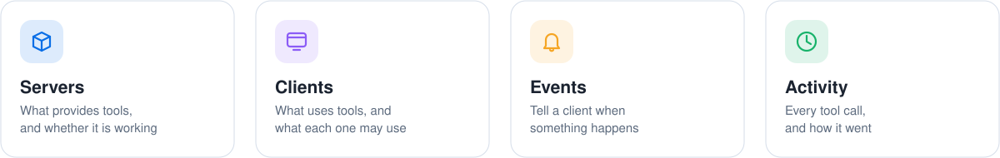

<p align="center">
  
</p>
<h1 align="center">Plug</h1>
<p align="center">
  <b>One place on your Mac that holds every tool and gives it to every client.</b>
</p>
<p align="center">
  <a href="https://github.com/cyberpapiii/plug/releases/latest"></a>
  
  <a href="LICENSE"></a>
</p>

<p align="center">
  <picture>
    <source media="(prefers-color-scheme: dark)" srcset="docs/assets/readme-hero-dark.svg">
    
  </picture>
</p>

You add a server once. Claude, ChatGPT, Codex, Cursor, and everything else you
use all get its tools, on this Mac or over the internet. Plug keeps the servers
running, signs you in once, and shows you what happened.

Plug is an [MCP](https://modelcontextprotocol.io) gateway. It is a personal
tool for one person's Mac, not a team product or a hosted service.

## Install

Download the latest `Plug` disk image from [Releases](https://github.com/cyberpapiii/plug/releases),
move Plug to Applications, and open it. Or:

```sh
brew install --cask cyberpapiii/tap/plug-app
```

Plug lives in the menu bar. It keeps running in the background and updates
itself.

## Set up

Open Plug. The first run walks you through it:

1. **Add a server.** Import the ones your other apps already use, or add a
   new one.
2. **Connect a client.** Pick Claude, Codex, Cursor, or another, and Plug adds
   itself to that client's settings. Restart the client.
3. **Use a tool.** Ask your client to do something. The call shows up in
   Activity.

That is all. Every connected client now has every server.

The question mark in the toolbar opens these steps again. To have an agent do
it for you, give it [docs/guides/agent-setup.md](docs/guides/agent-setup.md).

## What you see

The menu bar panel says whether everything is working, has an on/off switch
for Plug, and lists the latest tool calls. The window has four sections:

<p align="center">
  <picture>
    <source media="(prefers-color-scheme: dark)" srcset="docs/assets/readme-sections-dark.svg">
    
  </picture>
</p>

- **Servers.** Whether each is working, its sign-in, and its tools. Switch
  off any tool you do not want.
- **Clients.** Give each a name and an icon, and choose which servers and
  tools it may use.
- **Events.** Tell a client when something happens, so it does not have to
  keep asking.
- **Activity.** Which client called which tool, and how it went.

## Clients

**On this Mac.** Plug sets these up for you: Claude Code, Claude Desktop,
Codex, Cursor, VS Code Copilot, GitHub Copilot CLI, Gemini CLI, Zed, Warp,
OpenCode, Goose, Cline, Kiro, Amp, Pi, and more. Any other client that speaks
MCP works too; Plug gives you the settings to paste.

**Over the network.** ChatGPT and Claude on the web or phone reach Plug at an
address you set up. The client signs in, and you approve it with a passkey.
See [docs/OPERATOR-GUIDE.md](docs/OPERATOR-GUIDE.md).

## Servers

A server is either a command that runs on this Mac or a remote service with an
address. Plug handles sign-in for services that need it, keeps a key in the
Keychain instead of a file, and restarts a server that stops. One broken
server never takes the others down.

Need the same server for a second account, such as a work Slack beside a
personal one? Add an account to it.

## The command line

Everything the app does is also in the `plug` command, for agents and scripts.
Add `--output json` to any command.

```sh
plug status     # Is Plug running, and does anything need you
plug servers    # The servers Plug holds
plug tools      # The tools those servers provide
plug clients    # The clients that use them
plug events     # Tell a client when a tool's result changes
plug doctor     # Check the whole setup and say what to fix

plug setup                      # Bring servers over and connect your clients
plug server add                 # Add one server
plug link                       # Connect a client
plug auth login --server slack  # Sign in to a server
```

`plug help` lists the rest.

## Where things are

| | |
|---|---|
| Settings | `~/Library/Application Support/plug/config.toml` |
| Logs | `~/Library/Logs/plug/` |

Most people never open the settings file. It is described in
[docs/SETTINGS.md](docs/SETTINGS.md).

## More

| | |
|---|---|
| [docs/VISION.md](docs/VISION.md) | What Plug is for, and the words it uses |
| [docs/STATUS.md](docs/STATUS.md) | What is being worked on |
| [CHANGELOG.md](CHANGELOG.md) | What changed, release by release |
| [docs/SETTINGS.md](docs/SETTINGS.md) | The settings file |
| [docs/CLIENT-COMPAT.md](docs/CLIENT-COMPAT.md) | Notes on each client |
| [docs/OPERATOR-GUIDE.md](docs/OPERATOR-GUIDE.md) | Remote access and sign-in |
| [docs/events.md](docs/events.md) | Events |
| [docs/ARCHITECTURE.md](docs/ARCHITECTURE.md) | How it is built |
| [CONTRIBUTING.md](CONTRIBUTING.md) | Build it and change it |
| [SECURITY.md](SECURITY.md) | Report a security problem |

## License

Apache-2.0. See [LICENSE](LICENSE).
