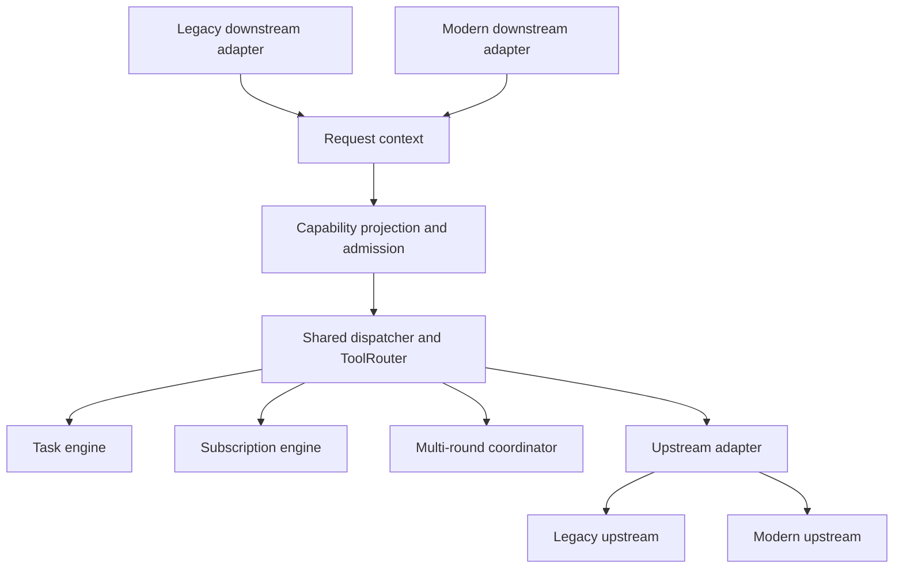
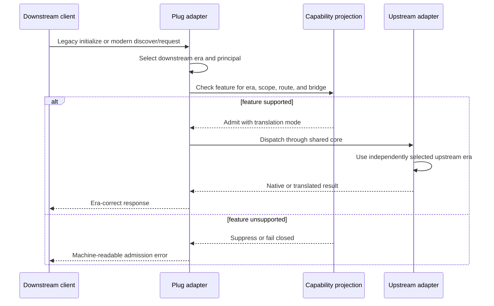
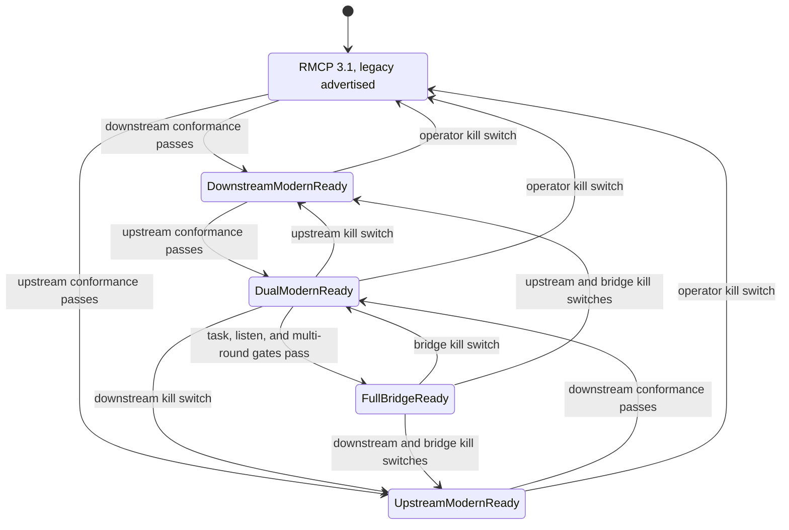

# MCP 2026 Dual-Era Modernization - Plan

## Goal Capsule

- **Objective:** Make Plug a production-ready MCP `2026-07-28` gateway while every currently working legacy client and upstream continues to function.
- **Authority:** Current `main` behavior and tests win over historical plans or research claims. The final MCP `2026-07-28` specification and the exactly pinned RMCP release define the modern wire contract.
- **Execution profile:** Land the work as dependency-ordered, independently reversible units. Keep modern advertisement disabled until the corresponding behavior and conformance rows pass.
- **Stop conditions:** Stop rather than advertise a capability that Plug cannot complete for the selected downstream/upstream era pair. Stop on an RMCP incompatibility that would require weakening existing security, ownership, or cancellation guarantees.
- **Tail ownership:** This plan includes implementation, compatibility proof, operator documentation, installed-binary verification, and user-facing release notes.

---

## Product Contract

### Summary

Plug will support MCP `2026-07-28` and legacy MCP concurrently through narrow wire adapters around one shared routing core. Downstream and upstream protocol eras negotiate independently. Modern clients receive sessionless HTTP, discovery, deterministic catalogs, explicit ownership, modern task and subscription behavior, secure multi-round request handling, and honest capability projection. Existing clients keep their current behavior.

### Problem Frame

Plug currently pins RMCP `2.2.0`, selects MCP `2025-11-25`, and rejects `2026-07-28`. Its routing, tasks, subscriptions, OAuth, daemon IPC, and transport parity foundations are mature, but its HTTP server and durable ownership model are built around the legacy initialize/session/SSE lifecycle. A dependency bump alone would expose incomplete lifecycle semantics, while a hard cutover would break all successful client and upstream traffic observed on this machine.

### Requirements

**Compatibility and protocol truth**

- R1. Plug must preserve existing legacy downstream and upstream behavior while adding MCP `2026-07-28` support.
- R2. Downstream and upstream protocol eras must negotiate independently for all four legacy/modern combinations.
- R3. Plug must advertise only protocol versions and capabilities that the active direction can complete end to end.
- R4. Operators must be able to force legacy or modern upstream behavior and disable either modern direction without rebuilding or deleting credentials.
- R5. The RMCP dependency must use an exact stable 3.1.x pin, with later upgrades evaluated separately.

**Identity, authorization, and lifecycle**

- R6. Protocol era, transport, authenticated principal, client metadata, request identity, trace context, and durable owner must remain distinct concepts.
- R7. Self-reported client metadata must never act as an authorization identity.
- R8. Durable modern tasks, listeners, and continuations must require a stable principal and explicit handle ownership.
- R8a. Durable-state admission must enforce configurable global and per-principal caps for tasks, queued task creation, listeners, distinct upstream subscriptions, continuations, continuation bytes, and concurrent modern requests before upstream side effects.
- R9. OAuth callbacks must validate the authorization issuer when supplied or required, and persisted upstream grants must bind to the canonical issuer and resource.
- R10. Existing upstream credentials must migrate conservatively or require explicit reauthorization without silent issuer reassignment.
- R11. OAuth consent, passwords, Keychain prompts, CAPTCHA, biometrics, and platform permissions remain human-only; agents may initiate, observe, and retry authorization without receiving secrets.
- R12. Revoking a principal must atomically invalidate its active tasks, listeners, and continuations through a generation-checked lifecycle ledger that prevents create-versus-revoke survivors.

**Modern downstream and upstream behavior**

- R13. Modern downstream HTTP must support `server/discover`, per-request metadata, POST-only requests, and no dependency on legacy session IDs, GET streams, DELETE cleanup, or replay.
- R14. Modern upstream auto-negotiation may fall back only on positively classified protocol incompatibility, never on authentication, TLS, timeout, rate-limit, or server failures.
- R15. The selected upstream era and version must be recorded for the live connection and renegotiated on reconnect.
- R16. Modern catalogs must be deterministic for a stable principal, policy, and routing snapshot; legitimate upstream inventory changes must be reflected deterministically and must not depend on hidden connection history.
- R17. Legacy lazy working sets may keep their current session-scoped behavior.
- R18. Machine-readable outcomes must distinguish authorization required, unavailable upstream, unsupported bridge, retryable transition, cancelled, expired continuation, permission denied, and modern `input_required` states.
- R18a. A typed default-deny permission table must map every method family and extension to validated scopes or an explicit local trust grant, and both capability projection and runtime admission must consume it.

**Shared engines and modern extensions**

- R19. Legacy and modern wire adapters must reuse the existing routing, task, subscription, cancellation, notification, and upstream-lifecycle engines.
- R20. Modern `subscriptions/listen` must use explicit listener ownership and drain the upstream subscription only after the final authorized listener closes.
- R21. The modern Tasks extension and legacy task methods must adapt the same internal task state, ownership, retention, and cancellation rules.
- R22. Multi-round tool requests must work in both mixed-era directions or be suppressed before any upstream side effect.
- R23. Legacy-to-modern continuations must be single-use, principal-bound, request-digest-bound, route-bound, time-bounded, replay-resistant, and authenticated with RMCP's request-state codec plus registry-side binding checks.
- R24. Parked multi-round payloads must be bounded in per-principal count, global count, total bytes, item size, and lifetime and must fail closed after daemon restart.
- R25. Namespaced extension data, MCP Apps metadata/resources, cache hints, tracing metadata, and supported schema fields must survive routing unless a shared extension-envelope policy removes them for reserved-key collision, invalid namespace, excessive size/depth/count, or another named security rule.

**Observability, validation, and release quality**

- R26. Logs and operator JSON must report requested and selected downstream and upstream protocol versions without redefining existing fields.
- R27. Capability discovery and runtime admission must use the same projection decision so advertised support matches execution truth.
- R28. The release must prove the four era combinations across applicable transports and method families with deterministic tests.
- R29. The installed signed binary and daemon must be verified with real clients, OAuth, Keychain, restart, and health checks before the modernization is called complete.
- R30. User-facing release notes must explain practical benefits, compatibility, configuration, security changes, and known limits without protocol jargon as the organizing structure.
- R31. Modern downstream support must cover external HTTP and stdio, including daemon-backed `plug connect`; internal raw IPC is not a user-facing MCP transport but must preserve era, principal, and ownership context.
- R32. Every enabled modern direction must pass with the official RMCP/MCP `2026-07-28` reference peer before advertisement; absent a production launch peer, that direction remains default-off.

### Key Flows

- F1. Legacy client to legacy upstream
  - **Trigger:** An existing stdio, HTTP, or daemon-backed client connects through the legacy lifecycle.
  - **Outcome:** Existing initialization, sessions, catalogs, tasks, subscriptions, reverse requests, and cleanup remain behaviorally unchanged.
  - **Covered by:** R1, R3, R17, R19, R28
- F2. Modern client to modern upstream
  - **Trigger:** A stable principal discovers Plug and sends modern sessionless requests.
  - **Outcome:** Plug uses native modern lifecycle semantics and shared internal engines without fabricating a legacy session.
  - **Covered by:** R2, R6, R8, R13, R15, R19-R21, R25-R28
- F3. Mixed-era request
  - **Trigger:** Downstream and upstream select different protocol eras.
  - **Outcome:** Plug passes through, translates, or rejects before side effects according to one capability projection table.
  - **Covered by:** R2, R3, R18, R22, R27, R28
- F4. Modern authorization recovery
  - **Trigger:** An agent request reaches an upstream that needs OAuth.
  - **Outcome:** The agent receives a safe authorization URL and observable status, a human completes consent, and the agent retries without seeing credentials.
  - **Covered by:** R9-R12, R18, R29
- F5. Multi-round interaction
  - **Trigger:** A tool call requires additional sampling, elicitation, or user input across an era boundary.
  - **Outcome:** Plug completes the supported bridge with bounded protected state or refuses the capability before starting.
  - **Covered by:** R22-R24, R27-R28

### Acceptance Examples

- AE1. Covers F1. Given the RMCP 3.1 dependency is installed but modern directions are disabled, when each currently installed client connects, then it negotiates legacy MCP and all existing parity tests remain green.
- AE2. Covers F2. Given an authenticated modern client, when it discovers and calls Plug over separate HTTP requests without a session header, then catalogs, ownership, cancellation, and results remain correct.
- AE3. Covers F3. Given a modern client and legacy upstream without a completed multi-round bridge, when Plug projects capabilities, then the unsupported feature is absent and an attempted call is rejected before upstream side effects.
- AE4. Covers F3. Given the upstream discovery endpoint returns a protocol-incompatibility response, when automatic negotiation runs, then Plug falls back to legacy and records the selected version.
- AE5. Covers F3. Given upstream discovery returns an authentication, TLS, timeout, rate-limit, or server error, when automatic negotiation runs, then Plug reports that error and does not misclassify the upstream as legacy.
- AE6. Covers F4. Given an OAuth provider returns an issuer that differs from the authorization state, when the callback arrives, then Plug rejects the exchange and preserves the prior grant unchanged.
- AE7. Covers F5. Given a protected continuation is replayed, expired, tampered with, used by another principal, or presented after daemon restart, when Plug validates it, then Plug rejects it and leaves no parked request active.
- AE8. Covers F2. Given the same principal, policy, routing snapshot, and upstream catalog inputs across new connections and daemon restart, when modern catalogs are listed, then names and ordering are identical regardless of connection order or prior search calls; controlled upstream additions/removals update membership without stale entries.
- AE9. Covers F2. Given two principals have durable tasks or listeners, when one principal is revoked, then only that principal's state is cancelled and the other principal remains unaffected.
- AE10. Covers F3. Given unknown namespaced extension fields cross either mixed-era direction, when the request and result complete, then the fields round-trip unless a documented sanitizer owns their removal.

### Success Criteria

- Existing legacy clients and configured upstreams retain their observed behavior.
- Both modern directions can be enabled independently and rolled back independently.
- Every advertised capability has a representative passing execution test for its era pair.
- Foundation, ordinary modern interoperability, durable extensions, and multi-round bridges are independently releasable milestones; later work cannot block shipping an earlier verified milestone.
- No modern durable state is owned by mutable client metadata or a fabricated HTTP session.
- No authorization secret appears in agent-visible results or logs.
- The complete repository and installed-runtime gates pass.
- Protocol-version telemetry is reviewed after each release and at least quarterly; retiring a legacy direction requires a separate plan backed by a sustained observation window with no negotiated legacy traffic plus named client and upstream compatibility evidence.

### Scope Boundaries

**Included**

- RMCP 3.1 migration and compatibility shielding.
- Protocol-era, principal, request-owner, and capability-projection architecture.
- Modern downstream and upstream negotiation and HTTP lifecycle.
- OAuth issuer validation and credential migration.
- Modern catalog, task, subscription, extension, tracing, cache, schema, and multi-round behavior.
- Conformance, real-client verification, operator documentation, installation, and release notes.

**Outside this product's identity**

- Rendering MCP Apps inside Plug.
- Autonomous OAuth consent or operating-system permission approval.
- Separate agent-only catalogs, state stores, routing engines, or authorization policy.
- Reintroducing the removed singular downstream OAuth client configuration as a compatibility path.
- Treating session-scoped working-set narrowing as modern behavior; modern clients use policy-derived filters and pagination instead.

---

## Planning Contract

### Key Technical Decisions

- KTD1. **Use dual-era wire adapters around one shared core.** (session-settled: user-approved — chosen over a hard modern-only cutover: every observed working client and upstream still negotiates legacy MCP.) Governs R1-R3 and R19.
- KTD2. **Do not resurrect the singular downstream OAuth client path.** (session-settled: user-directed — chosen over retaining the old Claude-specific configuration as legacy: that product configuration was removed and is unrelated to protocol compatibility.) Governs R9-R12 and the Scope Boundaries.
- KTD3. **Upgrade RMCP without activating modern support.** (session-settled: user-approved — chosen over treating a dependency bump as protocol completion: Plug owns custom lifecycle behavior the SDK cannot activate safely by itself.) Pin one stable 3.1.x release and override SDK defaults so only legacy versions are advertised until later gates pass. Governs R3-R5.
- KTD4. **Model era, principal, and owner separately.** Extend the shared downstream context with selected protocol data and a canonical tagged `PrincipalId`: downstream OAuth uses the verified issuer, subject/client grant, and resource; configured static credentials use a non-secret configuration identity plus credential generation; stdio uses a process-instance identity; daemon IPC uses a registry-issued identity. Variants are non-interchangeable, caller-supplied session values and `clientInfo` never enter the key, OAuth token rotation preserves identity, and reconnect semantics are explicit per variant. Governs R6-R8.
- KTD5. **Require stable identity for durable modern features.** OAuth grants, static credentials, stdio processes, and daemon IPC identities may own durable state. Anonymous loopback HTTP may use ordinary stateless calls, but tasks, listeners, and continuations stay suppressed until a stable credential exists. Governs R7-R8 and R27.
- KTD6. **Classify the HTTP era before typed request handling.** A legacy adapter owns initialize, sessions, GET, DELETE, SSE replay, and session cleanup. A modern adapter owns discovery and sessionless POST behavior. Both call shared dispatch. Governs R13 and R19.
- KTD7. **Negotiate upstreams with explicit failure taxonomy.** Add `auto`, `legacy`, and `modern` modes. Automatic fallback occurs only on confirmed protocol incompatibility, with selected version stored as live connection truth. Governs R14-R15.
- KTD8. **Make capability projection executable policy.** One typed, default-deny feature and permission matrix consumes both eras, transport constraints, principal/scopes or local trust grant, client policy, upstream capabilities, and implemented bridges. It explicitly covers tools, resources, prompts, completion, tasks, listeners, continuation completion, extensions, and administrative methods. Discovery, admission, upstream advertisement, and dispatch share the decision; unknown combinations suppress and reject with the same outcome. Governs R3, R18, R18a, R22, and R27.
- KTD9. **Keep modern catalogs deterministic.** Modern lists derive from stable policy and routing snapshots. Stateless search may help discovery but cannot mutate later visibility. Legacy working sets remain isolated in the legacy adapter. Governs R16-R17.
- KTD10. **Adapt proven state machines instead of recreating them.** Task and subscription wire translations use the current owner-liveness, tombstone, detached-transition, generation, route-reconciliation, and bounded-cleanup machinery. Governs R19-R21.
- KTD11. **Keep initial multi-round parked state memory-only.** Enable RMCP's `request-state` feature and use `RequestStateCodec` with a dedicated 32-byte-or-larger OS-CSPRNG key generated at daemon start, kept only in memory, domain-separated from other keys, never logged, and discarded on restart. The client-visible token contains no prompt, input, credential, or raw route; associated data binds principal, request digest, route, feature kind, nonce, and expiry. Constant-time verification precedes lookup, registry state enforces single use and quotas, and all rejection variants are externally indistinguishable. Governs R22-R24.
- KTD12. **Preserve unknown extension data inside a security envelope.** Use typed models for known behavior and retain only syntactically valid namespaced unknown fields within byte/depth/count limits. Reserve a Plug-owned prefix, strip peer-supplied collisions, forbid unknown fields from influencing authorization, principal, route, or continuation state, and redact values from normal logs. Governs R25.
- KTD13. **Activate modern support direction by direction.** Modern downstream and modern upstream have independent configuration gates and operator kill switches. Advertisement requires the relevant conformance slice. Governs R3-R4 and R28-R29.
- KTD14. **Make revocation an atomic lifecycle boundary.** A generation-checked principal ledger marks a generation inactive before detaching indexed state; every durable-state create registers under the guard and rechecks liveness before publication. U3 establishes the coordinator, U6 registers listeners, and U8 registers continuations. Governs R12.
- KTD15. **Ship in independently useful milestones.** Foundation-only U1-U3 may release with modern support disabled; ordinary modern interoperability U4-U5 may release direction by direction; U6 durable capabilities, U7 extension surfaces, and U8 bridges activate only after their own rows pass. A missing real modern launch peer keeps that direction dark without blocking earlier releases. Governs R28-R32.

### Assumptions

- RMCP 3.1.x remains the stable target during implementation. If a newer stable release exists before the dependency unit lands, update the exact target only after reviewing its migration surface and open correctness issues.
- Before U1 implementation, inventory which `2026-07-28` surfaces RMCP 3.1.x models natively and which Plug must own. Confirm that legacy advertisement can be overridden and that the exact pin passes Rust 1.88; stop for re-planning if either premise fails.
- The MCP `2026-07-28` specification is treated as frozen at the revision cited in Sources. Published errata or revision requires re-review of the capability matrix and affected conformance rows before additional modern activation.
- An omitted upstream protocol mode deserializes to `legacy` for both existing and new configurations. `auto` and `modern` are explicit per-server opt-ins until their activation gates pass.
- Existing server-name-keyed upstream credentials remain readable during migration, but an issuer change requires explicit reauthorization.
- Modern anonymous loopback HTTP is useful for ordinary calls but is not a sufficient identity boundary for cross-request durable state.
- The internal task retention policy remains authoritative for modern tasks. Multi-round parked state uses a shorter dedicated TTL.
- MCP Apps support means faithful transport of extension metadata and resources, not rendering them.
- The official RMCP/MCP reference client and server are the minimum modern launch cohort. Installed production clients are additional evidence, not a substitute; if no production peer exists, release notes must say the modern direction is preview/default-off.

### High-Level Technical Design

#### Component topology

#### Independent negotiation and dispatch

#### Capability activation state

### System-Wide Impact

- **Authorization:** OAuth issuer becomes part of upstream trust identity. Modern durable state keys on principals rather than sessions or mutable metadata.
- **Runtime truth:** Session counts remain legacy-specific. Operator output gains selected versions plus modern active-request, listener, task-owner, and continuation counts.
- **Cancellation:** Foreground requests cancel on abandonment. Tasks outlive the request. Listen streams own listeners. Multi-round state outlives the first response only until consumed, cancelled, expired, revoked, or restarted.
- **Catalog behavior:** Legacy clients retain working sets. Modern clients receive stable policy-derived catalogs.
- **Agent parity:** Agents can discover, call, cancel, monitor, authorize, and recover through machine-readable results, while human consent boundaries remain intact.
- **Security:** Unknown metadata preservation cannot bypass scope, identity, header, or continuation validation.

### Risks and Mitigations

| Risk | Consequence | Mitigation |
|---|---|---|
| RMCP 3.1 advertises modern support by default | Clients enter incomplete paths | Override supported versions and add dependency-only characterization tests |
| RMCP 3.1 removed legacy task wire APIs | Dependency bump cannot compile or preserve legacy task behavior | Extract Plug-owned legacy task types and routing before the bump |
| A server name is rebound to another OAuth issuer | Existing token leaks to a replacement endpoint | Perform token-silent discovery and atomically bind issuer/resource before any credential use |
| Hidden session identity leaks into modern state | Cross-client exposure or inaccessible work | Introduce stable principals before modern durable features |
| Automatic fallback masks outages or auth failures | Misleading compatibility and unsafe retries | Permit fallback only for confirmed protocol incompatibility |
| Capability projection is consistently wrong in discovery and dispatch | Agent is over-authorized or stranded despite self-consistent tests | Test both against a separate specification-derived policy manifest and observed side effects |
| Existing task/subscription races regress | Orphaned tasks or remote subscriptions | Reuse current engines and deterministic race harnesses |
| Extension fields are stripped by typed SDK models | Apps, cache, trace, or future features silently break | Add unknown-field round-trip tests at every adapter boundary |
| Parked multi-round state is replayed or stolen | Cross-principal action or data disclosure | Bound and authenticate state; consume once; invalidate on revocation and restart |
| One oversized PR becomes hard to review or roll back | Unsafe landing and poor diagnosis | Keep units independently committed and activation gated |
| No independent modern implementation is available | RMCP and Plug fixtures share the same protocol mistake | Ship only dormant foundations and keep the direction default-off until an independent peer passes |
| Real smoke tests miss soak-time leaks | Installed daemon accumulates stale ownership or fails rollback | Dark telemetry, bounded canary, quantitative soak thresholds, and in-flight rollback rehearsal |

### Sources and Research

- MCP `2026-07-28` changelog: <https://modelcontextprotocol.io/specification/2026-07-28/changelog>
- MCP server discovery: <https://modelcontextprotocol.io/specification/2026-07-28/server/discover>
- MCP Streamable HTTP: <https://modelcontextprotocol.io/specification/2026-07-28/basic/transports/streamable-http>
- RMCP `3.1.0` release: <https://github.com/modelcontextprotocol/rust-sdk/releases/tag/rmcp-v3.1.0>
- TypeScript SDK migration guidance: <https://github.com/modelcontextprotocol/typescript-sdk/blob/main/docs/migration/support-2026-07-28.md>
- Current protocol policy: `plug-core/src/protocol.rs`
- Existing HTTP lifecycle: `plug-core/src/http/server.rs`, `plug-core/src/http/session.rs`
- Shared dispatch and state engines: `plug-core/src/dispatch/mod.rs`, `plug-core/src/proxy/`, `plug-core/src/tasks.rs`
- Established subscription invariants: `docs/solutions/architecture-patterns/resource-subscription-transitions-and-owner-reconciliation.md`
- Existing RMCP integration lessons: `docs/solutions/integration-issues/rmcp-sdk-integration-patterns-plug-20260303.md`

---

## Implementation Units

### U1. Upgrade RMCP 3.1 behind a legacy-only compatibility shield

- **Goal:** Move the SDK foundation to an exact RMCP 3.1.x release without exposing modern protocol behavior.
- **Requirements:** R1, R3-R5, R26, R28
- **Dependencies:** None
- **Files:** `Cargo.toml`, `Cargo.lock`, `plug-core/src/protocol.rs`, `plug-core/src/proxy/handler.rs`, `plug/src/ipc_proxy.rs`, `plug-core/src/http/server.rs`, `plug-core/src/server/mod.rs`, `plug-core/src/notifications.rs`, `plug-core/src/proxy/tasks.rs`, `plug-core/src/tasks.rs`, `plug-core/tests/integration_tests.rs`
- **Approach:**
  1. Inventory RMCP 3.1's native and missing surfaces for discovery, modern/legacy tasks, `subscriptions/listen`, `input_required`, request state, unknown-field retention, HTTP lifecycle, and supported-version overrides; attach confirmed gaps to U4-U8 before coding them.
  2. Before the dependency bump, extract RMCP 2.2-only legacy task request/result/metadata types and `tasks/list`, `tasks/result`, creation, cancellation, stdio/HTTP/IPC/artifact/upstream routing into a Plug-owned compatibility module over the existing task engine.
  3. Adapt remaining RMCP API and model changes through public constructors and re-exports while preserving current behavior.
  4. Override `ServerHandler::supported_protocol_versions()` for both `ProxyHandler` and `IpcProxyHandler` so stdio, HTTP, and IPC advertise only the current legacy version.
  5. Centralize repeated protocol literals in the protocol policy module and add requested/selected version logging without changing operator JSON semantics yet.
  6. Keep existing HTTP-to-legacy-SSE transport fallback behavior unchanged and prove the exact pin against Rust 1.88.
- **Execution note:** Characterize legacy negotiation before changing the dependency, then use the unchanged tests as the migration boundary.
- **Patterns to follow:** Exact dependency pinning in `Cargo.toml`; typed RMCP adapters in `plug-core/src/server/mod.rs`; parity clients in `plug/src/daemon/mod.rs`.
- **Test scenarios:**
  1. Covers AE1. Legacy stdio, HTTP, and IPC clients negotiate `2025-11-25` after the SDK upgrade.
  2. Server cards and discovery-related SDK hooks do not advertise `2026-07-28` during this unit.
  3. Existing initialization, `tasks/list`, `tasks/result`, task creation/cancellation, notification, OAuth, HTTP, and legacy-SSE behavior remains unchanged through Plug-owned legacy task types.
  4. Compile-time adaptations do not replace current timeout, detached ownership, or request-correlation rules with SDK defaults.
- **Verification:** The full legacy suite and cross-transport parity matrix pass with no modern support enabled.

### U2. Introduce protocol-era, principal, owner, and capability policy

- **Goal:** Establish the context and policy boundaries required for honest mixed-era routing.
- **Requirements:** R2-R8, R16-R19, R26-R28
- **Dependencies:** U1
- **Files:** `plug-core/src/protocol.rs`, `plug-core/src/types.rs`, `plug-core/src/proxy/mod.rs`, `plug-core/src/proxy/catalog.rs`, `plug-core/src/dispatch/mod.rs`, `plug-core/src/session/mod.rs`, `plug-core/src/http/server.rs`, `plug-core/src/server/mod.rs`, `plug/src/daemon/mcp_dispatch.rs`, `plug/src/daemon/registry.rs`, `plug/src/ipc_proxy.rs`, `plug-core/src/proxy/tests.rs`, `plug/src/daemon/mod.rs`
- **Approach:**
  1. Extend the shared call context with selected protocol era/version, canonical tagged principal, scopes, client metadata, request identity, trace context, deadline/cancellation, and durable owner.
  2. Preserve validated OAuth claims in request context instead of reducing them to an identity-free authenticated flag.
  3. Define canonical `PrincipalId` constructors and rotation/reconnect rules for verified OAuth, configured static credentials, stdio process instances, and registry-issued IPC; reject cross-variant collisions and all identity derived from sessions or `clientInfo`.
  4. Define one typed default-deny permission/capability table covering every method family, extension, durable operation, and unknown method, and use it for discovery, admission, upstream client advertisement, and dispatch.
  5. Define one typed machine-readable outcome taxonomy and one wire encoding per era for authorization required, unavailable upstream, unsupported bridge, retryable transition, cancelled, expired continuation, permission denied, and `input_required`.
  6. Record selected upstream protocol truth in server metadata and operator projections.
  7. Fix tool-priority ties with a routed-name fallback in the shared projection, preserving and characterizing the legacy order.
  8. Keep modern durable features suppressed for anonymous loopback HTTP and define configurable pre-side-effect quotas for all durable state and concurrent modern calls.
- **Patterns to follow:** `DownstreamCallContext`; immutable `RouterSnapshot` publication; `TaskOwner`; `NotificationTarget`; additive operator JSON contracts.
- **Test scenarios:**
  1. Protocol era and transport vary independently through stdio, HTTP, and IPC contexts.
  2. OAuth token rotation preserves principal identity while a different client cannot access owned state.
  3. Mutable `clientInfo` cannot change principal ownership or scopes.
  4. Every projected feature is admitted by the same policy; every suppressed feature is rejected before upstream effects.
  5. Equal-priority tools sort deterministically by routed name.
  6. Operator JSON adds protocol fields without removing or redefining existing fields.
  7. Cross-variant principal collisions fail; token rotation retains ownership while credential generation replacement does not silently inherit it.
  8. Request identity and trace context propagate independently of principal, transport, and era.
  9. Every outcome taxonomy variant has one tested legacy encoding and one tested modern encoding.
  10. Per-principal and global admission races fail before upstream effects and one principal cannot consume another's allocation.
- **Verification:** Context propagation reaches every routed method family and the projection has complete table-driven coverage for all era pairs.

### U3. Bind upstream OAuth to issuer and preserve human consent boundaries

- **Goal:** Make upstream OAuth safe for modern issuer semantics without losing valid existing credentials unnecessarily.
- **Requirements:** R9-R12, R18, R29
- **Dependencies:** U1, U2
- **Files:** `plug-core/src/oauth.rs`, `plug/src/commands/auth.rs`, `plug-core/src/server/mod.rs`, `plug-core/src/config/mod.rs`, `plug-core/tests/integration_tests.rs`, `plug/src/daemon/auth_status.rs`, `plug/src/runtime.rs`, `docs/guides/oauth.md`
- **Approach:**
  1. Carry optional callback issuer through normal, manual, and completion auth flows.
  2. Perform token-silent discovery and validate canonical issuer, resource, token endpoint, TLS, redirect policy, and callback issuer before loading, refreshing, attaching, or sending any server-name-keyed token.
  3. Introduce a versioned Plug credential envelope containing RMCP credentials plus canonical issuer, resource, registration, and scopes; read bare legacy records as unbound and expose only embedded credentials through RMCP's store trait.
  4. After verified discovery, atomically persist the same bound envelope through fail-closed file and Keychain paths and retire the legacy lookup for that server; issuer/resource conflict requires reauthorization and never mutates the prior grant.
  5. Establish the generation-checked principal lifecycle ledger and revocation coordinator, mark a generation inactive before detaching state, register current task cleanup, and require all current durable creates to publish under a liveness guard. U6 registers listeners and U8 continuations later.
  6. Trigger revocation on explicit operator action, credential removal/replacement during reload, and invalid-grant/revoked refresh outcomes.
  7. Keep approval endpoints loopback-human-only and return agent-safe remediation state without tokens.
- **Patterns to follow:** Downstream multi-client issuer/resource binding; fail-closed credential persistence; existing mock OAuth provider.
- **Test scenarios:**
  1. Matching issuer completes code exchange, persistence, refresh, restart, and reconnect.
  2. Missing optional issuer follows provider metadata policy without weakening state validation.
  3. Mismatched or changed issuer rejects exchange and leaves previous credentials unchanged.
  4. Existing credentials migrate only after verified token-silent discovery; URL/issuer/resource/redirect conflicts require reauthorization and no authorization header, refresh token, or token request is sent before binding.
  5. Agent-visible authorization output includes URL and status but no access token, refresh token, verifier, or consent secret.
  6. Remote callers cannot forge the loopback approval boundary.
  7. Principal revocation races with task creation leave no surviving state and remove only that principal's generation.
  8. Logs and operator JSON contain no token, code, verifier, raw claim, or credential envelope field at any log level.
- **Verification:** Deterministic mock-provider OAuth, issuer migration, persistence, restart, and test-Keychain gates are mandatory. An installed smoke test may reuse an already valid grant; any consent, password, biometric, or Keychain prompt is recorded as a user-assisted post-PR release gate and is never completed or claimed by the agent.

### U4. Add the modern downstream discovery and sessionless HTTP adapter

- **Goal:** Serve ordinary MCP `2026-07-28` downstream calls without entering the legacy session lifecycle.
- **Requirements:** R2-R3, R6-R8, R13, R16-R19, R26-R28, R31-R32
- **Dependencies:** U1, U2
- **Files:** `plug-core/src/http/server.rs`, `plug-core/src/http/error.rs`, `plug-core/src/http/session.rs`, `plug-core/src/mcp_http_headers.rs`, `plug-core/src/protocol.rs`, `plug-core/src/proxy/handler.rs`, `plug-core/src/proxy/catalog.rs`, `plug-core/src/downstream_oauth/mod.rs`, `plug-core/src/config/mod.rs`, `plug-core/tests/integration_tests.rs`, `plug/src/daemon/mod.rs`, `plug/src/ipc_proxy.rs`
- **Approach:**
  1. Classify protocol era from the request envelope and headers before era-specific deserialization.
  2. Keep current initialization, session, GET, DELETE, SSE replay, and cleanup inside the legacy adapter.
  3. Implement modern discovery, per-request metadata, POST-only dispatch, modern headers, errors, result types, and cancellation in a separate adapter for HTTP and stdio; daemon-backed `plug connect` preserves the selected context across internal IPC without exposing raw IPC as a public MCP transport.
  4. Keep discovery and modern POST behind the existing bearer-authentication, Origin/Host and DNS-rebinding protection, loopback listener policy, and four-mebibyte body limit. Discovery uses the caller's projected permissions and never exposes upstream URLs or credential state.
  5. Produce a deterministic policy-filtered modern catalog with pagination; keep search stateless and non-mutating and document that session-scoped narrowing is legacy-only.
  6. Add a reloadable global modern-downstream enable/kill switch with a legacy-only default; disabling it restores legacy-only advertisement without deleting credentials or rebuilding.
  7. Establish the shared era-matrix conformance harness and require each later unit to add its own rows before activation.
  8. Keep extension, cache, trace, schema, and Apps metadata surfaces suppressed until U7's security envelope and era rows pass.
  9. Activate modern downstream advertisement only after this unit's reference-client conformance slice passes; absent that proof it remains default-off.
- **Execution note:** Begin with envelope and no-session integration tests that fail against the legacy-only handler.
- **Patterns to follow:** Axum `oneshot` tests; shared dispatch shells; `mcp_http_headers` validation; existing HTTP reverse-request delivery errors.
- **Test scenarios:**
  1. Covers AE2. Discovery and separate POST requests succeed without a session ID, GET stream, DELETE, initialized notification, or replay state.
  2. Legacy HTTP behavior remains byte- and lifecycle-compatible.
  3. Header/body protocol mismatch and modern method/name mismatch use modern error semantics without changing legacy errors.
  4. Repeated modern lists remain ordered-identical across connections and daemon restart for one principal.
  5. Modern ordinary request abandonment cancels its upstream call and cleans correlation.
  6. Anonymous loopback calls work for ordinary requests but do not advertise durable features.
  7. Unknown namespaced request and result metadata round-trips.
  8. Missing/invalid bearer credentials, hostile/null Origin and Host, chunked/content-length oversize bodies, and cross-origin discovery fail before upstream effects.
  9. Anonymous discovery is a strict permission-filtered subset and contains no upstream endpoint or auth state.
  10. Runtime kill-switch reload removes modern advertisement while legacy calls continue and stored credentials remain untouched.
  11. Modern stdio and daemon-backed `plug connect` negotiate the same era and preserve principal/owner context across internal IPC.
- **Verification:** Modern downstream conformance passes for ordinary tools, resources, prompts, completion, errors, pagination, metadata, cancellation, and deterministic discovery.

### U5. Add independent modern upstream negotiation and translation

- **Goal:** Connect to modern upstream servers without coupling their era to the downstream client.
- **Requirements:** R2-R5, R14-R15, R18-R19, R26-R28, R32
- **Dependencies:** U1, U2, U3
- **Files:** `plug-core/src/config/mod.rs`, `plug-core/src/server/mod.rs`, `plug-core/src/types.rs`, `plug-core/src/proxy/catalog.rs`, `plug-core/src/reload.rs`, `plug-test-harness/src/bin/mock-server.rs`, `plug-core/tests/integration_tests.rs`, `plug/src/views/servers.rs`
- **Approach:**
  1. Add per-server `auto`, `legacy`, and `modern` modes; an omitted field always deserializes to `legacy`, so an unchanged configuration never sends discovery.
  2. Use RMCP 3.1 `ClientLifecycleMode::Auto` with modern preferred versions and the explicit legacy version; retain current forced-legacy paths.
  3. Preserve RMCP's `METHOD_NOT_FOUND`-only automatic fallback. Treat `UNSUPPORTED_PROTOCOL_VERSION` as modern version negotiation; no-compatible-version, authentication, TLS, timeout, rate-limit, transport, and server failures propagate without fallback. Any additional transport classification requires an explicit table and proof before use.
  4. Store selected era/version on the live upstream and renegotiate on reconnect, reload, and supervision restart.
  5. Translate ordinary request/result envelopes through the shared router while leaving extension-specific fields suppressed for U7.
  6. Keep extension, cache, trace, schema, and Apps metadata surfaces suppressed until U7.
  7. Add a reloadable global modern-upstream enable/kill switch, default-off, that overrides per-server `auto`/`modern` with legacy behavior without deleting credentials.
  8. Activate modern upstream behavior independently only after the official reference-server row passes; otherwise keep the global gate default-off.
- **Patterns to follow:** Existing HTTP-to-SSE fallback classifier; `ServerManager` lifecycle ownership; reload and supervision restart tests.
- **Test scenarios:**
  1. Covers AE4. Confirmed method/protocol incompatibility falls back to legacy once.
  2. Covers AE5. Authentication, TLS, timeout, rate-limit, and server errors do not fall back.
  3. Forced-modern rejects a legacy-only server; forced-legacy does not attempt discovery.
  4. Reconnect and reload renegotiate and publish the new live truth atomically.
  5. Legacy downstream to modern upstream and modern downstream to legacy upstream complete ordinary calls through the correct translation mode.
  6. OAuth-required modern upstream enters the same auth recovery state as legacy upstreams.
  7. An unchanged configuration sends no discovery request, while each explicit mode has one deterministic request sequence.
  8. Reloading the global kill switch restores legacy upstream behavior without credential loss or rebuild.
- **Verification:** Both upstream modes and automatic classification pass unit and real-transport integration coverage, with selected version visible in status.

### U6. Adapt subscriptions and tasks through the existing lifecycle engines

- **Goal:** Expose modern long-lived behavior without replacing Plug's hardened ownership and transition machinery.
- **Requirements:** R8, R8a, R12, R18-R21, R27-R28
- **Dependencies:** U2, U4, U5
- **Files:** `plug-core/src/proxy/subscriptions.rs`, `plug-core/src/proxy/tasks.rs`, `plug-core/src/tasks.rs`, `plug-core/src/notifications.rs`, `plug-core/src/http/server.rs`, `plug-core/src/server/mod.rs`, `plug-core/src/proxy/tests.rs`, `plug-core/tests/integration_tests.rs`, `plug/src/daemon/mod.rs`
- **Approach:**
  1. Map a modern listen stream to an authorized listener target and the existing per-URI transition registry.
  2. Map modern task extension methods to the existing task store and owner-lifecycle machinery.
  3. Define foreground, task, listener, and revocation cleanup separately.
  4. Register listener cleanup with U3's principal lifecycle ledger; create, publish, revoke, and reconnect all use generation guards and liveness rechecks.
  5. Enforce U2's per-principal/global task, queued-creation, listener, distinct-subscription, and concurrent-request quotas before upstream effects with machine-readable limit outcomes.
  6. Activate tasks and listeners independently when their era-pair rows pass.
- **Execution note:** Preserve deterministic transition gates and paused-time tests; do not replace them with sleep-based stream tests.
- **Patterns to follow:** Generation-matched subscription coordinator; detached transitions; owner tombstones; bounded task teardown; W3C trace parsing.
- **Test scenarios:**
  1. A listen stream receives updates, closes cleanly, and unsubscribes upstream only when the final authorized listener closes.
  2. Listen cancellation during subscribe/unsubscribe preserves completion ordering and final remote state.
  3. Modern tasks survive request disconnect, remain visible to their principal, reject other principals, and terminate on cancel, expiry, revocation, or shutdown.
  4. Reconnect does not resurrect closed listeners and does not lose retained tasks.
  5. Covers AE9. Revoke-versus-listener and revoke-versus-task creation leaves no surviving state for that generation and does not affect another principal.
  6. Unsupported or over-limit task/listen combinations are absent or rejected before side effects; cap races and one-principal exhaustion preserve fair isolation.
- **Verification:** Task and listen lifecycle state, ownership cleanup, quotas, and upstream side-effect counts pass across the applicable era matrix.

### U7. Preserve extensions, cache, trace, schema, and Apps metadata safely

- **Goal:** Carry modern metadata across all era pairs without allowing extension payloads to become an authorization or resource-exhaustion channel.
- **Requirements:** R6, R18a, R25-R28
- **Dependencies:** U2, U4, U5
- **Files:** `plug-core/src/types.rs`, `plug-core/src/proxy/mod.rs`, `plug-core/src/proxy/catalog.rs`, `plug-core/src/mcp_http_headers.rs`, `plug-core/src/server/mod.rs`, `plug-core/src/artifacts.rs`, `plug-core/tests/integration_tests.rs`, `plug-test-harness/src/bin/mock-server.rs`
- **Approach:**
  1. Add the shared extension envelope from KTD12 before cloning, buffering, logging, or forwarding peer data.
  2. Preserve cache hints, TTLs, Apps/UI metadata, W3C trace context, supported schemas, and admitted unknown fields through applicable boundaries.
  3. Reserve and strip the Plug-owned metadata prefix at both adapter edges; no unknown field may influence capability policy, identity, routing, credentials, or continuation state.
  4. Add each surface to the independent era-pair conformance oracle and activate it only after its rows pass.
- **Test scenarios:**
  1. Covers AE10. Valid metadata round-trips across all era pairs with type and value fidelity.
  2. Reserved-key collisions, invalid namespace syntax, excessive depth/count/bytes, and authorization-shaped unknown fields fail before buffering or effects.
  3. Secret-like extension values are absent from logs and operator JSON at every log level.
  4. An upstream-supplied Plug-reserved field never reaches the downstream client.
  5. Trace identity propagates without becoming a principal or durable owner.
- **Verification:** Independent fixtures prove preservation and sanitization across all enabled era pairs.

### U8. Implement secure multi-round tool-request bridging

- **Goal:** Complete both mixed-era multi-round interaction directions without weakening ownership or replay safety.
- **Requirements:** R8, R12, R18, R22-R24, R27-R28
- **Dependencies:** U2, U4-U6
- **Files:** `Cargo.toml`, `Cargo.lock`, `plug-core/src/proxy/mod.rs`, `plug-core/src/proxy/tasks.rs`, `plug-core/src/proxy/handler.rs`, `plug-core/src/http/server.rs`, `plug-core/src/server/mod.rs`, `plug-core/src/ipc.rs`, `plug/src/daemon/mcp_dispatch.rs`, `plug/src/ipc_proxy.rs`, `plug-core/tests/integration_tests.rs`, `plug-test-harness/src/bin/mock-server.rs`
- **Approach:**
  1. Define bridge eligibility for bounded elicitation/sampling only, attributed to the originating authenticated upstream and route, with per-chain count/size limits; reject untagged, oversized, unauthenticated, or route-changed reverse requests before presenting them downstream.
  2. Translate modern-upstream `input_required` into an eligible legacy reverse request and continue according to the upstream's documented continuation contract; never replay a tool call that may already have produced side effects.
  3. For legacy-upstream to modern-client flow, detach and transfer ownership of the exact original upstream call, active-call correlation, and pending reverse-request responder into a bounded registry before returning `input_required`; a later request supplies input to that responder and awaits the same call.
  4. Enable RMCP's `request-state` feature and encode a client-visible token using KTD11. Validate version, algorithm, bindings, and expiry before lookup; keep single-use nonce and payload server-side.
  5. Register continuation cleanup with U3's lifecycle ledger and clean on success, failure, timeout, cancellation, revocation, upstream loss, reload, and shutdown.
  6. Keep affected capabilities suppressed for transports or era pairs where exact ownership transfer cannot be guaranteed or whose bridge is disabled/incomplete.
- **Execution note:** Build adversarial tests before activating either bridge direction.
- **Patterns to follow:** Active-call correlation before send; request-level cancellation handles; task owner-liveness probes; bounded cleanup.
- **Test scenarios:**
  1. Modern upstream to legacy client completes elicitation or sampling and retries with the correct response.
  2. Legacy upstream to modern client returns `input_required`, accepts one valid continuation, and completes under a new request ID.
  3. Covers AE7. Replay, tampering, expiry, wrong principal, wrong digest, wrong route, daemon restart, and duplicate completion reject safely.
  4. Cancel-versus-complete and timeout-versus-response races leave no active correlation or parked state.
  5. Upstream disappearance or route change invalidates continuation state without dispatching to a replacement server.
  6. Registry count, payload size, and TTL limits fail closed under load.
  7. Per-principal continuation exhaustion does not block a second principal; global count and byte caps race safely.
  8. Key replacement, malformed length, version/algorithm confusion, and restart all produce the same external rejection without lookup or state mutation.
  9. A dropped first request does not drop the detached original call, and continuation never causes a second tool invocation.
- **Verification:** Both bridge directions pass adversarial lifecycle tests and become advertised only after their complete era-pair rows pass.

### U9. Complete conformance, rollout controls, installation, documentation, and release notes

- **Goal:** Prove the modernization in source, installed runtime, and user-facing operations before shipping the PR.
- **Requirements:** R1-R5, R26-R32
- **Dependencies:** U1-U8, while each earlier milestone may release independently with later capabilities suppressed
- **Files:** `plug/src/daemon/mod.rs`, `plug-core/tests/integration_tests.rs`, `plug-test-harness/src/bin/mock-server.rs`, `scripts/`, `docs/PROJECT-STATE-SNAPSHOT.md`, `docs/PLAN.md`, `docs/guides/`, `README.md`, `CHANGELOG.md`
- **Approach:**
  1. Maintain a checked-in compatibility inventory of observed legacy client/upstream versions, transports, authentication, and fallback paths; derive distinct regression rows for materially different legacy families rather than one generic legacy cell.
  2. Extend U4's era-matrix harness through every unit with semantic cleanup and property tests against a separately maintained specification-derived capability-policy manifest.
  3. Run pinned official conformance artifacts plus at least one independently implemented modern client and server from a different SDK family. A checked-in substitute requires independent normative wire provenance; without it, merge only the dormant foundation and keep that direction disabled.
  4. Verify direction-specific feature gates, forced modes, and rollback without credential deletion.
  5. Stage activation through dark negotiation telemetry, bounded canary enablement, a documented soak interval, zero ownership/correlation leaks, bounded error thresholds, and rollback rehearsal with foreground calls, tasks, listeners, and OAuth recovery active.
  6. Update current-truth documents only after implementation exists on the branch and label it branch-scoped until merge.
  7. Build and install the signed binary, restart the daemon, and exercise real clients plus existing-grant OAuth/Keychain flows; defer any human prompt as an explicit post-PR release gate.
  8. Write user-friendly release notes organized around compatibility, reliability, security, agent capability, setup changes, working-set behavior, activation posture, and known limits.
  9. Add a quarterly compatibility-review runbook driven by negotiated-version telemetry and a separately planned legacy-retirement threshold.
- **Patterns to follow:** Existing method-generic parity drivers; project truth rules; signed local installation and daemon health checklist.
- **Test scenarios:**
  1. All four era combinations complete applicable tools, resources, prompts, completion, errors, pagination, tasks, subscriptions, cancellation, notifications, OAuth, reverse requests, and extensions.
  2. Every advertised capability has a successful representative call; every disabled bridge rejects before upstream effects.
  3. Installed Claude, Cursor, Codex, stdio, HTTP, daemon IPC, the official reference peers, and independent modern peers connect as expected.
  4. Forced legacy restores the pre-modern path without deleting credentials or rebuilding.
  5. Keychain access remains stable across reinstall and daemon restart without repeated prompts when a valid grant already exists.
  6. Canary soak and in-flight rollback meet documented error, leak, cleanup, and recovery thresholds.
- **Verification:** Source gates, conformance, real-client smoke tests, signed installation, daemon health, project truth, and release-note review all pass.

---

## Verification Contract

| Gate | Scope | Required result |
|---|---|---|
| `cargo fmt --check` | Workspace formatting | Clean |
| `cargo test --workspace` | Unit, integration, transport, race, and era-matrix behavior | All pass |
| `cargo clippy --workspace --all-targets -- -D warnings` | Rust correctness and hygiene | Clean |
| `cargo +1.88.0 check --workspace` | Declared MSRV | Clean |
| `cargo deny check advisories` | Dependency advisories | Clean |
| `scripts/check-todo-status.sh` | Tracked-work consistency | Exit 0 |
| MCP conformance | Enabled modern directions | Pinned official suite plus per-unit era rows pass |
| Independent interop | Reference peer plus independently implemented modern client and server | Every enabled direction completes representative and lifecycle calls; otherwise remains default-off |
| Real-client matrix | Checked-in legacy inventory and installed clients | Expected version/transport selected and representative call succeeds |
| Canary and rollback | Dark telemetry, bounded enablement, soak, in-flight rollback | Thresholds met with zero ownership/correlation leaks |
| Installed runtime | Signed binary, daemon, existing-grant OAuth, Keychain, restart | Healthy steady state with no repeated prompts; human prompts remain a post-PR gate |

Behavior-changing units require red or characterization evidence before implementation, focused verification during the unit, and the full contract before PR creation. Race tests use deterministic gates, held locks, paused time, completion sequences, and final remote-state assertions rather than sleeps.

---

## Definition of Done

- U1 is done when RMCP 3.1.x is exactly pinned, the native-vs-Plug surface inventory is recorded, legacy task wire types are Plug-owned, Rust 1.88 and all legacy behavior pass, and no modern version is advertised.
- U2 is done when era/principal/owner context reaches every method family and one tested capability projection governs advertisement and admission.
- U3 is done when token-silent issuer validation, credential binding/migration, human consent boundaries, the principal lifecycle coordinator, existing task revocation, and deterministic OAuth/Keychain tests pass; user-assisted consent is not a PR blocker.
- U4 is done when modern discovery and ordinary downstream calls pass over HTTP, stdio, and daemon-backed `plug connect` without legacy session machinery, while legacy behavior remains unchanged.
- U5 is done when modern upstream negotiation, global and per-server modes, narrow fallback, reference-server interoperability, reconnect truth, rollback, and both ordinary mixed-era directions pass.
- U6 is done when modern task/listen lifecycles, quotas, revocation races, and cleanup pass through the existing state engines.
- U7 is done when extension metadata preservation and the shared security envelope pass across every enabled era pair.
- U8 is done when both multi-round bridge directions pass adversarial security, cancellation, replay, and cleanup tests before advertisement; either bridge may remain suppressed without blocking earlier milestones.
- U9 is done when the complete source, conformance, independent-peer, legacy-inventory, canary, signed-installation, daemon-health, truth-document, and release-note gates pass for each activated milestone.
- Existing singular-client downstream OAuth configuration is not restored.
- Modern support can be disabled independently in either direction without data loss.
- At merge, each modern direction is either advertised only after its independent interop and conformance gates pass or explicitly shipped default-off with the exact remaining gate documented.
- No dead-end experiment, duplicate router, obsolete compatibility shim, generated coverage artifact, or unused feature gate remains in the final diff.
- The branch contains only reviewed modernization work and preserves unrelated user changes.
