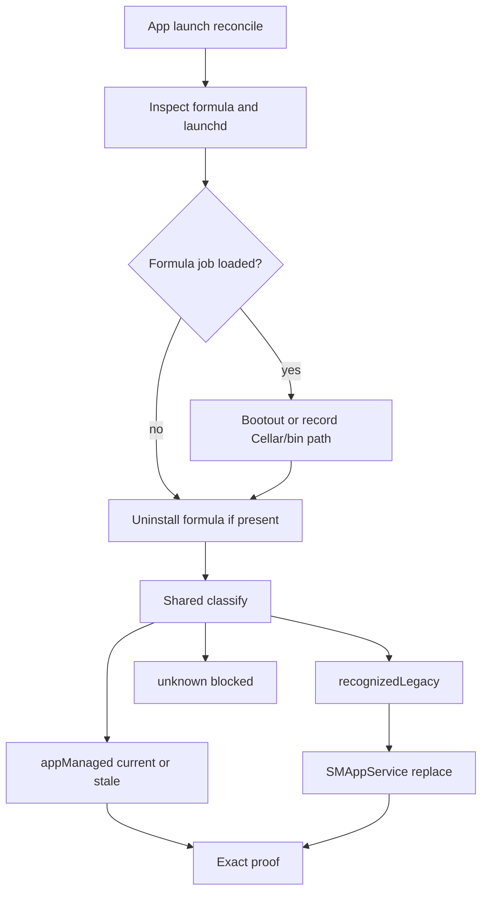

# Ownership and Operator IPC Hardening

## Goal Capsule

- **Objective:** A leftover Homebrew or CLI Plug install can be adopted without a dead Try Again loop, and a Sparkle-skewed app talks to the daemon with honest capability errors instead of PARSE_ERROR or silent Unmanaged.
- **Means:** Finish the #124 leftover-path recognition with a live fixture and pre-uninstall inspect, then one shared path table and classify. Capability-gated operator reads (U4) can land beside leftover inspect (U1–U3). Then doctor/app copy, config persistence, and a PlugIPC contract test. File splits and live client certs stay deferred for this program.
- **Authority:** `main` plus PR #124 (`fix/leftover-homebrew-launchd-adopt`). Code and tests beat older design specs.
- **Stop conditions:** Stop rather than invent a second runtime authority, flip modern MCP gates, rewrite protocol routing, or claim ChatGPT/Codex/Cursor/OpenCode/WebKit passkey certification without those clients.

## Product Contract

### Problem Frame

The Aug 24-26 unification made Plug.app the install owner. Classification still uses two languages, two Homebrew path lists, and two fail-closed rules. #124 recognizes leftover Cellar and brew-bin jobs by path shape. Adopt can still leave a stale launchd program pointing at a deleted Cellar path. Operator IPC grew 3 to 6 without a selected version. Edit Server always calls `GetServerConfig`.

### Requirements

- R1. After formula uninstall, a leftover `com.plug.daemon` job at a Cellar or Homebrew bin path is `.recognizedLegacy` and adopt can complete to healthy.
- R2. Formula removal inspects or bootouts proven formula jobs in the same step. A deleted Cellar path must not remain the loaded program after a successful adopt.
- R3. One path table and one `classify()` decide leftover vs unknown vs app-managed. Swift and Rust must not invert Cellar vs `opt/plug`.
- R4. Inspect errors fail closed to handshake `unknown` / app blocked, never `Unmanaged`. Handshake can say app-owned but stale (`stale: bool`).
- R5. `GetServerConfig` is refused without `server_config_read`. The app shows restart/update, not a dead Save.
- R6. Operator IPC overlap has a written rule for when 3 and 4 go away, or a selected version. Coordinator max matches the live band.
- R7. CLI doctor and the app use one sentence for leftover launchd.
- R8. The first operator mutation must not silently drop comments or rewrite the whole `config.toml` unless that is the only safe persist path and is documented.
- R9. PlugIPC request/response shapes have a golden payload or generated check so the next operator field fails CI, not a running app.
- R10. Snapshot baseline SHA matches `main` after this work lands.
- R11. Live client certs (ChatGPT, Codex, Cursor, OpenCode, WebKit passkey) stay listed as remaining gates. This program does not fake them.

### Actors

- A1. Mac user upgrading from Homebrew formula to Plug.app.
- A2. User whose Sparkle-updated app talks to a still-starting or older daemon.
- A3. Implementer and CI.

### Scope Boundaries

In scope: leftover launchd adopt, shared classify, operator capability honesty, doctor copy, config persist comment risk, PlugIPC contract test, snapshot SHA.

### Deferred to Follow-Up Work

- File splits of `plug/src/commands/misc.rs`, `clients.rs`, `plug-core/src/ipc.rs` (follow-up after U1–U5, not this program).
- Live ChatGPT, Codex, Cursor, OpenCode, and WebKit passkey ceremonies.
- GUI mockups and `.impeccable/` critiques.

### Outside this product's identity

- Modern MCP gate flips, mixed-era MRTR, Apps/UI advertisement.
- A second config or health store in the app.

## Planning Contract

### Key Technical Decisions

- KTD1. Sequence leftover fixture and pre-uninstall inspect before the shared classifier. (session-settled: user-directed — chosen over starting file splits or GUI: user said do U1–U5 before ownership rewrite or GUI work.)
- KTD2. Shared classify is one Rust function plus a Swift call or duplicated table generated from one source. Do not keep two hand-maintained allowlists. (session-settled: user-directed — chosen over leaving the #124 Swift-only union: thermos overlap finding.)
- KTD3. R5 is app-side. `canReadServerConfig` from daemon handshake capabilities, same pattern as `canManageTools`. Do not send `GetServerConfig` without `server_config_read`. Do not invent a daemon-side reject or a selected-version field: a daemon that can parse `GetServerConfig` already advertises `ServerConfigRead`, and KTD4 forbids storing a client range. Older daemon PARSE_ERROR is avoided by not calling. (feasibility P1 — chosen over “daemon rejects unless advertised.”)
- KTD4. Operator IPC: document the overlap rule and keep MIN=3 until a real removal exists. Do not raise MIN in this program. (inferred default — chosen over negotiating a new selected version this week: no capability has been removed.)
- KTD5. Live client certs are not implementation units. Record them in snapshot remaining-work only. (pipeline challenge of "do all": LFG cannot complete those ceremonies without those clients.)
- KTD6. Launchctl inspect `Err(_)` maps to handshake `DaemonOwnershipMode::Unknown`, never `Unmanaged`. App-owned-but-old is `ownership: app_managed` plus `stale: bool`. Do not fail the handshake. (feasibility P1 — chosen over keeping Unmanaged on the wire or adding only a Swift fail-close.)
- KTD7. After inspect-before-uninstall, `adoptRecognizedLegacy` uses the inspect-time records and must not require re-inspect to still equal `.recognizedLegacy`. If brew already unloaded `com.plug.daemon`, still register SMAppService from that snapshot; do not `evidenceChanged` abort. Bootout while loaded is preferred; snapshot pass-through is the fallback. (feasibility P1 — chosen over the current `current == snapshot.ownership` guard.)

### Assumptions

- A leftover Homebrew job is still the 0.7.x failure class on real Macs that installed the formula.
- #124 is the base of this stack unless it merges first.
- Signed `UnifiedReconciliationFixtureTests` stay skipped in CI. U1 must still be a unit or in-process fixture that CI can run.

### High-Level Technical Design

Operator reads: handshake capabilities → `canReadServerConfig` → `GetServerConfig` or restart copy.

## Implementation Units

### U1. CI-runnable leftover Cellar fixture

Covers R1.

**Approach.** Extend `LaunchdJobInspectorTests` is done on #124. Add a coordinator-level fixture that sequences formulaInstalled true → remove formula → inspect with a Cellar `com.plug.daemon` record still present → expect adoption path, not `.unknown` / Setup incomplete.

**Files.** `PlugApp/PlugAppTests/InstallationCoordinatorTests.swift`, existing recording doubles.

**Test scenarios.**

- Happy: Cellar leftover after `formulaInstalled` flips false → daemon inspect is `.recognizedLegacy` → adopt is offered or auto-adopted.
- Edge: `/opt/homebrew/bin/plug` leftover with empty `recognizedPaths` → same.
- Error: `/tmp/not-plug` on `com.plug.daemon` stays `.unknown`.

**Depends on.** #124.

### U2. Inspect or bootout before formula uninstall

Covers R2.

**Approach.** In `InstallationCoordinator.performReconciliation`, inspect daemon jobs before `removeRecognizedFormula`. If ownership is recognized-legacy Homebrew, bootout those jobs while still loaded, then uninstall. `adoptRecognizedLegacy` must use the inspect-time records, not only `DaemonServiceManager.defaultLegacyPaths`, and must not require a post-uninstall re-inspect to still equal `.recognizedLegacy` (KTD7). If brew already dropped the job, still SMAppService-register from the snapshot.

**Files.** `PlugApp/PlugApp/Services/InstallationCoordinator.swift`, `DaemonServiceManager.swift`, coordinator tests.

**Test scenarios.**

- Happy: formula + Cellar job → uninstall → no loaded job still pointing at the deleted Cellar path after adopt replace.
- Edge: formula installed but no launchd job → uninstall proceeds, inspect is unknown / no leftover.
- Error: bootout failure stays blocked, not healthy.

**Depends on.** U1.

### U3. One path table and one classify

Covers R3, R4.

**Approach.** One Rust `is_recognized_legacy_program` that includes Cellar, brew bin, and `opt/plug`. Swift `LegacyPlugProgram` matches it or reads the same list. `ipc_ownership` maps inspect `Err(_)` to `DaemonOwnershipMode::Unknown` (KTD6), never `Unmanaged`. App-owned-but-old is `stale: bool` on `OperatorHandshake` beside `ownership: app_managed`. `Unknown` is the fail-closed wire value; do not fail the handshake.

**Files.** `plug/src/service.rs`, `plug/src/install.rs`, `plug-core/src/ipc.rs`, `PlugApp/PlugApp/Models/InstallationState.swift`, `LaunchdJobInspector.swift`, doctor snapshot in `plug/src/commands/misc.rs`.

**Test scenarios.**

- Happy: Cellar path recognized in Rust and Swift.
- Happy: `opt/plug` recognized in Rust.
- Error: launchctl inspect error → not Unmanaged.
- Edge: app-owned stale parent bundle version → handshake/app agree stale.

**Depends on.** U2.

### U4. Gate GetServerConfig

Covers R5.

**Approach.** App-side only (KTD3). `canReadServerConfig` from handshake capabilities. `EditServerView` shows restart/update copy when the capability is missing. Save disabled. No `GetServerConfig` on the wire. Do not add a daemon-side reject or per-session client capability store.

**Files.** `PlugApp/PlugApp/Stores/AppModel.swift`, `Servers/EditServerView.swift`, app tests. Daemon `GetServerConfig` handler stays ungated.

**Test scenarios.**

- Happy: capability present → config loads.
- Error: capability absent → no `GetServerConfig` wire call, user-visible restart/update, Save disabled.
- Edge: older fixture handshake without v6 → same as error.

**Depends on.** none. Can parallel U1.

### U5. Operator IPC overlap rule

Covers R6.

**Approach.** Comment on `OPERATOR_IPC_MIN/MAX` in `plug-core/src/ipc.rs`: overlap is the contract; MIN stays 3 until a capability is removed; first removal must raise MIN and add a test. Coordinator already at 6 on #124. Do not invent a selected-version handshake field in this program.

**Files.** `plug-core/src/ipc.rs`, a focused unit test that handshake still ignores client range (characterization).

**Test scenarios.**

- Happy: client 3-4 still overlaps daemon 3-6.
- Edge: client 7-7 rejected (already coordinator test).

**Depends on.** none.

### U6. Doctor and app leftover sentence

Covers R7.

**Approach.** Doctor leftover-launchd warning text matches the app adopt/Turn On wording. Point at Plug.app adopt, not a second CLI repair that the app will undo.

**Files.** `plug/src/commands/misc.rs`, doctor tests if present.

**Test scenarios.**

- Happy: leftover job → doctor warn contains the same adopt verb as the app.

**Depends on.** U3 so classify agrees.

### U7. Config persist comments

Covers R8.

**Approach.** If atomic rewrite cannot keep comments, document that in the persist function and add a test that a comment-only extra key is the known loss, or persist via toml_edit if already a dependency. Do not add a new TOML stack unless one exists.

**Files.** `plug-core/src/operator.rs`, operator tests.

**Test scenarios.**

- Happy: mutation persists the changed server/tool.
- Edge: existing comment behavior is pinned (kept or documented drop).

**Depends on.** none.

### U8. PlugIPC golden payload

Covers R9.

**Approach.** One rustc-serialized `OperatorHandshake` / `GetServerConfig` JSON fixture that Swift `FrameCodec` / `ProtocolModels` must decode. Or a shared testdata JSON both sides load. No full codegen this program.

**Files.** `plug-core` test exporting fixture, `PlugApp/PlugIPC/Tests`.

**Test scenarios.**

- Happy: current handshake JSON decodes in Swift.
- Error: renamed field fails the Swift test.

**Depends on.** U3 when handshake gains stale; U4 for the `GetServerConfig` fixture.

### U9. Snapshot SHA

Covers R10.

**Approach.** Set `docs/PROJECT-STATE-SNAPSHOT.md` baseline to the merge commit that contains this program. Do this last.

**Files.** `docs/PROJECT-STATE-SNAPSHOT.md`.

**Test scenarios.** None. Docs only.

**Depends on.** U1-U8 landing SHA.

## Verification Contract

- `xcodebuild test -project PlugApp/PlugApp.xcodeproj -scheme PlugApp -destination 'platform=macOS' -only-testing:PlugAppTests/LaunchdJobInspectorTests -only-testing:PlugAppTests/InstallationCoordinatorTests CODE_SIGNING_ALLOWED=NO`
- Targeted daemon/operator rust tests for U3-U5, U7.
- `swift test --package-path PlugApp/PlugIPC` for U8.
- `cargo test --workspace` before merge of the stack.
- Do not claim PlugApp signed-fixture CI coverage.

## Definition of Done

- U1-U8 have tests named above and pass.
- Leftover Homebrew adopt cannot return Setup incomplete solely because Cellar != `opt/plug`.
- Edit Server cannot fire `GetServerConfig` without `server_config_read` (app-side gate).
- R11 remains listed as remaining work, not done.
- U9 updates snapshot after merge.
- File splits stay deferred; they are not a unit in this program.
