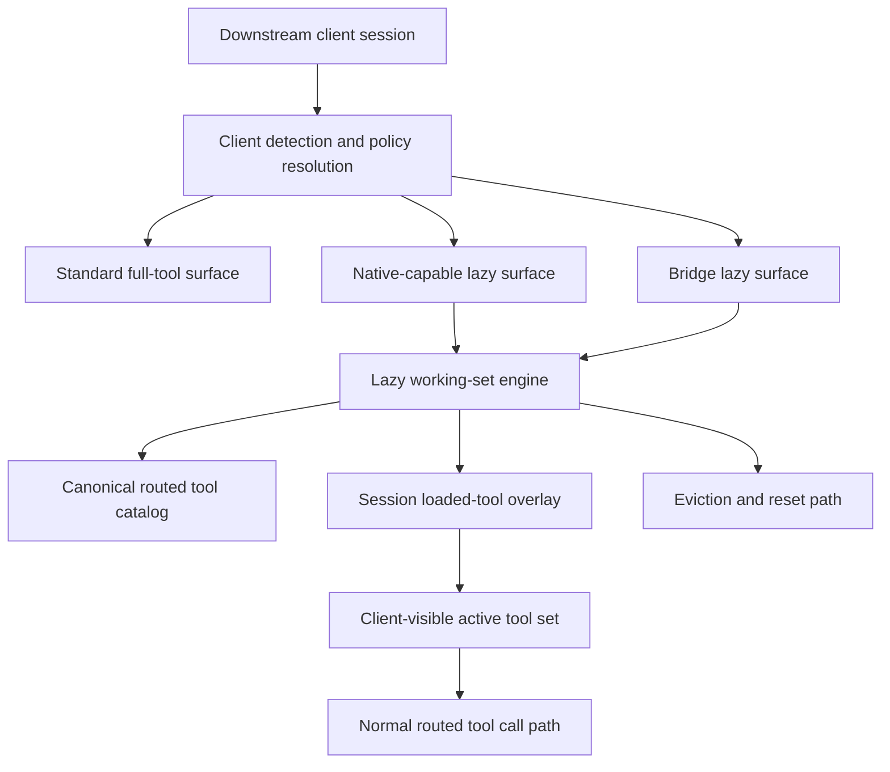

# feat: lazy tool discovery v2

## Overview

Redesign `plug`'s current meta-tool mode into a real lazy tool discovery system with one shared internal working-set engine and adaptive client-facing surfaces. The target shape is not "improve the text search wrapper." The target shape is "search, load, evict, then direct-call real routed tools," while preserving a clear operator UX and leaving standard full-tool mode available.

---

## Problem Frame

The existing meta-tool mode solved only the first 10 percent of the problem: it proved `plug` can expose a smaller `tools/list` surface, but it left clients stuck behind a text-oriented discovery contract and a permanent `plug__invoke_tool` wrapper. The origin requirements document reframes this as a cross-client lazy-loading problem, not an OpenCode-only patch: `plug` needs a modern session working set, smart per-client defaults, and a bridge surface for clients that do not already provide native deferred discovery (see origin: `docs/brainstorms/2026-04-23-lazy-tool-discovery-v2-requirements.md`).

The plan therefore treats the current meta-tool mode as prior art and keeps only the parts worth preserving: canonical routed tools remain the source of truth, lazy behavior remains opt-in or client-targeted rather than mandatory, and direct routed call behavior remains the endpoint once a tool is loaded.

---

## Requirements Trace

- R1. One internal lazy-discovery engine shared across supported clients
- R2. Smart per-client defaults with operator overrides
- R3. Adaptive client-facing discovery surfaces by client target
- R4. Bridge clients get real search, load, and eviction actions
- R5. Loaded tools appear exactly like normal routed tools
- R6. Loaded tools are called directly, not through a permanent wrapper
- R7. Search/load results are machine-readable and expose full definitions at load time
- R8. Working set is session-scoped and sticky across turns
- R9. Working set supports eviction
- R10. Mode is visible/editable in setup and `plug clients`
- R11. Automatic mode choices are legible enough to inspect during setup
- R12. Preserve normal permission and approval semantics as far as clients allow
- R13. Bridge clients get a compact always-visible discovery hint/surface
- R14. V2 supersedes the current meta-tool contract
- R15. `plug__invoke_tool` remains fallback/debug only
- R16. Standard full-tool mode remains available

**Origin actors:** A1 (Plug operator), A2 (AI client), A3 (Plug runtime)
**Origin flows:** F1 (Client setup and mode confirmation), F2 (Search, load, and direct call), F3 (Working-set evolution)
**Origin acceptance examples:** AE1 (covers R2, R10, R11), AE2 (covers R5, R6, R7), AE3 (covers R8, R9), AE4 (covers R12, R15)

---

## Current Branch Progress

As of the first implementation slice on `codex/lazy-tool-discovery-v2`:

- U1 is implemented: config now has `lazy_tools`, smart per-client defaults, per-client overrides, validation, reload diffing, and `plug clients`/link-flow visibility.
- U2-U4 are implemented as a functional vertical slice: bridge clients get session-scoped loaded-tool sets, `plug__search_tools`/`plug__load_tool`/`plug__evict_tool`/`plug__list_loaded_tools`, loaded tools reappear under their real routed names, direct hidden calls are rejected until load, and load/evict emits `tools/list_changed`.
- U5 is partially implemented: `docs/CLIENT-COMPAT.md`, `docs/ARCHITECTURE.md`, and `README.md` now describe the lazy-tool policy matrix and bridge flow. Broader transport/live-client regression coverage still needs to be completed before treating v2 as fully shipped.

Live smoke evidence from this branch:

- Installed branch binary with `./scripts/dev-reinstall.sh --quick`.
- Restarted the local daemon and verified `plug status` reached `running`.
- Simulated an OpenCode MCP stdio client with `clientInfo.name = "opencode"`.
- Verified the initial OpenCode bridge `tools/list` contained only 7 `plug__*` tools.
- Verified `plug__search_tools` returned machine-readable matches, `plug__load_tool` made a real routed tool visible, an unloaded direct real-tool call was rejected with a `plug__load_tool` hint, and `plug__evict_tool` removed the loaded tool again.

---

## Scope Boundaries

- This plan covers lazy tool discovery, working-set loading/eviction, adaptive client surfaces, and operator configuration for those behaviors.
- This plan does not rewrite unrelated transport, auth, task, or artifact systems beyond the changes required to keep lazy discovery transport-complete.
- This plan does not require a universal public lazy-loading protocol for every external MCP implementation; it only needs a coherent `plug` design.
- This plan does not remove standard full-tool mode.

### Deferred to Follow-Up Work

- Publicizing any `plug` lazy-discovery contract for external ecosystem reuse
- Broader protocol or SDK standardization work outside `plug`
- Additional client targets beyond the first capability buckets validated in this plan

---

## Context & Research

### Relevant Code and Patterns

- `plug-core/src/proxy/mod.rs` already separates canonical routed tools from the currently exposed meta-tool surface and is the natural place to keep shared lazy-discovery behavior.
- `plug-core/src/session/mod.rs` and `plug-core/src/session/stateful.rs` already provide session-scoped state and are the most natural home for a durable loaded-tool working set.
- `plug-core/src/client_detect.rs` and `plug-core/src/types.rs` already encode client-target identity and are the right seam for capability-bucket defaults.
- `plug/src/commands/clients.rs` and `plug/src/views/clients.rs` already own operator-facing client inspection and are the right seam for visible mode inspection and overrides.
- Existing meta-tool-mode tests in `plug-core/src/proxy/mod.rs`, `plug-core/src/http/server.rs`, and `plug-core/src/server/mod.rs` provide a regression baseline for transport parity and should be evolved rather than discarded.

### Institutional Learnings

- `docs/solutions/integration-issues/phase3a-meta-tool-mode-tool-drift-20260307.md` confirms the valuable part of the current design: canonical routing and exposed client surface should remain separate concerns.
- `docs/solutions/integration-issues/phase3-resilience-token-efficiency.md` records the original `search_tools` meta-tool work and its token-efficiency intent, which should be preserved while replacing the wrapper-first UX.
- `docs/CLIENT-COMPAT.md` and `docs/research/client-validation.md` already capture client quirks and should be promoted from narrative notes into an explicit capability-bucket input for defaults.

### External References

- OpenAI tool search documentation describes the target lazy-loading interaction shape: search returns a loaded subset that becomes callable on subsequent turns, with explicit load/unload semantics.
- OpenCode PR `#12520` is a strong comparison point for bridge-client behavior: compact always-visible guidance, search/load semantics, and avoidance of permanent wrapper-only interaction.

---

## Key Technical Decisions

- Replace the single `meta_tool_mode: bool` mindset with a richer client-targeted lazy-discovery policy model. The old boolean can remain as migration input, but it should not be the controlling abstraction.
- Keep one canonical routed tool catalog globally, and add a session-scoped loaded-tool overlay rather than creating a second routing system.
- Treat client-facing lazy UX as an adapter layer over the same internal engine. The internal engine owns search, load, evict, and loaded-tool visibility; client adapters decide which bootstrap surface each client sees.
- Restore loaded tools to their normal routed identity once loaded. If a client can only see a bridge surface, the bridge should be the bootstrap path, not the permanent call path.
- Retain `plug__invoke_tool` only as explicit fallback/debug infrastructure.

---

## Open Questions

### Resolved During Planning

- Should v2 be a polish pass on the March 7 meta-tool design or a broader redesign? It should be a broader redesign that reuses only the internals worth keeping.
- Should one client get the best possible bespoke experience, or should cross-client design win? Cross-client design wins, with adaptive client-facing surfaces.
- Should mode choice be fully manual or fully automatic? Use smart per-client defaults with operator-visible overrides.
- Should loaded tools be turn-only or session-scoped? Use a sticky session working set with eviction.
- Should loaded tools keep a `plug` wrapper identity? No. Once loaded, they should look like normal routed tools.

### Deferred to Implementation

- Which concrete capability buckets should exist in the first version, and exactly which client targets map to each bucket?
- What eviction policy should the first version use: explicit only, budget-based, context-shift heuristics, or a small composable mix?
- How much of client approval/permission behavior can actually be preserved for each first-wave client target?
- Should bridge-client bootstrap surfaces converge on one internal set of actions even if their visible names or prompt hints differ?

---

## Alternative Approaches Considered

- Keep improving the current `plug__search_tools` plus `plug__invoke_tool` UX. Rejected because it preserves the wrong contract: text search followed by permanent wrapper invocation.
- Force one universal lazy-discovery surface on every client. Rejected because it would degrade clients that already have stronger native deferred-discovery behavior.
- Build an OpenCode-only bridge and leave every other client untouched. Rejected because it weakens the long-term product shape and turns lazy discovery into a one-off compatibility hack.

---

## High-Level Technical Design

> *This illustrates the intended approach and is directional guidance for review, not implementation specification. The implementing agent should treat it as context, not code to reproduce.*

The implementation should keep the canonical routed tool snapshot intact, add per-session loaded-tool state, and teach `tools/list` to produce a client-specific active set derived from policy plus session state. Search/load/evict mutate only the session overlay; direct tool calls continue to use the normal routed path once a tool has been loaded into the active set.

---

## Implementation Units

- [ ] U1. **Replace global meta-tool mode with client-target lazy policy**

**Goal:** Introduce a durable policy model that can choose smart defaults per client target and persist operator overrides.

**Requirements:** R1, R2, R3, R10, R11, R16

**Dependencies:** None

**Files:**
- Modify: `plug-core/src/config/mod.rs`
- Modify: `plug-core/src/reload.rs`
- Modify: `plug-core/src/types.rs`
- Modify: `plug-core/src/client_detect.rs`
- Modify: `plug/src/commands/clients.rs`
- Modify: `plug/src/commands/misc.rs`
- Modify: `plug/src/views/clients.rs`
- Test: `plug-core/src/client_detect.rs`
- Test: `plug-core/src/config/mod.rs`

**Approach:**
- Introduce a policy model that distinguishes standard full-tool behavior from the lazy-discovery variants `plug` needs to support.
- Make the policy durable in config, keyed by client target, with auto/default semantics plus explicit overrides.
- Teach both setup/link flows and client-management UI to display the chosen mode, the origin of that choice, and the override path.

**Patterns to follow:**
- Existing client-target mapping and inspection flow in `plug/src/commands/clients.rs`
- Existing setup-to-link handoff in `plug/src/commands/misc.rs`
- Existing config validation and reload diffing in `plug-core/src/config/mod.rs` and `plug-core/src/reload.rs`

**Test scenarios:**
- Happy path: a known client target receives the expected default mode when no override exists.
- Edge case: an unknown client target falls back to a safe default rather than silently inheriting an unsafe lazy mode.
- Integration: an explicit override for one client target does not affect other client targets.
- Error path: invalid policy configuration fails validation with a clear config error.

**Verification:**
- `plug` can explain which mode applies to a linked client target and whether it came from an automatic default or an override.

---

- [ ] U2. **Add session-scoped lazy working-set state**

**Goal:** Give each downstream session its own sticky loaded-tool working set with room for eviction.

**Requirements:** R1, R5, R8, R9

**Dependencies:** U1

**Files:**
- Modify: `plug-core/src/session/mod.rs`
- Modify: `plug-core/src/session/stateful.rs`
- Modify: `plug-core/src/http/session.rs`
- Modify: `plug-core/src/ipc.rs`
- Modify: `plug-core/src/proxy/mod.rs`
- Modify: `plug/src/runtime.rs`
- Modify: `plug/src/daemon.rs`
- Modify: `plug/src/ipc_proxy.rs`
- Test: `plug-core/src/session/stateful.rs`
- Test: `plug-core/tests/integration_tests.rs`

**Approach:**
- Extend session state to track a loaded-tool overlay independently from the canonical routed catalog.
- Keep load and eviction decisions session-scoped so multiple concurrent sessions of the same client target can evolve independently without corrupting the global catalog.
- Preserve existing routed call behavior by treating the working set as a visibility layer, not a second routing engine.
- Thread session identity through the daemon/runtime list and call paths wherever downstream clients currently receive tool surfaces based only on client type.

**Patterns to follow:**
- Existing session persistence and snapshot handling in `plug-core/src/session/stateful.rs`
- Existing canonical routed-tool snapshot logic in `plug-core/src/proxy/mod.rs`
- Existing session registration and live-session plumbing in `plug/src/runtime.rs`, `plug/src/daemon.rs`, and `plug/src/ipc_proxy.rs`

**Test scenarios:**
- Happy path: loading a tool in one session makes it visible in that session without affecting a sibling session.
- Edge case: reconnect or resumed session preserves or rehydrates the expected working-set state according to the chosen session model.
- Error path: evicting a tool not currently loaded is a no-op or structured error rather than state corruption.
- Integration: HTTP and stdio/IPC session paths expose the same working-set semantics.
- Integration: daemon-backed stdio sessions and HTTP sessions derive active tool visibility from session identity rather than client type alone.

**Verification:**
- A downstream session can load tools over time while the global routed catalog remains unchanged and reusable by other sessions.

---

- [ ] U3. **Replace text-only bridge discovery with real search, load, and evict actions**

**Goal:** Turn bridge-client lazy discovery into a machine-readable bootstrap surface rather than a text search wrapper.

**Requirements:** R3, R4, R7, R13, R15

**Dependencies:** U1, U2

**Files:**
- Modify: `plug-core/src/proxy/mod.rs`
- Modify: `plug-core/src/server/mod.rs`
- Modify: `plug-core/src/http/server.rs`
- Test: `plug-core/src/proxy/mod.rs`
- Test: `plug-core/src/server/mod.rs`
- Test: `plug-core/src/http/server.rs`

**Approach:**
- Replace the current bridge behavior that returns free-form text with explicit machine-readable actions for search/load/evict plus compact always-visible guidance for bridge clients.
- Keep bridge bootstrap tools small and purposeful; they should help the model get to a direct-call state quickly rather than becoming a long-lived management API.
- Preserve `plug__invoke_tool` as fallback/debug only, not the intended everyday path.

**Patterns to follow:**
- Existing meta-tool interception in `plug-core/src/proxy/mod.rs`
- Existing transport-parity handling in `plug-core/src/server/mod.rs` and `plug-core/src/http/server.rs`

**Test scenarios:**
- Happy path: bridge search returns machine-readable matches and loading a selected tool changes the active tool set.
- Edge case: search with no matches returns a structured empty result rather than a prose-only failure mode.
- Error path: loading an unknown or stale routed tool fails cleanly without leaving partial session state behind.
- Integration: bridge bootstrap surface is transport-complete across stdio/IPC and HTTP.

**Verification:**
- A bridge client can search, load, and evict tools without depending on text parsing or permanent wrapper invocation.

---

- [ ] U4. **Restore loaded tools to normal routed identity and direct-call semantics**

**Goal:** Ensure loaded tools look and behave exactly like normal routed tools once they enter the working set.

**Requirements:** R5, R6, R12, R15

**Dependencies:** U2, U3

**Files:**
- Modify: `plug-core/src/proxy/mod.rs`
- Modify: `plug-core/src/tool_naming.rs`
- Modify: `plug-core/src/server/mod.rs`
- Modify: `plug-core/tests/integration_tests.rs`
- Test: `plug-core/src/proxy/mod.rs`
- Test: `plug-core/tests/integration_tests.rs`

**Approach:**
- Teach `tools/list` for a session's active set to expose loaded tools with the same routed names and metadata used in standard mode.
- Ensure a loaded tool uses the normal routed `tools/call` path so client behavior, approval semantics, and downstream logs align with ordinary routed tools as much as the client permits.
- Keep hidden tools inaccessible until loaded, but remove any extra wrapper identity once the load step is complete.

**Patterns to follow:**
- Existing routed tool naming and title normalization in `plug-core/src/tool_naming.rs`
- Existing normal routed call path in `plug-core/src/proxy/mod.rs`

**Test scenarios:**
- Happy path: after load, a routed tool appears with the same name it would have in standard mode and is called directly.
- Edge case: unloading a previously loaded tool removes it from the active set without breaking still-loaded siblings.
- Error path: direct call to an unloaded hidden tool is rejected cleanly until it is loaded.
- Integration: loaded tool metadata, names, and result handling match standard mode closely enough that callers do not need special-case logic.

**Verification:**
- After load, the client can treat a tool exactly like a standard routed tool rather than a `plug` meta-tool artifact.

---

- [ ] U5. **Ship client-matrix validation, operator docs, and regression coverage**

**Goal:** Make the adaptive lazy-discovery design inspectable, documented, and safe to evolve.

**Requirements:** R2, R10, R11, R14, R16

**Dependencies:** U1, U2, U3, U4

**Files:**
- Modify: `docs/CLIENT-COMPAT.md`
- Modify: `docs/ARCHITECTURE.md`
- Modify: `README.md`
- Modify: `plug-core/tests/integration_tests.rs`
- Modify: `plug-core/src/http/server.rs`
- Modify: `plug-core/src/server/mod.rs`
- Test: `plug-core/tests/integration_tests.rs`

**Approach:**
- Promote the client capability matrix from scattered notes into a maintained planning-and-runtime input.
- Document how smart defaults, overrides, bridge clients, and standard mode are expected to behave.
- Add regression coverage that proves the first supported lazy-discovery buckets behave correctly across the shared router and both transport families.

**Patterns to follow:**
- Existing client-compatibility narrative in `docs/CLIENT-COMPAT.md`
- Existing transport-parity test style in `plug-core/src/http/server.rs` and `plug-core/src/server/mod.rs`

**Test scenarios:**
- Happy path: first-wave client targets receive the expected default mode and active tool-surface behavior.
- Edge case: standard full-tool mode remains unchanged when selected explicitly.
- Integration: the same lazy-discovery scenario behaves consistently in stdio/IPC and HTTP.
- Error path: capability-matrix regressions are caught by targeted tests rather than discovered by user reports.

**Verification:**
- The first supported client buckets are documented, test-backed, and inspectable through operator-facing surfaces.

---

## System-Wide Impact

- **Interaction graph:** Client detection, config/reload, session state, router listing, HTTP session handling, stdio/IPC handling, and operator client-management surfaces all change together.
- **Error propagation:** Search/load/evict failures must be structured enough for bridge clients while preserving the existing routed tool failure path for loaded tools.
- **State lifecycle risks:** Per-session loaded-tool overlays introduce drift, reconnect, and eviction-order risks that do not exist in the current global-only tool snapshot model.
- **API surface parity:** `tools/list` behavior changes across stdio, IPC-backed sessions, and HTTP sessions; parity is load-bearing for credibility of the new design.
- **Integration coverage:** Unit tests are not enough; the plan needs end-to-end transport checks that prove search/load changes the visible tool set and preserves direct-call behavior afterward.
- **Unchanged invariants:** Canonical routed tool naming, standard full-tool mode, and the underlying routed call path remain the source of truth. V2 changes how tools become visible in a session, not what a routed tool fundamentally is.

---

## Risks & Dependencies

| Risk | Mitigation |
|------|------------|
| Policy model becomes too abstract or hard to explain | Keep the client-target modes small and operator-facing language concrete in setup and `plug clients` |
| Working-set state drifts from the canonical routed catalog | Keep the overlay session-scoped and derive visible sets from the canonical snapshot rather than cloning routing logic |
| Bridge surface becomes another wrapper-first API | Limit bridge tools to bootstrap actions only and restore loaded tools to normal routed identity immediately after load |
| Client approvals or permissions cannot fully preserve native semantics | Make the first-wave client matrix explicit, document the limits, and test the best possible behavior bucket by bucket |
| Transport parity regresses while adding lazy state | Keep shared logic in the router/session layers and backstop it with HTTP plus stdio/IPC regression coverage |

---

## Documentation / Operational Notes

- `docs/CLIENT-COMPAT.md` should become the operator-facing explanation of which client targets use which lazy-discovery mode by default.
- `README.md` should explain lazy discovery as a first-class product capability instead of leaving meta-tool mode as a niche implementation detail.
- The `plug clients` surface should be the primary inspection/debug path for "why is this client seeing this tool surface?"

---

## Sources & References

- **Origin document:** `docs/brainstorms/2026-04-23-lazy-tool-discovery-v2-requirements.md`
- Related docs: `docs/CLIENT-COMPAT.md`, `docs/research/client-validation.md`
- Related plan: `docs/plans/2026-03-07-feat-phase3a-meta-tool-mode-plan.md`
- Related solution note: `docs/solutions/integration-issues/phase3a-meta-tool-mode-tool-drift-20260307.md`
- External docs: OpenAI tool search documentation
- External reference: OpenCode PR `#12520`
