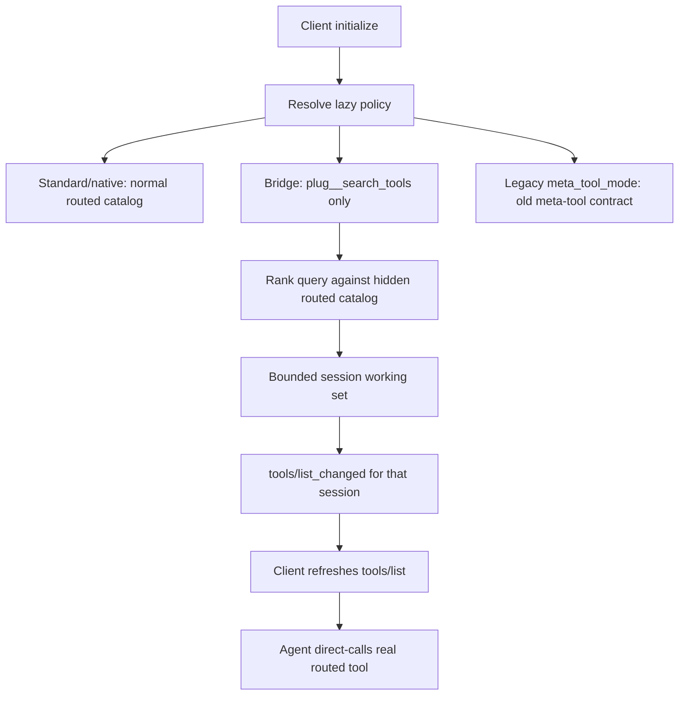

# fix: lazy tool discovery review hardening

## Overview

Harden the lazy tool discovery v2 branch after review. The product shape remains intentionally simple for bridge clients: `plug__search_tools` is the only visible bootstrap tool, search loads a bounded ranked set of real routed tool definitions into the session, and the agent then calls the chosen real routed tool directly.

This plan fixes the review blockers without reintroducing a cluttered bridge surface.

---

## Problem Frame

The current branch moved toward the right UX but left three classes of defects: the bridge working set can grow without bound, the search primitive is too weak to be the only discovery tool, and compatibility/docs/config surfaces disagree about what tools and modes exist. The fix should make the bridge mode feel like Codex-style deferred discovery while preserving existing `meta_tool_mode` behavior only as compatibility for explicit legacy users.

---

## Requirements Trace

- R1. Bridge mode exposes exactly one primary bootstrap tool: `plug__search_tools`.
- R2. `plug__search_tools` returns ranked machine-readable matches and loads callable real routed tool definitions.
- R3. Bridge working sets remain session-scoped and bounded so repeated searches cannot re-expand to the full catalog.
- R4. Direct hidden routed calls are rejected until loaded, including task-wrapped paths.
- R5. Disabled meta tools and client visibility are enforced before local meta-tool interception.
- R6. Existing explicit `meta_tool_mode = true` users do not silently lose their legacy meta-tool contract unless docs and tests declare the break.
- R7. Lazy client-target config keys validate and resolve consistently.
- R8. Operator and machine-readable CLI output distinguish configured policy from live daemon policy when restart is required.
- R9. Current-truth and public docs match the implemented branch state using repo-approved truth labels.

**Origin actors:** A1 (Plug operator), A2 (AI client), A3 (Plug runtime)
**Origin flows:** F1 (Client setup and mode confirmation), F2 (Search, load, and direct call), F3 (Working-set evolution)
**Origin acceptance examples:** AE1 (covers R2, R10, R11), AE2 (covers R5, R6, R7), AE3 (covers R8, R9), AE4 (covers R12, R15)

---

## Scope Boundaries

- Keep the OpenCode/bridge deferred-mode UX to `plug__search_tools -> direct routed tool call`.
- Do not expose `plug__load_tool`, `plug__evict_tool`, `plug__list_loaded_tools`, or `plug__invoke_tool` in bridge mode.
- Preserve standard full-tool mode and native-lazy mode.
- Do not redesign unrelated transport, auth, artifact, or upstream routing systems.

### Deferred to Follow-Up Work

- Semantic embeddings or external search indexes beyond local ranked lexical search.
- Live validation against every downstream client UI.
- Public standardization of a `plug` lazy-tool protocol outside this repo.

---

## Context & Research

### Relevant Code and Patterns

- `plug-core/src/proxy/mod.rs` owns the canonical routed catalog, bridge-visible tool surface, meta-tool interception, direct-call guard, and lazy working sets.
- `plug-core/src/config/mod.rs` owns lazy policy resolution, target validation, and compatibility with `meta_tool_mode`.
- `plug-core/src/http/server.rs`, `plug-core/src/server/mod.rs`, `plug/src/daemon.rs`, and `plug/src/runtime.rs` thread client/session identity through tools/list, tools/call, task calls, and cleanup.
- `plug/src/views/clients.rs` and `plug/src/commands/clients.rs` own operator-facing lazy-mode inspection.
- Existing proxy, HTTP, server, daemon, and CLI tests already cover the first implementation slice and should be extended rather than replaced.

### Institutional Learnings

- `docs/solutions/integration-issues/phase3a-meta-tool-mode-tool-drift-20260307.md` established the important invariant: canonical routed tools and exposed client surface must remain separate.
- `docs/solutions/integration-issues/phase3-resilience-token-efficiency.md` documented the token-efficiency goal and the cost of accidental catalog expansion.
- `docs/research/client-validation.md` is compatibility evidence, not truth by itself; definitive client defaults in `docs/CLIENT-COMPAT.md` need matching validation language.

---

## Key Technical Decisions

- Bridge mode stays one-tool: `plug__search_tools` is both discovery and bounded load.
- Working-set shrinkage is automatic, not agent-managed: use a bounded LRU-style session set instead of exposing eviction tools to the model.
- Search ranks tokenized matches across routed name, title, server id, and description, then loads only the top bounded result set.
- Legacy `meta_tool_mode = true` compatibility is isolated from bridge defaults so OpenCode does not inherit old wrapper tools.
- Capability and task behavior should be client-aware enough that bridge sessions are not invited into unsupported task-wrapped meta-tool flows.

---

## High-Level Technical Design

> *This illustrates the intended approach and is directional guidance for review, not implementation specification. The implementing agent should treat it as context, not code to reproduce.*

---

## Implementation Units

- [x] U1. **Bound bridge search and improve ranking**

**Goal:** Make `plug__search_tools` the only bridge primitive while preventing repeated searches from regrowing the visible catalog.

**Requirements:** R1, R2, R3

**Dependencies:** None

**Files:**
- Modify: `plug-core/src/proxy/mod.rs`
- Test: `plug-core/src/proxy/mod.rs`

**Approach:**
- Replace the bridge working-set `HashSet` with an ordered bounded representation.
- Tokenize user queries and score matches across routed name, title, server id, and description.
- Load ranked matches into the session working set with a small fixed cap and deterministic eviction.
- Return machine-readable ranking metadata, loaded tools, and any evicted names from `plug__search_tools`.

**Execution note:** Add regression tests before changing the bridge working-set behavior.

**Patterns to follow:**
- Existing `bridge_search_tools_adds_real_tools_to_session_visible_set` and `bridge_search_publish_tool_list_changed_for_newly_loaded_matches` tests.
- Existing priority-sort and tool fingerprint helpers in `plug-core/src/proxy/mod.rs`.

**Test scenarios:**
- Happy path: query `send slack message` matches a Slack tool described as sending messages even though the words are not contiguous.
- Edge case: repeated searches over more unique tools than the cap leave only the bounded working-set size visible.
- Edge case: repeated search for an already loaded tool refreshes recency without duplicating the tool.
- Integration: search publishes targeted `tools/list_changed` only when the visible bridge set changes.

**Verification:**
- Bridge clients can search naturally and then direct-call loaded routed tools.
- Visible bridge tools never exceed `plug__search_tools` plus the configured internal cap.

---

- [x] U2. **Separate bridge mode from legacy meta-tool compatibility**

**Goal:** Keep bridge mode clean while preventing existing explicit `meta_tool_mode = true` clients from losing their old contract accidentally.

**Requirements:** R1, R4, R6

**Dependencies:** U1

**Files:**
- Modify: `plug-core/src/proxy/mod.rs`
- Modify: `plug-core/src/config/mod.rs`
- Modify: `plug-core/src/types.rs`
- Test: `plug-core/src/proxy/mod.rs`
- Test: `plug-core/src/server/mod.rs`
- Test: `plug-core/src/http/server.rs`

**Approach:**
- Resolve a private router surface distinction between bridge lazy mode and legacy meta-tool mode.
- Expose only `plug__search_tools` for bridge clients.
- Preserve or explicitly test legacy `plug__list_servers`, `plug__list_tools`, `plug__search_tools`, and `plug__invoke_tool` only for `meta_tool_mode = true`.
- Ensure `plug__invoke_tool` cannot be used from bridge mode.

**Execution note:** Characterize legacy `meta_tool_mode` behavior before wiring the private surface split.

**Patterns to follow:**
- Base `meta_tool_mode` implementation in `plug-core/src/proxy/mod.rs`.
- Existing route-first direct call behavior for normal routed tools.

**Test scenarios:**
- Happy path: OpenCode/default bridge tools/list returns exactly `plug__search_tools`.
- Compatibility: explicit `meta_tool_mode = true` tools/list returns the legacy meta-tool set.
- Error path: bridge mode rejects `plug__invoke_tool`.
- Error path: hidden direct real-tool calls reject before and after any bridge list call until search loads them.

**Verification:**
- The primary deferred UX remains one visible tool, and legacy behavior is isolated behind the legacy flag.

---

- [x] U3. **Close meta-tool guard, task, capability, and disabled-tool gaps**

**Goal:** Ensure local meta-tools obey visibility/disable rules and bridge clients are not advertised unsupported task behavior.

**Requirements:** R4, R5

**Dependencies:** U1, U2

**Files:**
- Modify: `plug-core/src/proxy/mod.rs`
- Modify: `plug-core/src/server/mod.rs`
- Modify: `plug-core/src/http/server.rs`
- Modify: `plug/src/daemon.rs`
- Test: `plug-core/src/proxy/mod.rs`
- Test: `plug-core/src/server/mod.rs`
- Test: `plug-core/src/http/server.rs`
- Test: `plug/src/daemon.rs`

**Approach:**
- Check disabled tools and visible-surface eligibility before intercepting `plug__search_tools` or legacy meta tools.
- Add client-aware capability synthesis or suppress task capability for bridge sessions.
- Keep task-wrapped real routed tool calls behind the lazy direct-call guard.
- Handle task-wrapped meta-tool calls consistently: either reject with a clear unsupported error when bridge tasks are suppressed, or route them through the same meta-tool path if tasks remain advertised.

**Test scenarios:**
- Error path: `disabled_tools = ["plug__search_tools"]` removes and rejects the bridge search tool.
- Error path: task-wrapped hidden real-tool calls reject until search loads the tool.
- Error path: task-wrapped `plug__search_tools` is not advertised to bridge clients or returns a deliberate unsupported error.
- Integration: initialized OpenCode capabilities do not imply unsupported bridge task behavior.

**Verification:**
- No hidden tool can be reached by direct, wrapper, or task call before search loads it for that session.

---

- [x] U4. **Fix lazy policy config aliases and operator truth**

**Goal:** Make lazy configuration deterministic and honest for agents and operators.

**Requirements:** R7, R8

**Dependencies:** None

**Files:**
- Modify: `plug-core/src/config/mod.rs`
- Modify: `plug-core/src/reload.rs`
- Modify: `plug/src/views/clients.rs`
- Modify: `plug/src/commands/clients.rs`
- Modify: `plug/src/daemon.rs`
- Test: `plug-core/src/config/mod.rs`
- Test: `plug/src/views/clients.rs`
- Test: `plug/src/commands/clients.rs`

**Approach:**
- Canonicalize or reject lazy client aliases so validation and resolution use the same key space.
- Preserve the current text warning that lazy-policy changes require daemon restart.
- Mirror restart-required/configured-vs-live semantics in JSON enough that agents do not mistake configured values for live runtime state.
- Avoid silently replacing invalid config with default policy in JSON output.

**Test scenarios:**
- Happy path: `codex` and `codex-cli` lazy overrides resolve to the same policy, or aliases are rejected with a canonical-key error.
- Error path: invalid lazy config surfaces a JSON config error rather than default-looking policy.
- Integration: JSON client output includes restart-required/configured-state information when live sessions exist.
- Integration: reload reports restart-required lazy-tool changes instead of implying live application.

**Verification:**
- Agents can inspect lazy policy from CLI JSON without trusting a false live state.

---

- [x] U5. **Update docs and current-truth artifacts**

**Goal:** Align docs with the implemented one-tool bridge and repo truth rules.

**Requirements:** R9

**Dependencies:** U1, U2, U3, U4

**Files:**
- Modify: `README.md`
- Modify: `docs/ARCHITECTURE.md`
- Modify: `docs/CLIENT-COMPAT.md`
- Modify: `docs/PROJECT-STATE-SNAPSHOT.md`
- Modify: `docs/PLAN.md`
- Modify: `docs/plans/2026-04-23-001-feat-lazy-tool-discovery-v2-plan.md`
- Modify: `docs/plans/2026-04-23-002-fix-lazy-tool-discovery-review-hardening-plan.md`

**Approach:**
- Document bridge mode as exactly `plug__search_tools -> direct routed tool call`.
- Remove stale claims about bridge `load`, `evict`, `list_loaded`, and `invoke` tools.
- Mark branch work with approved truth labels such as `exists off-main`.
- Add current-truth entries only as branch/off-main candidate state unless merged to `main`.

**Test scenarios:**
- Test expectation: none for prose-only docs, but grep documented `plug__*` bridge tool names against implementation to avoid drift.

**Verification:**
- Public docs, architecture docs, current truth docs, and plan docs describe the same behavior.

---

## System-Wide Impact

- **Interaction graph:** `initialize` chooses capabilities, `tools/list` exposes the visible surface, `plug__search_tools` mutates session working set, `tools/list_changed` prompts refresh, and direct `tools/call` uses the normal routed path.
- **Error propagation:** Hidden direct calls should fail as invalid bridge calls with a search hint, while unknown or disabled meta-tools should fail as unavailable/not found.
- **State lifecycle risks:** Working-set state must be cleared on disconnect and bounded during long-lived sessions.
- **API surface parity:** Stdio, HTTP, and daemon IPC need the same bridge semantics.
- **Integration coverage:** Router-unit tests are not enough; at least one HTTP or stdio flow should cover initialize/list/search/list/direct-call.
- **Unchanged invariants:** Standard and native modes continue exposing the normal routed catalog; disabled routed tools stay excluded from both full and bridge discovery.

---

## Risks & Dependencies

| Risk | Mitigation |
|------|------------|
| Preserving legacy meta mode reintroduces clutter into bridge clients | Keep legacy behavior only behind explicit `meta_tool_mode = true`; bridge defaults expose only `plug__search_tools`. |
| Bounded working set evicts a tool the agent still expects | Return `evicted_tools` metadata and require the agent to search again if it changes topics. |
| Search ranking is still lexical rather than semantic | Add strong tokenized lexical tests now; defer embeddings to follow-up work. |
| JSON/operator truth expands scope | Implement the minimum honest fields needed to avoid false live-state claims. |

---

## Documentation / Operational Notes

- Existing installs using `meta_tool_mode = true` should be documented as legacy compatibility.
- OpenCode/deferred bridge mode should be documented as the recommended low-token path for clients without native tool search.
- Restart-required lazy config changes should be visible in both text and JSON operator flows.

---

## Sources & References

- Origin document: `docs/brainstorms/2026-04-23-lazy-tool-discovery-v2-requirements.md`
- Prior implementation plan: `docs/plans/2026-04-23-001-feat-lazy-tool-discovery-v2-plan.md`
- Review findings from current branch review in this session
- Related code: `plug-core/src/proxy/mod.rs`
- Related code: `plug-core/src/config/mod.rs`
- Related code: `plug/src/views/clients.rs`
