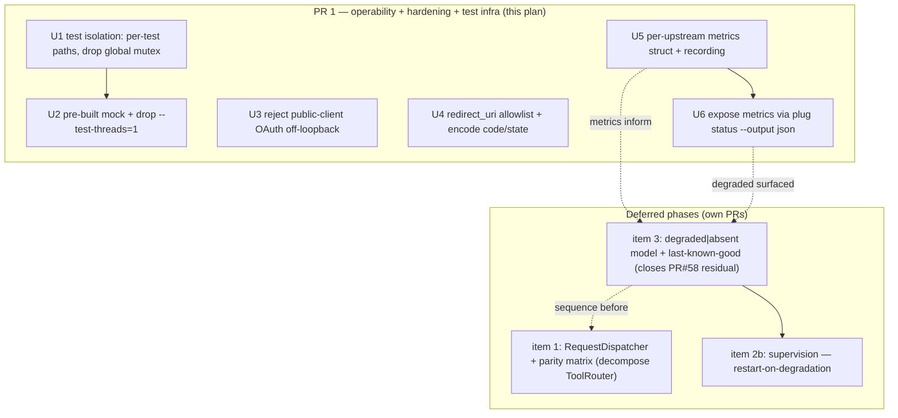
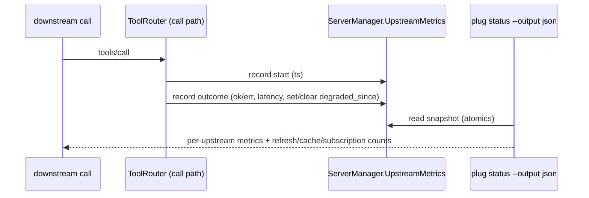

# feat: Operability + Hardening + Test Infra — High-Leverage Improvement Program

## Summary

A strategic review of `plug` surfaced five high-leverage improvements. They form a **multi-PR program**, not one change: the largest (a transport-dispatcher rewrite) touches the three biggest files and the 6.3k-line `ToolRouter` and must land on its own for reviewable, low-risk delivery.

This plan captures the **full five-item roadmap** as the durable design and scopes the **first PR** to the three bounded, additive, low-risk items that deliver value without rewriting core routing:

- **Test isolation/speed** — remove the global daemon-test mutex so the suite runs parallel; pre-build the mock so integration tests don't pay `cargo run` compile cost.
- **Tunneled-path hardening** — reject secretless/public-client OAuth on non-loopback binds; add a `redirect_uri` allowlist and encode `code`/`state` on `/oauth/authorize`.
- **Operability surface** — a per-upstream self-health metrics surface (call counts, latency, error rate, circuit state, degraded-since; refresh durations; artifact-cache size; live subscription counts) exposed through `plug status --output json`.

The remaining three — the transport `RequestDispatcher` (item 1), the first-class degraded-vs-absent model (item 3), and active upstream supervision (item 2b) — are documented under **Deferred Phases** with approach, affected modules, risk, and sequencing (do 3, then 1; supervision last).

---

## Problem Frame

`plug` is feature-complete for its bar but carries three structural/operational drags the review identified:

1. **Transport parity drift** — stdio, HTTP, and daemon IPC each re-implement MCP request handling; features land on stdio/HTTP first and IPC parity arrives later as bug fixes (documented in `docs/solutions/`; the PR #58 progress-token fix was the latest instance). *(Item 1 — deferred.)*
2. **No operability for a "runs for days" daemon** — when an upstream degrades (the iMessage server leaks continuations and needs periodic manual restarts), there is no surface that tells the operator *why* or *since when*. Health is binary-ish; there are no per-upstream call/latency/error metrics. *(Item 2 — observability here, supervision deferred.)*
3. **"Degraded" and "absent" are conflated** — a transient upstream stall is treated like removal in catalog refresh and subscriptions (the PR #58 residual: a listing timeout prunes and upstream-unsubscribes active subscriptions without rebinding). *(Item 3 — deferred.)*

Plus two bounded, independent improvements: the test suite is stuck single-threaded behind a global mutex (slow CI feedback), and the Cloudflare-tunneled downstream HTTP path has an unauthenticated public-client OAuth gap and an open redirector.

This PR takes the three that are safe to land together. The deferred items get their own focused review.

---

## Requirements

**This PR (R1–R7):**

- **R1** — The full test suite passes with parallel threads; CI no longer needs `--test-threads=1`. (item 4)
- **R2** — Integration tests use a pre-built mock binary instead of `cargo run` at test time. (item 4)
- **R3** — A non-loopback HTTP bind with `auth_mode = "oauth"` and no `oauth_client_secret` (public client) is rejected by config validation. (item 5)
- **R4** — `/oauth/authorize` validates `redirect_uri` against a configured allowlist and rejects unlisted URIs. (item 5)
- **R5** — `code` and `state` are percent-encoded in the `/oauth/authorize` `Location` header. (item 5)
- **R6** — `plug status --output json` reports per-upstream metrics: call count, error count/rate, last call latency (or rolling), circuit-breaker state, and degraded-since timestamp; plus catalog refresh duration, artifact-cache size, and live subscription count. (item 2a)
- **R7** — All CI gates pass: `cargo fmt --check`, `cargo clippy --workspace --all-targets -- -D warnings`, `cargo test --workspace` (parallel). Each behavior change carries a test.

**Roadmap (R8–R10, deferred — see Deferred Phases):**

- **R8** — A transport-agnostic `RequestDispatcher` owns MCP method handling once; transports are thin shims; a parameterized parity test asserts identical behavior across stdio/HTTP/IPC. (item 1)
- **R9** — Upstreams have a first-class `healthy | degraded | absent` state; catalog/subscription/notification paths preserve last-known-good for `degraded`. Closes the PR #58 residual. (item 3)
- **R10** — Upstream supervision restarts a server that degrades (not just on disconnect). (item 2b)

---

## Key Technical Decisions

- **KTD-1 (item 4): Replace the global test mutex with explicit path injection, not a smarter lock.** The daemon resolves runtime/state dirs via a process-global `test_runtime_paths()` mutex (`plug/src/daemon.rs:308`) that all daemon tests share, forcing serial execution. Thread a `RuntimePaths { runtime_dir, state_dir }` value through the daemon constructors: production builds it once from XDG (in `main`/`runtime.rs`), tests construct their own from `tempfile::TempDir`. Delete the global mutex and `set/clear_test_runtime_paths`. This removes the *reason* for `--test-threads=1` rather than working around it.
- **KTD-2 (item 4): Pre-build the mock via a `build.rs` or a cargo test-time dependency, not a checked-in binary.** Integration tests shell out to `cargo run -p plug-test-harness --bin mock-mcp-server` (compiles on first use). Use `env!("CARGO_BIN_EXE_mock-mcp-server")` — Cargo builds binary targets before tests and exposes their paths via this env var — so tests exec the already-built binary with zero added build config. (Fallback if the harness mock isn't a `[[bin]]` of the test crate: a `build.rs` that `cargo build`s it once.)
- **KTD-3 (item 4): Drop `--test-threads=1` only after proving parallel-safety.** Run the full suite parallel repeatedly (e.g. ×20) locally before editing `.github/workflows/ci.yml` (lines 38, 49) and `CONTRIBUTING.md` (line 31). Latent shared-state races (fixed ports, env vars, shared temp paths) surface here and get fixed, not re-serialized.
- **KTD-4 (item 5): Reject public-client OAuth off-loopback in `validate_config`, mirroring the existing guard.** `validate_config` (`plug-core/src/config/mod.rs:458`) already rejects `auth_mode = "none"` on a non-loopback bind. Add the symmetric rule: `auth_mode = "oauth"` + `oauth_client_secret.is_none()` + non-loopback ⇒ error. This fails fast at config load instead of silently minting tokens to anyone who knows `client_id` (the secretless `validate_client_auth` path at `downstream_oauth/mod.rs:362`).
- **KTD-5 (item 5): `redirect_uri` allowlist + encoding at the authorize boundary.** `build_authorize_redirect` (`downstream_oauth/mod.rs:138`) interpolates `code`/`state` raw into the `Location` and never checks `redirect_uri`. Add a configured allowlist (default: the loopback callback range plus any explicitly listed URIs) checked before issuing a code, and percent-encode `code`/`state`. Assumption: the allowlist is a new optional `http.oauth_redirect_uri_allowlist` config field defaulting to localhost callbacks (which is what `plug auth login` uses); the user can widen it.
- **KTD-6 (item 2a): A read-side metrics struct recorded on the call path, exposed through the existing status JSON.** Add a per-upstream `UpstreamMetrics` (atomic counters: calls, errors; a rolling/last latency; a `degraded_since: Option<SystemTime>`) held in `ServerManager` alongside the existing `health`/`circuit_breakers` DashMaps (`server/mod.rs:506-509`). Record at the tool-call boundary in `ToolRouter` (`proxy/mod.rs`, where timeout/circuit are already handled). Surface via `overview_json`/`status_json` (`plug/src/views/overview.rs:104,156`) extending the existing `ServerStatus` JSON (`plug-core/src/types.rs:337`). Refresh duration: time `refresh_tools`. Artifact-cache size and subscription count: read existing `ArtifactStore`/`resource_subscriptions` state. Mostly additive and read-side — no routing behavior changes.
- **KTD-7: Metrics carry no behavior.** In this PR, metrics are observability only. They will *inform* item 3 (degraded state) and item 2b (supervision) later, but nothing in this PR acts on them. This keeps the surface low-risk and the PR coherent.

---

## High-Level Technical Design

Program phasing and dependencies (this PR = solid boxes; deferred = dashed):

Metrics data flow (item 2a, read-side):

---

## Implementation Units (this PR)

### U1. Per-test runtime paths; remove the global daemon-test mutex

**Goal:** Daemon tests stop sharing global mutable state so the suite can run parallel.
**Requirements:** R1, R7
**Dependencies:** none
**Files:**
- `plug/src/daemon.rs` (remove `test_runtime_paths()`/`set_test_runtime_paths`/`clear_test_runtime_paths` ~308-325; thread a `RuntimePaths` value through daemon construction; production resolution sites ~248, ~277)
- `plug/src/runtime.rs` (build `RuntimePaths` from XDG once at the production entry point)
- `plug/src/ipc_proxy.rs` + `plug/src/daemon.rs` test modules (each test constructs its own temp `RuntimePaths`)
**Approach:** Introduce `RuntimePaths { runtime_dir, state_dir }`. Production constructs it from XDG (the logic currently behind the `test_runtime_paths` fallback). Tests pass per-test `tempfile::TempDir`-backed paths. Delete the `static … Mutex<Option<…>>` and its setters. Every `set_test_runtime_paths(...)` call site becomes "construct paths, pass into the daemon under test."
**Patterns to follow:** existing `tempfile`/temp-dir usage in `artifacts.rs` tests; the existing daemon test harness in `ipc_proxy.rs` (`spawn_test_daemon`).
**Test scenarios:**
- Existing daemon/IPC tests still pass, now each with isolated paths (no cross-test interference).
- Edge: two daemon tests running concurrently bind distinct sockets/paths and don't collide (proven by U2's parallel run).
**Verification:** All `plug` bin tests pass with isolated paths; the global mutex and its setters are gone (grep).

### U2. Pre-built mock + drop `--test-threads=1`

**Goal:** Faster, parallel test runs.
**Requirements:** R1, R2, R7
**Dependencies:** U1
**Files:**
- `plug-core/tests/integration_tests.rs` (`mock_server_config` ~1150 and any other `cargo run … mock-mcp-server` call sites → use `env!("CARGO_BIN_EXE_mock-mcp-server")`)
- `plug/src/ipc_proxy.rs` test helper `ensure_mock_server_built` (~1362 — simplify/remove now that Cargo pre-builds the bin)
- `.github/workflows/ci.yml` (lines 38, 49 — remove `-- --test-threads=1`)
- `CONTRIBUTING.md` (line 31 — same)
**Approach:** Replace the `cargo run -p plug-test-harness --bin mock-mcp-server -- …` command vector with the pre-built binary path from `CARGO_BIN_EXE_mock-mcp-server` (Cargo sets this for integration tests when the binary is a target the test crate can see; if the mock lives in `plug-test-harness`, add it as a dev-dependency/bin the test crate references, or build once via `build.rs`). Then drop the CI flag.
**Execution note:** Prove parallel-safety before editing CI — run `cargo test --workspace` (no `--test-threads=1`) repeatedly and fix any flake at the source.
**Test scenarios:**
- The whole workspace suite passes with default (parallel) threads, run repeatedly with no flake.
- Integration tests spawn the mock without a `cargo` compile step (observe no compile in test output after a warm build).
**Verification:** CI green without `--test-threads=1`; local `cargo test --workspace` parallel passes ×20.

### U3. Reject public-client OAuth on non-loopback binds

**Goal:** A tunneled OAuth listener can't be a secretless open token mint.
**Requirements:** R3, R7
**Dependencies:** none
**Files:**
- `plug-core/src/config/mod.rs` (`validate_config` ~458 — add the guard next to the existing non-loopback rules)
- test: inline `#[cfg(test)]` in `plug-core/src/config/mod.rs`
**Approach:** Add to `validate_config`: if `!http_bind_is_loopback(bind_address)` and `auth_mode == Oauth` and `http.oauth_client_secret.is_none()` ⇒ push an error ("a confidential OAuth client (oauth_client_secret) is required when binding a non-loopback downstream address"). Mirrors the `auth_mode = "none"` and TLS guards already there.
**Patterns to follow:** the adjacent non-loopback validations (`config/mod.rs:464-486`).
**Test scenarios:**
- Non-loopback bind + oauth + no client secret ⇒ validation error present.
- Loopback bind + oauth + no secret ⇒ no error (local dev stays frictionless).
- Non-loopback bind + oauth + secret set ⇒ no error.
**Verification:** New config-validation tests pass; the existing config tests still pass.

### U4. `redirect_uri` allowlist + encoded `code`/`state` on authorize

**Goal:** Close the open-redirector and stop emitting unencoded params.
**Requirements:** R4, R5, R7
**Dependencies:** none
**Files:**
- `plug-core/src/downstream_oauth/mod.rs` (`build_authorize_redirect` ~138-180 — allowlist check + percent-encode)
- `plug-core/src/config/mod.rs` (new optional `http.oauth_redirect_uri_allowlist: Vec<String>`, default to loopback callbacks)
- test: inline `#[cfg(test)]` in `plug-core/src/downstream_oauth/mod.rs`
**Approach:** Before issuing a code, verify `redirect_uri` matches the allowlist (exact match against configured entries; default allowlist = localhost/127.0.0.1 callback origins used by `plug auth login`). Reject unlisted URIs with an error (no redirect). Percent-encode `auth_code` and `state` when building the `Location` value.
**Patterns to follow:** existing `build_authorize_redirect` structure; `url`/`percent-encoding` (already in the dep tree via `url`/`reqwest`).
**Test scenarios:**
- `redirect_uri` not on the allowlist ⇒ rejected, no `Location` issued.
- Allowlisted `redirect_uri` ⇒ redirect issued.
- `state` containing `&`/`=`/spaces ⇒ appears percent-encoded in the `Location`, round-trips correctly.
- Edge: `redirect_uri` already containing a query string still appends params correctly (the `?`/`&` separator logic at ~176).
**Verification:** New authorize tests pass; existing OAuth tests still pass.

### U5. Per-upstream metrics struct + recording

**Goal:** Capture per-upstream call/latency/error/degraded data and refresh/cache/subscription metrics.
**Requirements:** R6, R7
**Dependencies:** none
**Files:**
- `plug-core/src/server/mod.rs` (`UpstreamMetrics` held in `ServerManager` next to `health`/`circuit_breakers` ~506-509; accessor to snapshot it)
- `plug-core/src/proxy/mod.rs` (record call start/outcome + latency at the tool-call boundary; time `refresh_tools` duration)
- test: inline `#[cfg(test)]` in `plug-core/src/server/mod.rs` (metrics recording) and `proxy/mod.rs` (refresh-duration capture)
**Approach:** `UpstreamMetrics` with atomics: `call_count`, `error_count`, `last_latency_ms` (or a small rolling window), `degraded_since: Mutex<Option<SystemTime>>` (set on first failure/circuit-open, cleared on success). Record in the existing call path where timeout/circuit handling already lives. Capture `refresh_tools` wall-clock into a router-level field. Artifact-cache size = `ArtifactStore` total bytes (already tracked for eviction); subscription count = `resource_subscriptions` len. All read-side; no routing change.
**Patterns to follow:** the `CircuitBreaker` atomic-counter style (`circuit.rs:82`); existing DashMap-per-server state in `ServerManager`.
**Test scenarios:**
- A successful call increments `call_count`, records latency, leaves `degraded_since` clear.
- A failing/timed-out call increments `error_count` and sets `degraded_since`; a subsequent success clears it.
- `refresh_tools` populates a non-zero refresh-duration metric.
- Edge: metrics for a server with zero calls read as zeros, not absent/panic.
**Verification:** Metrics unit tests pass; recording adds no measurable hot-path cost (atomics only).

### U6. Expose metrics via `plug status --output json`

**Goal:** The operator can see per-upstream health/latency/error/degraded-since and runtime counters in machine-readable form.
**Requirements:** R6, R7
**Dependencies:** U5
**Files:**
- `plug-core/src/types.rs` (extend `ServerStatus` ~337 with the metrics fields, or a nested `metrics` object)
- `plug/src/views/overview.rs` (`overview_json`/`status_json` ~104-160 — include the new fields; text view optional, JSON is the contract)
- the daemon/runtime path that builds `ServerStatus` from `ServerManager` (populate metrics from the U5 snapshot)
- test: `plug/src/views/overview.rs` inline tests (assert the JSON contract includes the metrics fields)
**Approach:** Add the metrics to the `ServerStatus` JSON shape (and a top-level `runtime` object for refresh-duration/artifact-cache-size/subscription-count). Populate from the U5 snapshot wherever `ServerStatus` is assembled. Keep field names stable and documented; this is an agent-facing contract surface.
**Patterns to follow:** the existing `status_json_includes_inventory_contract_fields` test (`overview.rs:750`) and the inventory-contract JSON shape.
**Test scenarios:**
- `plug status --output json` includes per-server `call_count`, `error_count`, `circuit_state`, `degraded_since` (null when healthy), `last_latency_ms`.
- Top-level runtime object includes `last_refresh_ms`, `artifact_cache_bytes`, `live_subscription_count`.
- Cold path (daemon not running) still emits a stable schema (metrics null/zero, not missing keys) — mirrors the existing cold-path contract concern.
**Verification:** JSON-contract tests pass; `plug status --output json` against a live daemon shows populated metrics.

---

## Deferred Phases (own PRs — design captured, not implemented here)

Sequencing: **item 3 → item 1 → item 2b.** Do the degraded-vs-absent model first (it's the data model item 1's dispatcher and item 2b's supervision both build on); then the dispatcher rewrite; supervision last.

### Item 3 — First-class `degraded | absent` upstream state (R9; closes PR #58 residual)

**Approach:** Introduce an availability state per upstream (`healthy | degraded | absent`) distinct from removal. In catalog refresh (`refresh_tools`, `proxy/mod.rs` ~1578-1690) and `ServerManager::get_resources/get_prompts` (`server/mod.rs`), a server that fails/times out on listing is marked `degraded` and its **last-known-good** resources/routes are carried forward instead of pruned — so resource subscriptions are not upstream-unsubscribed and don't need to rebind. `absent` (genuinely removed from config) keeps today's prune behavior. The U5 metrics (degraded_since) feed this. **Risk:** mutates core catalog/subscription semantics; needs the cross-transport subscription tests and a "degraded server keeps its subscription" regression test. **Affected:** `proxy/mod.rs` (refresh + subscription prune/rebind), `server/mod.rs` (listing → degraded signal), `types.rs` (availability state).

### Item 1 — Transport `RequestDispatcher` + parity matrix (R8)

**Approach:** Extract a transport-agnostic dispatcher in `plug-core` owning parse→context→route→respond for every MCP method, behind a `DownstreamContext` trait (client identity, capabilities, bridge handle, session key). Migrate one method family at a time (start with `tools/call` — the worst-duplicated), pointing stdio (`proxy/mod.rs`), HTTP (`http/server.rs`), and daemon IPC (`daemon.rs`) at it and deleting their copies. Add **one parameterized test** running each MCP method over all three transports asserting identical responses/error codes — converting the recurring parity-drift bug class into a CI gate. Forces `ToolRouter` to decompose along seams (catalog / tasks / notifications / subscriptions). **Risk: highest in the repo** — rewrites the three largest files + the god-object; must keep all tests green per method-family migration. **Prereq:** item 3 first, so the dispatcher is built against the final availability model. **Affected:** `proxy/mod.rs`, `http/server.rs`, `daemon.rs`, `ipc_proxy.rs`, new `plug-core/src/dispatch/`.

### Item 2b — Upstream supervision: restart-on-degradation (R10)

**Approach:** Build on item 3's `degraded` state + the U5 metrics. When a server stays `degraded` past a threshold (sustained error rate / circuit open / latency blow-up — e.g. the iMessage continuation leak), supervise a process restart (stdio) or reconnect-with-reset (HTTP/SSE), bounded by backoff, not just reconnect-on-disconnect. **Risk:** process-lifecycle management; restart storms; must be backoff-bounded and observable (emit a restart event surfaced in status). **Affected:** `server/mod.rs` (lifecycle), `health.rs` (degradation thresholds), `engine.rs` (supervised task).

---

## Scope Boundaries

### In scope (this PR)
R1–R7: items 4, 5, and 2a.

### Deferred to Follow-Up Work (own PRs, sequenced)
Item 3 (R9), item 1 (R8), item 2b (R10) — designed above.

### Out of scope entirely
Any product-surface expansion (WebSocket, TUI, live runtime reconfiguration). Acting on metrics in this PR (metrics are observability-only here, per KTD-7).

---

## Risks & Mitigations

- **U2 dropping `--test-threads=1` exposes latent races.** That's the point — fix at the source (per-test ports/paths/env), never re-serialize. Gate the CI edit on a repeated parallel run (KTD-3).
- **U4 allowlist default too narrow could break `plug auth login`.** Default the allowlist to the exact localhost callback origins `plug auth login` already uses; cover the login flow's redirect in a test.
- **U6 changes an agent-facing JSON contract.** Add fields (don't rename/remove); keep the cold-path schema stable (null/zero, not missing keys) so existing consumers don't break.
- **U5 hot-path cost.** Atomics only on the call path; no locks except `degraded_since` (rare transitions). Verify no measurable per-call overhead.
- **Test serialization removal is workspace-wide.** Run `plug-core`, `plug`, and integration suites parallel separately and together before the CI edit.

---

## Verification (this PR)

- `cargo fmt --check` clean; `cargo clippy --workspace --all-targets -- -D warnings` clean.
- `cargo test --workspace` (parallel, no `--test-threads=1`) green, run repeatedly with no flake.
- New tests: config guard (U3), authorize allowlist/encoding (U4), metrics recording (U5), status JSON contract (U6), isolated daemon tests (U1).
- Manual: `plug status --output json` shows populated per-upstream metrics against a live daemon; a non-loopback oauth config without a secret fails `plug config check`.

## Post-Merge Truth Pass (required by CLAUDE.md)

After merge: update `docs/PROJECT-STATE-SNAPSHOT.md` (new operability surface; CI now parallel; downstream-OAuth hardening) and `docs/PLAN.md` (dated entry; the three deferred items recorded as the next phases with their sequencing). Confirm merged code is on `main` and the snapshot/PLAN match.
