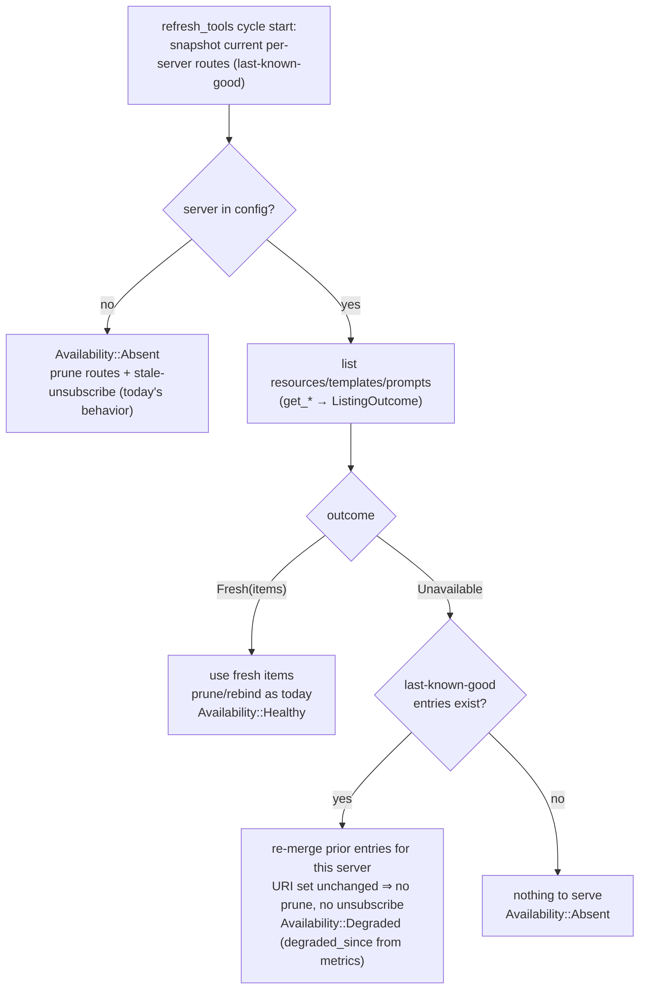
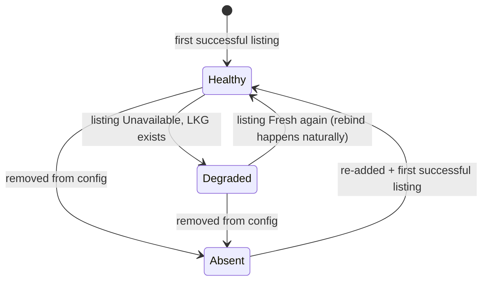

# feat: First-Class `healthy | degraded | absent` Upstream Availability State

## Summary

Deferred **item 3** of the operability/hardening program (origin: `docs/plans/2026-06-10-002-feat-operability-hardening-program-plan.md`, requirement **R9**). This is its own PR, sequenced **first** — before the transport `RequestDispatcher` rewrite (item 1) and active supervision (item 2b), both of which build on the availability model this plan establishes.

Today `plug` conflates two very different upstream conditions:

- a **transient stall** — a server is connected but slow/erroring on a `list_resources`/`list_prompts` call, and
- **genuine absence** — a server was removed from config, or has never successfully listed anything.

The listing methods return `Ok(Vec::new())` on timeout/error (`plug-core/src/server/mod.rs` `get_resources` et al.), so the catalog refresh (`refresh_tools`, `plug-core/src/proxy/mod.rs`) treats a stalled server identically to one that genuinely has zero resources: it prunes that server's routes and best-effort-sends upstream `resources/unsubscribe` for any active subscription, then never rebinds when the server recovers. This is the **PR #58 residual** recorded in `docs/PROJECT-STATE-SNAPSHOT.md`.

This plan introduces a first-class availability distinction so a stalled server keeps serving its **last-known-good** catalog (and keeps its subscriptions) while `absent` servers prune as they do today, and surfaces `healthy | degraded | absent` in the `plug status --output json` contract. Metrics carry the degraded-since signal already (PR #60's `UpstreamMetrics.degraded_since_epoch`); this plan reuses it rather than inventing a parallel timestamp.

---

## Problem Frame

`refresh_tools` rebuilds the merged catalog each cycle from `ServerManager::get_tools/get_resources/get_resource_templates/get_prompts`. When one of those listing calls times out, the method logs a warning and returns `Ok(Vec::new())` (`server/mod.rs` ~1186-1192). The refresh therefore sees the stalled server as having **no** resources/prompts and:

1. drops its entries from `resource_routes` / `prompt_routes` (`proxy/mod.rs` ~1579),
2. detects the now-missing URIs as stale subscriptions, removes them from the `resource_subscriptions` registry, and queues `stale_unsubscribes` (~1581-1631),
3. sends best-effort upstream `unsubscribe` for each (~1650-1667).

When the upstream recovers on a later refresh, the resource reappears in the routes — but the subscription was already torn down downstream-side and upstream-side, with no rebind. The downstream client silently stops receiving `resources/updated` notifications it is still subscribed to.

The root cause is a **missing semantic**: the system cannot distinguish "this server failed to answer, keep what we had" from "this server legitimately has nothing / is gone." Everything downstream of that ambiguity (prune, unsubscribe, no-rebind) is correct *only* for true absence.

There is partial vocabulary already (`ServerHealth::{Healthy, Degraded, Failed, AuthRequired}` in `types.rs`), but it is health-of-connection, not availability-of-catalog: a server can be `Healthy` by the failure-counter state machine and still time out a single listing call, and `ServerHealth` is not consulted by `refresh_tools` when deciding to prune. We need an availability signal derived from the *listing outcome of this refresh cycle*, not from the rolling health counter.

---

## Requirements

- **R9** (origin) — Upstreams have a first-class `healthy | degraded | absent` availability state; catalog, subscription, and notification paths preserve last-known-good for `degraded`; `absent` keeps today's prune behavior. Closes the PR #58 subscription-rebind residual.

Derived, plan-local:

- **L1** — Listing methods must distinguish a failed/timed-out listing from a genuinely empty one, so the refresh can branch on it.
- **L2** — A server whose listing is unavailable this cycle keeps its last-known-good resources/resource-templates/prompts in the merged catalog, and its active resource subscriptions are **not** pruned or upstream-unsubscribed.
- **L3** — A server that returns a *fresh* listing prunes/rebinds exactly as today (no behavior change for the healthy path).
- **L4** — A server removed from config (absent) prunes as today.
- **L5** — `plug status --output json` reports an `availability` value of `healthy`, `degraded`, or `absent` per server, with a stable always-present schema (additive field; existing consumers unaffected).
- **L6** — A regression test proves the PR #58 scenario is fixed: a listing timeout on a server with an active subscription does **not** unsubscribe upstream and does **not** drop the subscription; last-known-good is carried forward.
- **R7** (carried) — All CI gates pass: `cargo fmt --check`; `cargo clippy --workspace --all-targets -- -D warnings`; `cargo test --workspace -- --test-threads=1`. Each behavior change carries a test.

---

## Key Technical Decisions

- **KTD-1: Stop conflating timeout with empty — listing methods return a `ListingOutcome`, not a bare `Vec`.** The failure arm in `get_resources`/`get_resource_templates`/`get_prompts` (`server/mod.rs`) currently returns `Ok(Vec::new())`. Change these to return an outcome that distinguishes `Fresh(items)` (the call succeeded — empty is a legitimate answer) from `Unavailable` (timeout or transport error). This is the single seam the whole feature hinges on: without it, the refresh has no signal to branch on. Keep the change internal to `ServerManager` ↔ `ToolRouter`; it is not a wire/JSON contract.

- **KTD-2: Carry last-known-good in `refresh_tools` by reusing the router's existing routes for `Unavailable` servers.** The router already holds the current `resource_routes` / `prompt_routes` / template and tool routes (the previous cycle's catalog). When a server's listing comes back `Unavailable`, contribute *its existing entries* to the rebuilt catalog instead of nothing. Snapshot the current per-server entries at the top of the refresh, and for each `Unavailable` server merge its prior entries back in. This means the URI set for that server is unchanged across the cycle, so the stale-subscription detection (~1590-1617) naturally finds nothing to prune for it — no special-casing of the subscription loop required, which keeps the high-risk prune/unsubscribe code path untouched in its logic.

- **KTD-3: Availability is derived per-refresh-cycle, not a new stored state machine.** Represent availability as a new `Availability` enum (`Healthy | Degraded | Absent`) computed from (a) whether the server was present in config this cycle and (b) the listing outcome and (c) whether any last-known-good entries exist. Do **not** build a second rolling state machine beside `HealthState` — compute availability from the cycle's facts plus the already-existing `degraded_since_epoch` metric. Mapping:
  - `Healthy` — listing succeeded this cycle (fresh data served).
  - `Degraded` — listing was `Unavailable` this cycle but last-known-good entries exist and are being served.
  - `Absent` — server removed from config, or present-but-failing with no last-known-good to serve (nothing in the catalog for it).

- **KTD-4: Reuse `UpstreamMetrics.degraded_since_epoch` (PR #60) as the degraded-since signal.** When a listing goes `Unavailable`, the existing `record_call(server, ok=false, …)` path already sets `degraded_since_epoch`; the availability surfacing reads it via the existing `metrics_snapshot_or_default`. Do not add a parallel timestamp. The `Availability` value and the `degraded_since_epoch_secs` already in `UpstreamMetricsSnapshot` stay consistent because both derive from the same listing-outcome event.

- **KTD-5: Surface `availability` as an additive field on `ServerStatus`, defaulted for schema stability.** Add `availability: Availability` to `ServerStatus` (`types.rs`) with `#[serde(default)]` so cold-path / older-consumer reads always see a value and never a missing key — mirroring how PR #60 handled `metrics`. `Availability` serializes as a lowercase string (`"healthy"|"degraded"|"absent"`) to match the existing `circuit_state` / `auth_status` string-enum convention in the JSON contract.

- **KTD-6: Tools follow the same carry-forward, but `get_tools` is already cache-backed.** Per the recon, `get_tools` returns cached tools and does not hit the `Ok(Vec::new())`-on-timeout path the resource/prompt listers do, so tool routes are not the residual's locus. Apply carry-forward uniformly via the KTD-2 mechanism (reuse prior routes for `Unavailable` servers) so a future change to `get_tools` cannot reintroduce the bug, but add no tool-specific special-casing.

---

## High-Level Technical Design

Listing-outcome → refresh-branch → availability, per server per refresh cycle:

State semantics (note: `Absent` is not a stored health state — it is the absence of servable catalog for a configured-or-removed server):

---

## Implementation Units

### U1. `ListingOutcome` — distinguish failed listing from empty listing

**Goal:** Give the refresh a signal to branch on; stop returning `Ok(Vec::new())` for a timeout.
**Requirements:** L1, R7
**Dependencies:** none
**Files:**
- `plug-core/src/server/mod.rs` (`get_resources` ~1155-1214, `get_resource_templates` ~1216-1272, `get_prompts` ~1274-1330 — change the timeout/error arm; introduce a `ListingOutcome<T>` enum or a `(Vec<T>, bool available)` return)
- `plug-core/src/server/mod.rs` `#[cfg(test)]` (outcome unit tests)
**Approach:** Introduce an internal `ListingOutcome<T> { Fresh(Vec<T>), Unavailable }` (or equivalent). On timeout or transport error, return `Unavailable` instead of `Ok(Vec::new())`; on success return `Fresh(items)` (including a legitimately empty vec). Keep the existing `tracing::warn!` on the failure arm. These methods are internal to the crate (`pub(crate)` surface), so the signature change ripples only to `ToolRouter` callers in `proxy/mod.rs`, updated in U2. Record the failure through the existing `record_call(server, ok=false, …)` so `degraded_since_epoch` is set (KTD-4) — confirm whether the call path already records it; if not, add the record here.
**Patterns to follow:** the existing timeout block structure in `get_resources`; the `UpstreamMetrics::record` call sites added in PR #60.
**Test scenarios:**
- `get_resources` returns `Fresh(vec![...])` when the upstream answers (including `Fresh(vec![])` for a genuinely empty server — assert this is distinct from `Unavailable`).
- `get_resources` returns `Unavailable` when the upstream times out (simulate with a stalling mock or a zero/short `call_timeout_secs`).
- The `Unavailable` arm still emits the warning and sets `degraded_since_epoch` via `record_call`.
**Verification:** Listing-outcome unit tests pass; callers compile against the new return type after U2.

### U2. Last-known-good carry-forward in `refresh_tools`

**Goal:** A server that fails to list this cycle keeps its prior resources/templates/prompts in the catalog, so no prune and no upstream-unsubscribe fire for it.
**Requirements:** L2, L3, L4, R7
**Dependencies:** U1
**Files:**
- `plug-core/src/proxy/mod.rs` (`refresh_tools` ~1238-1690 — snapshot current per-server routes before rebuild; for `Unavailable` servers merge prior entries back; leave the stale-subscription detection ~1590-1631 and best-effort unsubscribe ~1650-1667 logically unchanged)
- `plug-core/tests/integration_tests.rs` and/or `plug-core/src/proxy/mod.rs` `#[cfg(test)]`
**Approach:** At the top of `refresh_tools`, capture the current per-server slice of `resource_routes` / `prompt_routes` / template routes / tool routes (the last-known-good). When assembling the new catalog, for each server whose `ListingOutcome` is `Unavailable` and which has last-known-good entries, contribute those prior entries instead of the empty set. Because the server's URI set is then identical across the cycle, the existing stale-detection `retain` finds no missing URIs for it and queues nothing — the subscription registry and upstream subscriptions are untouched with no change to that loop's logic (KTD-2). A server removed from config has no `ListingOutcome` (it is gone) and no carry-forward, so it prunes as today (L4). A `Fresh` server applies its new list and prunes/rebinds as today (L3).
**Patterns to follow:** the existing route-rebuild and `stale_unsubscribes` collection in `refresh_tools`; the per-server route grouping already present.
**Execution note:** Start from a failing integration test for the carry-forward contract (U4's regression test is the natural driver), then implement until green, keeping every existing subscription test green.
**Test scenarios:**
- A `Fresh` server that genuinely dropped a resource still prunes + unsubscribes that URI (no regression to L3 — fresh-empty must still prune).
- An `Unavailable` server with prior resources keeps every prior URI in the merged catalog this cycle.
- An `Unavailable` server with **no** prior entries contributes nothing (degenerate-absent; no panic, no stale entries).
- Mixed cycle: server A `Fresh` (applies changes), server B `Unavailable` (carries forward) — A's prune does not touch B's routes and vice versa.
**Verification:** Integration refresh tests pass; the existing `test_refresh_tools_skips_upstream_that_stalls_on_resource_listing` still passes; no subscription churn for the stalled server.

### U3. `Availability` enum + `ServerStatus` JSON surfacing

**Goal:** Operators and agents can read `healthy | degraded | absent` per server in `plug status --output json`.
**Requirements:** L5, R7
**Dependencies:** U2 (availability is computed from the refresh outcome)
**Files:**
- `plug-core/src/types.rs` (new `Availability` enum with lowercase serde rename; add `availability: Availability` to `ServerStatus` ~356-373 with `#[serde(default)]`)
- `plug-core/src/server/mod.rs` (`server_statuses()` ~1414-1463 — populate `availability` from the latest refresh outcome / presence + last-known-good)
- `plug/src/views/overview.rs` (confirm `status_json` flows `ServerStatus.availability` through automatically; add/adjust the contract test)
- `plug-core/src/types.rs` `#[cfg(test)]` and `plug/src/views/overview.rs` `#[cfg(test)]`
**Approach:** Define `Availability { Healthy, Degraded, Absent }` deriving `Serialize/Deserialize` with `#[serde(rename_all = "lowercase")]` and a sensible `Default` (`Healthy`) so cold-path reads emit a stable value (KTD-5). Store the per-server availability where the refresh outcome is known (a small `DashMap<String, Availability>` on `ServerManager` alongside `metrics`, set during `refresh_tools` / its `ServerManager` hook), and read it in `server_statuses()`. A configured server with no successful listing yet and no last-known-good reads `Absent`; a carried-forward server reads `Degraded`; a freshly-listed server reads `Healthy`. Keep the field additive — do not rename or remove existing `ServerStatus` fields.
**Patterns to follow:** PR #60's `metrics: Option<UpstreamMetricsSnapshot>` additive field + `metrics_snapshot_or_default` schema-stability approach; the `circuit_state`/`auth_status` lowercase-string-enum convention; the existing `status_json_includes_per_upstream_metrics` test in `overview.rs`.
**Test scenarios:**
- `ServerStatus` serializes `availability` as `"healthy"`/`"degraded"`/`"absent"` (string, lowercase).
- A server with metrics but never-degraded serializes `availability: "healthy"` and a healthy `degraded_since_epoch_secs: null` — assert the two signals agree.
- A degraded (carried-forward) server serializes `availability: "degraded"` and a non-null `degraded_since_epoch_secs`.
- Cold path (daemon not running / unreachable server branch of `server_statuses`) still emits the `availability` key (default, not missing) — mirrors the existing cold-path schema-stability concern.
- `plug status --output json` top-level shape includes per-server `availability` (contract test in `overview.rs`).
**Verification:** Type + JSON-contract tests pass; `availability` is present in every `ServerStatus` JSON object.

### U4. Regression test — degraded server keeps its subscription (closes the PR #58 residual)

**Goal:** Prove the original bug is fixed and lock it against regression.
**Requirements:** L6, R9, R7
**Dependencies:** U2, U3
**Files:**
- `plug-core/tests/integration_tests.rs` (new test beside `test_refresh_tools_skips_upstream_that_stalls_on_resource_listing` ~1247-1270)
- if a unit-level seam is cleaner for asserting "no upstream unsubscribe sent", add a focused `#[cfg(test)]` in `plug-core/src/proxy/mod.rs` beside `resource_subscription_registry_lifecycle` ~5801
**Approach:** Construct a mock upstream advertising a resource; subscribe a downstream client to that resource URI (registry has an active subscriber). Drive a `refresh_tools` cycle in which the upstream **stalls** on `list_resources` (so the listing is `Unavailable`). Assert: (a) the resource URI is still present in the merged catalog (last-known-good carried), (b) the subscription is still in `resource_subscriptions` with its subscriber, (c) **no** upstream `resources/unsubscribe` was sent for that URI, and (d) `availability` for that server reads `degraded`. Then drive a recovery cycle where the upstream answers `Fresh` and assert the server reads `healthy` and the subscription still delivers updates (no rebind needed because it was never torn down).
**Patterns to follow:** the stalling-upstream construction in the existing skip-on-stall integration test; the mock-server harness in `plug-test-harness`; `resource_subscription_registry_lifecycle` for registry assertions.
**Test scenarios:**
- Covers R9 / the PR #58 residual: stall-during-listing with an active subscription ⇒ no unsubscribe, subscription retained, URI retained, `availability=degraded`.
- Recovery: subsequent `Fresh` listing ⇒ `availability=healthy`, subscription intact and delivering.
- Control (no regression): a `Fresh` listing that genuinely removes the resource ⇒ subscription pruned + unsubscribe sent (the today-behavior for true removal still holds).
**Verification:** New regression test passes; all pre-existing subscription/refresh tests stay green under `cargo test --workspace -- --test-threads=1`.

---

## Scope Boundaries

### In scope
L1-L6 / R9: the listing-outcome seam, last-known-good carry-forward, the `Availability` enum + JSON surfacing, and the regression test. Resources are the residual's locus; resource-templates and prompts get the same carry-forward for consistency.

### Deferred to Follow-Up Work
- **Active supervision (item 2b)** — restarting/reconnecting a server that stays `Degraded` past a threshold. This plan makes `degraded` first-class and observable; acting on it is the next program phase.
- **Transport `RequestDispatcher` (item 1)** — sequenced after this; it will be built against the availability model established here.
- **Configurable degraded-retention policy** (e.g., evict last-known-good after N consecutive degraded cycles or a max staleness window). This plan carries last-known-good indefinitely while degraded; a staleness bound is a follow-up if stale-catalog risk proves material.

### Out of scope entirely
Any new product surface; acting on availability (supervision/restart); changing the `HealthState` failure-counter machine or `CircuitState`.

---

## Risks & Mitigations

- **Mutating core catalog/subscription semantics is the highest-risk area in this PR.** Mitigation: the carry-forward (KTD-2) is designed so the prune/unsubscribe *loop logic is unchanged* — an `Unavailable` server's URI set is identical across the cycle, so the existing stale-detection simply finds nothing. The control test in U4 (fresh-empty still prunes) guards the healthy path against accidental "never prune" regressions.
- **Stale catalog served indefinitely while degraded.** A server stuck degraded keeps serving last-known-good with no staleness bound. Mitigation: `availability=degraded` + `degraded_since_epoch` make the staleness visible to operators now; a retention policy is deferred (Scope Boundaries) and supervision (item 2b) is the real remedy.
- **`Absent` vs `Degraded` boundary for a never-listed failing server.** A configured server that has never successfully listed has no last-known-good, so it reads `Absent` even though it is "present but failing." Mitigation: this is the intended semantic (nothing servable = absent from the catalog's perspective); documented in KTD-3 and asserted in U2's degenerate-absent scenario.
- **JSON contract change.** `availability` is additive with a default; existing consumers that ignore unknown fields are unaffected, and cold-path reads emit the default rather than a missing key (KTD-5), matching PR #60's metrics-schema discipline.

---

## Verification

- `cargo fmt --check` clean; `cargo clippy --workspace --all-targets -- -D warnings` clean.
- `cargo test --workspace -- --test-threads=1` green, including the new U4 regression test and all pre-existing subscription/refresh tests.
- New tests: listing-outcome (U1), carry-forward refresh (U2), availability type + status JSON contract (U3), degraded-keeps-subscription regression + recovery + control (U4).
- Manual: against a live daemon, stall an upstream's listing and confirm `plug status --output json` shows that server `availability: "degraded"` with a non-null `degraded_since_epoch_secs`, the merged catalog still lists its resources, and a downstream subscription keeps receiving `resources/updated`.

## Post-Merge Truth Pass (required by CLAUDE.md)

After merge: update `docs/PROJECT-STATE-SNAPSHOT.md` (PR #58 residual now closed; `degraded|absent` availability is first-class and surfaced in `plug status --output json`) and `docs/PLAN.md` (dated entry; remove the subscription-rebind item from Remaining Work; record item 1 / item 2b as the remaining deferred phases). Confirm merged code is on `main` and the snapshot/PLAN match.
