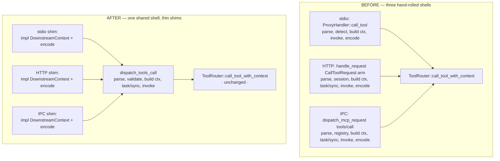

# feat: Transport-Agnostic `tools/call` Dispatcher — First Slice of Item 1

## Summary

First slice of deferred **item 1** of the operability/hardening program (origin: `docs/plans/2026-06-10-002-feat-operability-hardening-program-plan.md`, requirement **R8**). Its own PR. Item 3 (degraded-vs-absent availability) is already done on `main`; this dispatcher is built against that final availability model.

This PR migrates **one MCP method family — `tools/call` — only.** Other families (`tools/list`, `resources/*`, `prompts/*`, completion, subscriptions) stay on their current per-transport paths and migrate in follow-up PRs.

**Ground-truth correction to the program-plan premise.** The program plan framed item 1 as "three duplicated copies of `tools/call` to delete." Codebase research shows that is **not** the shape for this method family: the routing core is **already transport-agnostic and shared**. All three transports already delegate to `ToolRouter::call_tool_with_context()` → `call_tool_inner()` (`plug-core/src/proxy/mod.rs`):

- **stdio** — `ProxyHandler::call_tool` (`plug-core/src/proxy/mod.rs` ~4390) builds a `DownstreamCallContext` and calls `call_tool_with_context`.
- **HTTP** — the `CallToolRequest` arm of `handle_request` (`plug-core/src/http/server.rs` ~1272) builds a `DownstreamCallContext` and calls `call_tool_with_context`.
- **daemon IPC** — the `tools/call` case of `dispatch_mcp_request` (`plug/src/daemon.rs` ~2164) builds a `DownstreamCallContext` and calls `call_tool_with_context`.

What is **actually** duplicated and drift-prone is the **adapter shell** wrapped around that shared core — each transport independently: parses params, validates the tool name, detects client type, builds the context, branches task-vs-sync, invokes the router, and **encodes the response/error in its own wire shape** (~25 lines stdio, ~65 HTTP, ~110 IPC). The error-encoding step is where parity genuinely diverges (stdio: JSON-RPC error via peer; HTTP: 200 with error in body; IPC: `McpResponse`-with-error *or* an `Error` frame).

So this slice delivers two things of real value:

1. **A formal `DownstreamContext` trait + a single `dispatch_tools_call` adapter in `plug-core`** that owns the parse → context → (task/sync) → invoke → typed-result step once. Each transport keeps only its trait impl (identity, capabilities, session key, bridge) and its wire encoding. The hand-rolled middles are deleted.
2. **The parity matrix test** — the centerpiece — that drives identical `tools/call` scenarios through stdio, HTTP, and IPC and asserts identical decoded results and identical error codes/shapes, converting the recurring parity-drift bug class into a CI gate. This requires building the **first IPC end-to-end test harness** (none exists today).

This is a **refactor with no product-surface behavior change.** Client-aware filtering, meta-tool mode, progress/cancellation routing, and reverse-request (elicitation/sampling) forwarding for `tools/call` must continue to work identically across every transport.

---

## Problem Frame

**Roadmap (R8):** a transport-agnostic dispatcher owns MCP method handling once; transports are thin shims; a parameterized parity test asserts identical behavior across stdio/HTTP/IPC.

**Why it matters here, concretely:**

- The three adapter shells drift independently. Research already found divergences for `tools/call`: HTTP and IPC branch on `params.task` (task augmentation / `enqueue_tool_task`) but stdio does **not**; tool-filtering entry points differ (stdio via `list_tools_for_client`, HTTP via `list_tools_page_for_client_session` with an explicit lazy session key); error encodings differ three ways. Each divergence is a latent parity bug.
- There is **no automated guard** that the three transports behave identically for any method. The cross-transport bug class (a fix lands on one transport, the others rot) has recurred — PR #58's subscription residual was one instance. Item 1's deliverable is to make that class a CI gate.
- Item 1 is sequenced after item 3 specifically so the dispatcher is built against the final `healthy | degraded | absent` availability model. Research confirms the call path already does the right thing: routing gates only on `ServerHealth::is_routable()` (Healthy + Degraded route; Failed + AuthRequired do not), and degraded servers serve from the last-known-good catalog. **No routing change is needed** — the parity test just needs to lock this in as a regression guard.

**Scope of the behavioral contract being frozen:** for `tools/call`, identical decoded `CallToolResult` on success and identical error *code* + canonical shape on failure, across all three transports, for: happy-path success, unknown tool, upstream error, and (where observable) cancellation/timeout — while preserving meta-tool interception, client-aware visibility, progress forwarding, and reverse-request forwarding.

---

## Requirements

- **R8 (this slice, `tools/call` only):** one shared dispatch path owns the `tools/call` adapter shell; stdio/HTTP/IPC become thin shims over it; a parameterized parity test asserts identical success results and error shapes across all three transports.
- **R8-preserve:** no regression in client-aware filtering, meta-tool mode, progress/cancellation routing, or reverse-request forwarding for `tools/call` on any transport.
- **R8-availability:** `tools/call` routing continues to honor the availability model already on `main` — degraded upstreams remain routable and serve last-known-good; no reintroduction of prune-on-degraded semantics. (Already true; guarded by test.)

Out of this slice (R8 remainder): all other method families, and the full `ToolRouter` god-object decomposition. Explicitly deferred — see Scope Boundaries.

---

## Key Technical Decisions

### KTD1 — The dispatcher this slice adds is the *adapter shell*, not a re-route of the routing engine

The routing engine (`call_tool_with_context` → `call_tool_inner`) is already shared and already transport-agnostic; it is **not** rewritten here. The new `plug-core/src/dispatch/` module owns the *shell* around it: a `DownstreamContext` trait + a `dispatch_tools_call` function that performs parse → validate name → build `DownstreamCallContext` → branch task/sync → invoke router → return `Result<CallToolResult, McpError>`. Rationale: research shows the genuine duplication and drift live in the shell, not the route. Rewriting the already-shared core would be churn with no safety gain and maximal risk. This corrects the program-plan premise honestly rather than inventing duplication to delete.

### KTD2 — `DownstreamBridge` impls stay transport-specific; the trait does not abstract the bridge mechanism

`StdioBridge` (direct `peer` calls), `HttpBridge` (JSON-RPC over SSE + POST response correlation), and `DaemonBridge` (IPC reverse-request channel) are irreducibly different and cannot be unified. They remain registered exactly as today. The `DownstreamContext` trait exposes only what the *dispatch shell* needs (client identity, client type, capabilities for context, session key, request id). Reverse-request forwarding continues to flow through the existing `register_downstream_bridge` / `NotificationTarget` machinery untouched.

### KTD3 — Do NOT add a `DownstreamTransport::Ipc` variant in this slice

Today IPC reuses `DownstreamCallContext::stdio_for_client()`, so it shares the `stdio:{client_id}` lazy-session-key namespace. Adding a real `Ipc` transport variant would change `lazy_session_key` formatting and could alter lazy-tool working-set behavior for IPC clients — a behavior change outside this refactor's "no product-surface change" contract. The dispatcher works regardless of the enum value, so the IPC identity split is **deferred to a follow-up**. Recorded as a known latent smell, not fixed here.

### KTD4 — Response/error *encoding* stays per-transport; parity is asserted at the decoded level

`dispatch_tools_call` returns `Result<CallToolResult, McpError>`. Each transport keeps its own encoding (peer send / HTTP body / IPC frame) because the wire formats are genuinely different. The parity test asserts equality on the **decoded** `CallToolResult` and on the **error code + canonical fields**, normalizing away transport-envelope differences (HTTP 200-with-error-body vs JSON-RPC error frame). This is the correct seam: unify the decision, not the envelope.

### KTD5 — Task-augmentation branch is unified through the dispatcher, behavior-verified by the matrix

Today HTTP and IPC branch on `params.task` (→ `enqueue_tool_task` with a `TaskOwner`); stdio ignores it. `dispatch_tools_call` will handle the task branch uniformly so the behavior is defined in one place. Because stdio clients do not send `task` today, routing stdio through the task-aware dispatcher is behavior-preserving in practice. The parity matrix includes a task-augmentation case to prove this; **fallback** (deferred decision, see Open Questions): if the matrix reveals a stdio behavior change, gate the task branch on a trait-provided `supports_tasks()` capability rather than unconditionally.

### KTD6 — Availability is already honored; the test is the only required change for R8-availability

No code change to routing. The matrix adds a regression case: a degraded (but routable) upstream still serves `tools/call` from last-known-good across all three transports. This freezes the item-3 guarantee against future dispatcher edits.

---

## High-Level Technical Design

Adapter shell unification — before and after, for the `tools/call` path:



`DownstreamContext` trait surface (directional, not a signature spec):

```text
trait DownstreamContext:
    transport()        -> DownstreamTransport     # Stdio | Http (IPC reuses Stdio — KTD3)
    client_id()        -> Arc<str>
    request_id()       -> RequestId
    client_type()      -> ClientType
    capabilities()     -> ClientCapabilities       # for context/telemetry; bridge gating stays in the bridge
    session_key()      -> String                   # lazy working-set key
    # dispatch_tools_call uses these to assemble DownstreamCallContext + TaskOwner,
    # then calls the existing router entry points unchanged.
```

Parity matrix shape (one parameterized test, N scenarios × 3 transports):

```text
for transport in [stdio, http, ipc]:
  for scenario in [success_echo, unknown_tool, upstream_error,
                   cancellation, degraded_last_known_good, task_augmentation]:
      drive tools/call(scenario) through transport
      normalize envelope -> (decoded CallToolResult | error{code, canonical-fields})
      assert all three transports agree per scenario
```

---

## Output Structure

New module added under `plug-core`:

```text
plug-core/src/
  dispatch/
    mod.rs        # DownstreamContext trait, dispatch_tools_call, shared param/name validation
```

The per-unit `**Files:**` sections remain authoritative; the implementer may split `dispatch/mod.rs` into `context.rs` + `tools_call.rs` if it reads better.

---

## Implementation Units

### U1. Introduce `dispatch` module: `DownstreamContext` trait + `dispatch_tools_call`

**Goal:** Create the shared adapter shell that the three transports will delegate to. No transport is migrated yet; this unit only adds the new module and wires it into `plug-core`'s lib, with the routing core (`call_tool_with_context` / `enqueue_tool_task`) called unchanged.

**Requirements:** R8.

**Dependencies:** none.

**Files:**
- `plug-core/src/dispatch/mod.rs` (create) — `DownstreamContext` trait, `dispatch_tools_call`, shared tool-name validation + progress-token extraction.
- `plug-core/src/lib.rs` (modify) — `pub mod dispatch;` and any re-exports (`DownstreamContext`).
- `plug-core/src/proxy/mod.rs` (modify, minimal) — make `call_tool_with_context`, `enqueue_tool_task`, `DownstreamCallContext`, `DownstreamTransport`, `TaskOwner`, and `ClientType` reachable from `dispatch` (visibility/`pub(crate)` adjustments only; no logic change).

**Approach:** Define the trait per the HTD surface. `dispatch_tools_call(router, ctx, params) -> Result<CallToolResult, McpError>`:
1. validate non-empty tool name (return the same error the transports currently produce — preserve the existing `McpError` for empty name);
2. extract `progress_token` from params;
3. build `DownstreamCallContext` from the trait (`stdio_for_client` / `http_for_client_with_trace` selection driven by `transport()`);
4. branch on `params.task`: `Some` → `enqueue_tool_task(name, args, progress_token, TaskOwner::new(session_key), ctx)`; `None` → `call_tool_with_context(name, args, progress_token, ctx)` (KTD5 — uniform task handling);
5. return the typed result; do **not** encode the wire envelope (KTD4).

**Patterns to follow:** mirror the existing context construction in `ProxyHandler::call_tool` (`plug-core/src/proxy/mod.rs` ~4390) and the task branch in the HTTP `CallToolRequest` arm (`plug-core/src/http/server.rs` ~1280). Keep `DownstreamBridge` out of this trait (KTD2).

**Execution note:** Characterization-first — before changing transports, add a direct unit test of `dispatch_tools_call` against an in-process `ToolRouter` + mock context to pin the success and empty-name-error behavior. This locks the contract the three migrations must preserve.

**Test scenarios:**
- Happy path: `dispatch_tools_call` with a known tool name + a stub `DownstreamContext` returns the routed `CallToolResult` unchanged. Covers the parse→context→invoke→return contract.
- Edge: empty/whitespace tool name returns the same `McpError` shape the transports return today (assert error code + message substring).
- Edge: `params.task = Some(..)` routes to `enqueue_tool_task` (assert via a router test double or observable enqueue side-effect); `None` routes to `call_tool_with_context`.
- Edge: progress token present → forwarded into the call context; absent → `None` propagated.

**Verification:** New `plug-core` unit tests for `dispatch_tools_call` pass; `cargo build -p plug-core` clean; no transport behavior changed yet (existing suite still green).

---

### U2. Migrate stdio `tools/call` to the dispatcher

**Goal:** Replace the hand-rolled adapter middle in `ProxyHandler::call_tool` with a `DownstreamContext` impl + a call to `dispatch_tools_call`, keeping the stdio response/error encoding and `StdioBridge` exactly as today.

**Requirements:** R8, R8-preserve.

**Dependencies:** U1.

**Files:**
- `plug-core/src/proxy/mod.rs` (modify) — implement `DownstreamContext` for the stdio adapter; rewrite `ProxyHandler::call_tool` (~4390) to build the context impl, call `dispatch_tools_call`, and map the `Result<CallToolResult, McpError>` to the existing stdio return. Delete the now-duplicated inline body.

**Approach:** The stdio context supplies `transport() = Stdio`, the UUID `client_id`, the request id, the client type from `self.client_type`, capabilities from the negotiated client caps, and `session_key()` = `lazy_session_key(Stdio, client_id)`. Reverse-request bridge registration in `on_initialized` is untouched (KTD2).

**Patterns to follow:** existing `ProxyHandler::call_tool` and `DownstreamCallContext::stdio_for_client`.

**Test scenarios:**
- Integration (existing, must stay green): `test_stdio_end_to_end_proxy_path` — echo tool returns expected content.
- Integration (existing, must stay green): stdio elicitation/sampling forwarding tests; stdio progress/cancellation tests — prove reverse-requests and progress still flow for `tools/call`.
- Error path: unknown tool over stdio returns the same error code as before (captured by the U6 matrix; assert here that stdio behavior is unchanged).

**Verification:** Full existing stdio integration suite green; the inline context-building code in `call_tool` is gone (replaced by the trait impl + `dispatch_tools_call`).

---

### U3. Migrate HTTP `tools/call` to the dispatcher

**Goal:** Replace the inline `CallToolRequest` arm of `handle_request` with a `DownstreamContext` impl + `dispatch_tools_call`, keeping HTTP/SSE response encoding, session handling, and `HttpBridge` as today.

**Requirements:** R8, R8-preserve.

**Dependencies:** U1.

**Files:**
- `plug-core/src/http/server.rs` (modify) — implement `DownstreamContext` for the HTTP session adapter; rewrite the `CallToolRequest` arm (~1272) to build the context, call `dispatch_tools_call`, then encode the typed result/error into the existing HTTP response (preserving the 200-with-error-body convention and SSE-vs-immediate behavior). Delete the duplicated middle.

**Approach:** HTTP context supplies `transport() = Http`, `client_id` = session id, request id from the JSON-RPC message, client type from `sessions.get_client_type(session_id)`, capabilities from `client_capabilities`, `session_key()` = `lazy_session_key(Http, session_id)`. The task branch already lived here; it now lives in `dispatch_tools_call` (KTD5) — remove the local task branch and confirm the trace-carrying context (`http_for_client_with_trace`) is preserved (pass the trace through the trait or via `DownstreamCallContext` construction in the shell).

**Patterns to follow:** existing HTTP `CallToolRequest` arm; `HttpBridge` registration on `InitializedNotification`; SSE fanout untouched.

**Test scenarios:**
- Integration (existing, must stay green): `test_http_end_to_end_proxy_path_with_sse` — echo over HTTP returns expected content via SSE.
- Integration (existing, must stay green): HTTP elicitation/sampling forwarding + HTTP progress/cancellation tests.
- Edge: task-augmented `tools/call` over HTTP still enqueues a task (behavior preserved through the unified branch).
- Error path: unknown tool over HTTP still returns 200 with the JSON-RPC error in the body, same error code as before.

**Verification:** Full existing HTTP integration suite green; the inline arm is reduced to context-build + dispatch + encode; trace propagation preserved.

---

### U4. Migrate daemon IPC `tools/call` to the dispatcher

**Goal:** Replace the inline `tools/call` case of `dispatch_mcp_request` with a `DownstreamContext` impl + `dispatch_tools_call`, keeping IPC framing, the two IPC error encodings, and `DaemonBridge` as today. IPC continues to reuse the stdio context identity (KTD3).

**Requirements:** R8, R8-preserve.

**Dependencies:** U1.

**Files:**
- `plug/src/daemon.rs` (modify) — implement `DownstreamContext` for the IPC adapter (client id/type from `ClientRegistry`, capabilities from registry, `transport() = Stdio` per KTD3, session key = `stdio:{session_id}` to match today); rewrite the `tools/call` case (~2164) to build the context, call `dispatch_tools_call`, and encode the typed result/error into the existing `IpcResponse` shapes. Delete the duplicated middle.
- `plug/src/ipc_proxy.rs` (modify, only if a shared helper or visibility change is needed) — no behavior change.

**Approach:** Preserve both IPC error encodings exactly (`McpResponse`-with-error vs `Error` frame) — the matrix (U6) decodes both into the canonical `{code, fields}` form, so the encoding choice stays but must remain consistent. Reverse-request multiplexing in `handle_ipc_loop` and `DaemonBridge` are untouched (KTD2).

**Patterns to follow:** existing `dispatch_mcp_request` `tools/call` case; `DaemonBridge`; `detect_client` usage.

**Test scenarios:** (IPC has no e2e test today — these are first established in U5/U6)
- Covered by U6 matrix: success echo, unknown tool, upstream error over IPC match stdio/HTTP.
- Unit (if practical without full harness): the IPC `DownstreamContext` impl returns the expected identity tuple for a registered session.

**Verification:** IPC `tools/call` case is reduced to context-build + dispatch + encode; `cargo build` clean; U6 matrix green for the IPC column.

---

### U5. IPC end-to-end test harness helper

**Goal:** Build the missing test infrastructure to drive a `tools/call` over the real daemon IPC path in-process and decode the result — the prerequisite for the IPC column of the parity matrix.

**Requirements:** R8 (test infrastructure).

**Dependencies:** none (can land alongside U1–U4; required by U6).

**Files:**
- `plug-test-harness/src/lib.rs` (modify) — add an IPC harness helper that boots a daemon bound to a temporary Unix socket and returns a thin client able to send `IpcRequest::McpRequest { method: "tools/call", .. }` and decode the `IpcResponse`.
- `plug-core/tests/integration_tests.rs` or a new `plug/tests/ipc_integration.rs` (create/modify) — a smoke test proving the harness round-trips a `tools/call` echo over IPC. **Decision (defer to implementation):** place the IPC harness where it can reach the daemon entry points; `plug/tests/` if `plug::daemon` internals are needed, otherwise extend the shared harness. Reuse the prebuilt `mock_server_bin()` for the upstream.

**Approach:** Mirror the existing stdio/HTTP e2e setup (`Engine` + `mock_server_config`), but exercise the daemon socket loop. Bind to a unique temp socket path per test (respect the shared `runtime_paths_test_lock()` contract from PR #62 if global runtime paths are touched). Keep the helper minimal: connect, send one framed request, read one framed response, decode.

**Patterns to follow:** `test_stdio_end_to_end_proxy_path` and `test_http_end_to_end_proxy_path_with_sse` for engine/mock setup; `plug/src/daemon.rs` `handle_ipc_connection` / `handle_ipc_loop` for the socket protocol; `plug-test-harness/src/lib.rs` `mock_server_bin`.

**Execution note:** Test-first — write the IPC echo smoke test against the harness helper before wiring U6, so the harness is proven independently of the matrix.

**Test scenarios:**
- Happy path: boot daemon + mock upstream, send `tools/call` echo over IPC, decode `CallToolResult`, assert echoed content.
- Edge: socket cleanup / no leaked daemon task after the helper drops (guard against test interference under the parallel suite from PR #62).

**Verification:** IPC echo smoke test passes in isolation and under `cargo test --workspace` (parallel); no socket-path collisions across repeated runs.

---

### U6. Parameterized `tools/call` parity matrix (centerpiece)

**Goal:** One parameterized test driving identical `tools/call` scenarios through stdio, HTTP, and IPC, asserting identical decoded results and identical error codes/shapes — the CI gate that freezes cross-transport parity for `tools/call`.

**Requirements:** R8, R8-preserve, R8-availability.

**Dependencies:** U2, U3, U4, U5.

**Files:**
- `plug-core/tests/integration_tests.rs` (modify) or a new `plug-core/tests/tools_call_parity.rs` (create) — the parameterized matrix. Reuse stdio (existing), HTTP (existing), and IPC (U5) drivers behind a small per-transport closure that takes a `tools/call` request and returns a normalized `(Result<CallToolResult, NormalizedError>)`.
- `plug-test-harness/src/bin/mock-server.rs` (modify, only if a new failure mode is needed) — reuse existing `fail_mode` (`timeout`, `crash`) and tool list; add a discrete "tool returns error" mode only if no existing flag produces a clean upstream error.

**Approach:** Define a normalization function that strips transport envelopes: HTTP's 200-with-error-body and IPC's two error encodings all decode to `NormalizedError { code, message_contains, data_shape }`; success decodes to the `CallToolResult` content. Each scenario runs once per transport; assert all three normalized outputs are equal. Keep the upstream a single shared `mock_server_config` so the only variable is the downstream transport.

**Patterns to follow:** the degraded-carry-forward regression test added in item 3 (`plug-core/tests/integration_tests.rs`) for engine+mock+flag-file orchestration; existing stdio/HTTP e2e tests for the per-transport drivers.

**Test scenarios (each asserted equal across stdio × HTTP × IPC):**
- Happy path: known echo tool → identical `CallToolResult` content.
- Error: unknown tool name → identical error code + canonical shape (the `ToolNotFound` path).
- Error: upstream failure (`fail_mode`) → identical error code/shape.
- Edge: cancellation of an in-flight `tools/call` → identical observable outcome where the transport surfaces it (document any transport that cannot observe cancellation synchronously rather than asserting a false equality).
- Integration (R8-availability regression): a routable **degraded** upstream still serves `tools/call` from last-known-good identically on all three transports — freezes the item-3 guarantee.
- Edge (KTD5 guard): task-augmented `tools/call` behaves consistently; if stdio cannot support tasks, assert the documented consistent outcome rather than forcing equality (this is the signal that triggers the KTD5 fallback).

**Verification:** The matrix is green across all three transports; deliberately introducing a per-transport divergence (e.g., changing one transport's error code) makes the matrix fail — proving it is a real gate. `cargo test --workspace` (parallel) green.

---

## Scope Boundaries

**In scope:** the `tools/call` method family only — its adapter-shell unification across stdio/HTTP/IPC, the `DownstreamContext` trait + `dispatch_tools_call`, the IPC e2e harness, and the parity matrix.

### Deferred to Follow-Up Work

- **Remaining method families** — `tools/list`, `resources/*` (list/read/templates/subscribe/unsubscribe), `prompts/*`, completion, and notifications migrate to the dispatcher in their own PRs, each extending the parity matrix.
- **`DownstreamTransport::Ipc` identity split** (KTD3) — give IPC its own transport variant + lazy-session-key namespace; behavior-affecting, so it ships separately with its own tests.
- **Full `ToolRouter` god-object decomposition** — the program plan's "decompose along catalog/tasks/notifications/subscriptions seams" is a larger refactor; this slice only touches what `tools/call` needs.
- **Active upstream supervision (item 2b)** — unchanged sequencing; lands after the dispatcher work.

### Non-Goals (not a future PR)

- No change to the routing engine (`call_tool_inner`) semantics, the availability model, circuit breakers, semaphores, or health states.
- No change to any wire format or the `plug status` JSON contract.
- No new product capability — this is internal structure + test coverage only.

---

## Open Questions (Deferred to Implementation)

- **KTD5 task-handling fallback:** does routing stdio through the task-aware `dispatch_tools_call` change any observable stdio behavior? Default: unify; the U6 task case is the detector. If it diverges, add `DownstreamContext::supports_tasks()` and gate the branch. Resolve when U6 runs.
- **IPC harness placement (U5):** `plug/tests/` vs extending `plug-test-harness` — depends on which daemon entry points are reachable without exposing internals. Resolve during U5.
- **Cancellation observability (U6):** which transports surface `tools/call` cancellation synchronously enough to assert on? Document per transport rather than forcing a false parity assertion.
- **Empty-name error parity:** confirm all three transports currently produce the *same* error for an empty tool name; if they already diverge, the matrix will catch it — converge on the stdio shape as canonical (smallest blast radius) unless research shows otherwise.

---

## Risks & Mitigations

- **Highest-risk files in the repo** (`proxy/mod.rs`, `http/server.rs`, `daemon.rs`). Mitigation: one method family only; the shared routing core is untouched (KTD1); each transport migrates in its own unit (U2/U3/U4) behind the full existing suite; the matrix (U6) is the safety net.
- **Silent parity regression during migration.** Mitigation: U6 is written to *fail* on injected divergence (verification step) so it is a real gate, not a tautology.
- **Test interference under the parallel suite (PR #62).** Mitigation: U5 binds unique temp socket paths and respects `runtime_paths_test_lock()`; U5's cleanup scenario guards against leaked daemon tasks.
- **Trace/context propagation loss on HTTP** (the `http_for_client_with_trace` path). Mitigation: U3 explicitly preserves trace carrying through the trait; existing HTTP tests assert end-to-end behavior.
- **Scope creep into the god-object split.** Mitigation: KTD1 + Scope Boundaries — decompose only what `tools/call` needs.

---

## Verification

- `cargo fmt --check` clean.
- `cargo clippy --workspace --all-targets -- -D warnings` clean.
- `cargo test --workspace` (parallel — `--test-threads=1` removed on `main` by PR #62) green, including: all existing cross-transport tests (subscription, elicitation/sampling forwarding, progress/cancellation), the new `dispatch_tools_call` unit tests (U1), the IPC echo smoke test (U5), and the `tools/call` parity matrix (U6).
- The three transports' inline `tools/call` adapter middles are replaced by trait impls + `dispatch_tools_call`; the routing engine is unchanged.
- Injected per-transport divergence makes U6 fail (gate proven real).
- Post-merge truth pass: update `docs/PROJECT-STATE-SNAPSHOT.md` and `docs/PLAN.md` to record the `tools/call` slice of item 1 on `main`, with remaining method families + the IPC identity split explicitly deferred.
