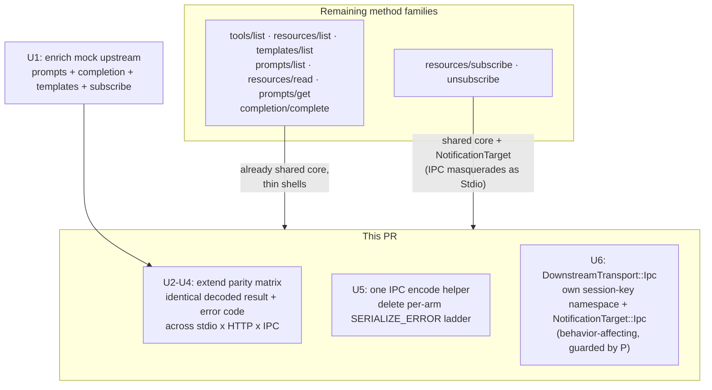

# feat: Complete the Cross-Transport Parity Gate + IPC Encoding Consolidation

## Summary

This finishes the **remaining deferred work of the transport dispatcher (item 1 / R8)** that PR #63 began. PR #63 shipped the `tools/call` slice — a `DownstreamContext` trait + `dispatch_tools_call` in `plug-core/src/dispatch`, all three transports migrated, the first IPC e2e harness, and a cross-transport parity matrix for `tools/call`. The plan deferred "remaining method families migrate to the dispatcher in their own PRs, each extending the parity matrix" and the `DownstreamTransport::Ipc` identity split (KTD3).

**Ground-truth correction (again).** Codebase research shows the other method families are **not** shaped like `tools/call`. For `tools/list`, `resources/{list,read,templates,subscribe,unsubscribe}`, `prompts/{list,get}`, and `completion/complete`, all three transports **already delegate to a single shared `ToolRouter` method** (`list_tools_page_for_client_session`, `list_resources_page`, `read_resource`, `list_prompts_page`, `get_prompt`, `subscribe_resource`, `complete_request`, etc.). The cost that justified the `DownstreamContext` trait for `tools/call` — progress-token extraction, sync-vs-task branching, reverse-request context construction — **does not exist** for any other family. Forcing those families through a `DownstreamContext`-style trait would be churn that buys nothing.

What is *actually* left to do for R8 is therefore narrower and more honest than "migrate every family to the dispatcher":

1. **Extend the parity matrix to the entire MCP method surface.** This is the real centerpiece of R8 — "a parameterized parity test asserts identical behavior across stdio/HTTP/IPC." Today it covers `tools/call` only. Extending it to every read/list/get/complete/subscribe family converts the recurring cross-transport drift bug class into a CI gate for the *whole* surface, not one method.
2. **Consolidate the duplicated IPC result/error-encoding boilerplate.** Research found the genuine duplication is not routing logic — it is the per-arm IPC `serde_json::to_value(...) → SERIALIZE_ERROR` ladder repeated ~10 lines in every method case in `plug/src/daemon.rs`. One shared encode helper deletes that drift surface across all families at once.
3. **The `DownstreamTransport::Ipc` identity split (KTD3).** Today IPC masquerades as `Stdio` everywhere (session-key namespace, `NotificationTarget`). This is the last dispatcher-deferred item. It is behavior-affecting (it changes the lazy-session-key namespace for IPC clients), so it is sequenced **last and isolated**, guarded by the now-complete parity matrix plus a targeted reconnect-ownership/session-key test — and is the droppable tail if review or CI surfaces unexpected reconnect blast radius.

This is a **refactor + test-hardening PR with no intended product-surface behavior change** for the read/list/get/complete/subscribe families. The single behavior-affecting change (U6) is the IPC identity-namespace split, scoped precisely and test-guarded.

---

## Problem Frame

**Roadmap (R8):** a transport-agnostic dispatcher owns MCP method handling once; transports are thin shims; a parameterized parity test asserts identical behavior across stdio/HTTP/IPC. PR #63 delivered the `tools/call` slice. This PR delivers the parity-gate completion + consolidation that R8 actually still needs.

**Why it matters, concretely:**

- **Parity drift is the recurring bug class.** PR #58's subscription residual, and the empty-name divergence converged in PR #63, are both instances of "a fix lands on one transport, the others rot." Today only `tools/call` is gated. Every other method — including the user-visible `tools/list`, `resources/read`, `prompts/get`, and the subscribe lifecycle — has **zero** automated cross-transport guard. The research confirms live divergences already exist (e.g., IPC hand-extracts params and emits its own `INVALID_PARAMS` for `resources/read` / `prompts/get` where stdio/HTTP use typed params; empty-success encodings differ three ways for subscribe/unsubscribe). These are exactly the latent parity bugs the matrix is meant to freeze.
- **The IPC encode ladder is real, repeated duplication.** Every IPC method arm repeats the same nested `match serde_json::to_value → IpcResponse::McpResponse / SERIALIZE_ERROR` block. It is the single largest source of per-arm boilerplate in `daemon.rs` and the most drift-prone (each arm can diverge in its error fallback). One helper removes it.
- **The IPC masquerade is a known latent smell (KTD3).** IPC sessions share the `stdio:{id}` lazy-working-set namespace and `NotificationTarget::Stdio`. It works today only because ids don't collide; it is fragile and obscures intent. Splitting it is the last piece of the dispatcher's deferred scope.

**Contract being frozen (extended from PR #63):** for *every* migrated method family — identical decoded result on success and identical error *code* + canonical shape on failure, across stdio/HTTP/IPC, for: success-with-content, unknown/missing-target error, upstream error, and (subscribe family) identical lifecycle outcome — while preserving pagination, client-aware visibility, and the availability model already on `main`.

---

## Requirements

- **R8 (parity completion):** the parameterized parity matrix covers `tools/list`, `resources/list`, `resources/read`, `resources/templates/list`, `prompts/list`, `prompts/get`, `completion/complete`, and `resources/subscribe`+`unsubscribe`, asserting identical success results and error shapes across all three transports — extended from the `tools/call`-only matrix shipped in PR #63.
- **R8-consolidate:** the duplicated IPC result/error-encoding ladder is replaced by one shared helper used by every IPC method arm; no behavior change to any IPC wire response.
- **R8-ipc-identity (KTD3):** IPC gets a first-class `DownstreamTransport::Ipc` identity with its own lazy-session-key namespace and `NotificationTarget::Ipc`, replacing the `Stdio` masquerade; guarded by the parity matrix and a reconnect-ownership/session-key test.
- **R8-preserve:** no regression in client-aware filtering, pagination, subscribe/unsubscribe lifecycle, reverse-request forwarding, or the `healthy | degraded | absent` availability model on any transport.

Out of this slice: the full `ToolRouter` god-object decomposition (a genuinely larger refactor) and active upstream supervision (item 2b, a separate product capability). Explicitly deferred — see Scope Boundaries.

---

## Key Technical Decisions

### KTD1 — Do NOT force non-`tools/call` families through a `DownstreamContext`-style trait

Research verdict: every other family is *already* a single shared `ToolRouter` call behind thin per-transport shells, with no progress/task/reverse-request complexity. A trait migration would be churn with no de-duplication payoff and would *add* surface area to the highest-risk files. The dispatcher module stays focused on `tools/call`; the other families are finished via **parity coverage + IPC encode consolidation**, which is where their genuine remaining value is. This corrects the program-plan premise honestly rather than inventing duplication to delete (same discipline as PR #63's KTD1).

### KTD2 — Parity is asserted on decoded results, not wire envelopes (carried from PR #63 KTD4)

The matrix continues to normalize away transport envelopes (HTTP 200-with-error-body, IPC `McpResponse`-with-error vs `Error` frame, stdio JSON-RPC error) into a canonical `(decoded result | error{code, canonical-fields})` and asserts the three transports agree per scenario per method. The existing `ParityOutcome` normalizer is generalized, not replaced.

### KTD3 — Enrich the mock upstream so parity asserts *real routed content*, not empty-list agreement

The mock server (`plug-test-harness/src/bin/mock-server.rs`) today implements only `list_tools`, `call_tool`, `list_resources`, `read_resource`. To drive meaningful parity content through prompts, completion, and resource templates, the mock must expose those handlers (and honor subscribe/unsubscribe). Without enrichment the parity tests would only prove "all three transports return the same empty page" — a weak guarantee. Enriching the mock is a self-contained prerequisite unit (U1) and keeps the upstream a single shared fixture so the only variable in each parity row is the downstream transport.

### KTD4 — One IPC encode helper; encoding choice preserved, fallback unified

The consolidation (U5) introduces a single helper (e.g. `IpcResponse::from_mcp_result(request_id, Result<serde_json::Value, McpError>)`) that every IPC method arm calls. It preserves today's encoding choice (success/error both carried in `McpResponse`) and unifies the `SERIALIZE_ERROR` fallback in one place. This is a pure mechanical de-duplication — the parity matrix (U2–U4) is the proof it changed no wire behavior.

### KTD5 — The IPC identity split is behavior-affecting, sequenced last, and droppable

`DownstreamTransport::Ipc` changes `lazy_session_key` from `stdio:{id}` to `ipc:{id}` for IPC clients and introduces `NotificationTarget::Ipc`. This alters the lazy-working-set bucket key for IPC sessions and touches reconnect-stable IPC ownership (a documented correctness area). It is therefore the **last** unit, guarded by the completed parity matrix (proves user-visible method results are unchanged) plus a dedicated reconnect-ownership/session-key test. If ce-work or review surfaces real reconnect blast radius, U6 is the tail that can be dropped from this PR and shipped separately — the U1–U5 value stands alone.

### KTD6 — Availability and pagination semantics are unchanged; the matrix only locks them in

No routing or pagination change. The matrix adds regression rows (degraded-but-routable upstream still serves list/read identically across transports; a paginated `tools/list` returns identical cursors across transports) to freeze guarantees already true on `main`.

---

## High-Level Technical Design

What "finish item 1" actually means after the research correction — most families need only test coverage, not migration:



Generalized parity matrix shape (extends the `tools/call`-only matrix from PR #63):

```text
generic driver per transport:  call(method, params) -> normalized (result | error{code, fields})
  stdio: rmcp client request    http: JSON-RPC body over axum oneshot    ipc: IpcTestHarness.call(method, params)

for method in [tools/list, resources/list, resources/templates/list, resources/read,
               prompts/list, prompts/get, completion/complete]:
  for scenario in [success_with_content, missing_or_unknown_target, (paginated where applicable)]:
      assert stdio == http == ipc   (normalized)

subscribe/unsubscribe (lifecycle):
  subscribe(uri) then unsubscribe(uri) on each transport -> identical success outcome + identical idempotent re-unsub shape
```

---

## Implementation Units

### U1. Enrich the mock upstream: prompts, completion, resource templates, subscribe/unsubscribe

**Goal:** Give the shared mock MCP server the handlers needed so downstream parity tests can drive *real routed content* through every method family, not just empty-list agreement.

**Requirements:** R8 (test infrastructure).

**Dependencies:** none.

**Files:**
- `plug-test-harness/src/bin/mock-server.rs` (modify) — advertise `prompts`, `completions` capabilities (and keep `resources` with `subscribe: true`); implement `list_prompts`, `get_prompt`, `complete`, `list_resource_templates`, and `subscribe`/`unsubscribe` handlers with small deterministic fixtures (e.g. one prompt `mock_prompt`, one completion source, one template `mock://template/{id}`). Gate behind existing capability flags so other tests are unaffected; reuse the existing `resources` flag pattern.

**Approach:** Mirror the existing `list_resources` / `read_resource` handler shape. Keep fixtures tiny and deterministic so parity assertions are exact (fixed names, fixed content). Do not change tool fixtures or fail-mode behavior. Where rmcp's `ServerHandler` provides a default that already returns the right empty/typed shape, only override what the parity tests must exercise with content.

**Patterns to follow:** existing `MockServer::list_resources` / `read_resource` and `get_info` capability block in `plug-test-harness/src/bin/mock-server.rs`.

**Test scenarios:**
- Happy path: a direct harness boot of the enriched mock returns the fixed prompt, completion, template, and resource fixtures (sanity that the upstream serves them before any proxy is involved).
- Edge: `get_prompt` for an unknown name and `read_resource` for an unknown uri return errors (so downstream error-parity rows have a real upstream error to forward).
- Test expectation: covers the upstream side only; downstream parity is U2–U4.

**Verification:** `cargo build -p plug-test-harness` clean; the enriched mock serves all five families; no existing test that uses the mock regresses (capabilities are additive/flag-gated).

---

### U2. Generalize the parity harness to be method-generic

**Goal:** Lift the three transport drivers from hard-coded `tools/call` to a generic `call(method, params) -> NormalizedOutcome`, and generalize `ParityOutcome` to cover list/read/get/complete results — the foundation every new parity row builds on.

**Requirements:** R8.

**Dependencies:** U1.

**Files:**
- `plug/src/daemon.rs` (modify, test module ~3950–4210) — generalize `parity_stdio`, `parity_http`/`http_tools_call_response`, and `parity_ipc`/`IpcTestHarness` so each takes a `method: &str` + `params: serde_json::Value` and returns the normalized outcome. Extend `ParityOutcome` (currently `Success{text,is_error}` / `Error{code}`) to carry a normalized result `serde_json::Value` (canonicalized: stable key order, transport-envelope stripped) so list/read/get/complete results can be compared structurally, not just as call-result text.
- `plug-test-harness/src/lib.rs` (modify, only if `IpcTestHarness` lives there / needs a generic `call`) — add/extend a generic `call(method, params)` on the IPC harness if the current helper is `tools/call`-specific.

**Approach:** Keep the existing `tools/call` rows working through the generalized driver (regression guard on the refactor itself). The normalizer must canonicalize JSON (sorted keys) so structural equality is order-insensitive. For errors, continue normalizing to `{code}` (+ optional `message_contains`). Drivers stay real-transport (rmcp client for stdio, axum `tower::oneshot` for HTTP, real daemon socket loop for IPC) — no mocking the transport.

**Patterns to follow:** the existing `parity_*` drivers and `parity_from_result_json` normalizer in `plug/src/daemon.rs`; the initialize-handshake-for-session-id pattern in `http_tools_call_response`.

**Execution note:** Characterization-first — the existing `tools/call` parity rows must pass unchanged through the generalized driver before any new family row is added. That proves the generalization is behavior-preserving.

**Test scenarios:**
- Regression: all existing `tools/call` parity rows (success, unknown tool, empty name, task divergence) pass through the generalized `call(method, params)` driver unchanged.
- Edge: the JSON normalizer canonicalizes key order so two structurally-equal results with different serialization order compare equal.

**Verification:** existing parity rows green through the generic driver; no transport driver mocks the wire; `cargo test -p plug-mcp` green.

---

### U3. Parity matrix rows for the read/list/get/complete families

**Goal:** Add parameterized parity rows asserting identical decoded results and error codes across stdio/HTTP/IPC for `tools/list`, `resources/list`, `resources/templates/list`, `resources/read`, `prompts/list`, `prompts/get`, and `completion/complete`.

**Requirements:** R8, R8-preserve, R8-availability.

**Dependencies:** U1, U2.

**Files:**
- `plug/src/daemon.rs` (modify, parity test module) — one assertion block per method family using the generic driver against the shared enriched mock upstream.

**Approach:** Each family gets: a success-with-content row (asserts identical canonicalized result across the three transports against the U1 fixtures), and a missing/unknown-target error row (asserts identical normalized `{code}`). Add pagination rows for the list families where the router paginates (`tools/list`, `resources/list`, `prompts/list`): drive a page request and assert identical `nextCursor`/items across transports. Add one R8-availability regression row reusing the item-3 degraded-flag pattern: a degraded-but-routable upstream serves `resources/list` (or `read`) from last-known-good identically across transports. Keep the upstream a single shared `mock_server_config` so the only variable is the downstream transport.

**Patterns to follow:** the `tools/call` parity rows (PR #63) for structure; the degraded-carry-forward regression test from item 3 (`plug-core/tests/integration_tests.rs`) for the degraded-flag orchestration.

**Test scenarios (each asserted equal across stdio × HTTP × IPC):**
- `tools/list`: success page with the mock's tool fixtures → identical filtered/paginated result; second page via cursor → identical `nextCursor`.
- `resources/list` + `resources/templates/list`: success → identical lists; degraded-but-routable upstream → identical last-known-good.
- `resources/read`: known uri → identical content; unknown uri → identical error code (catches the IPC hand-extracted-`INVALID_PARAMS` vs typed-param divergence research flagged).
- `prompts/list`: success → identical list. `prompts/get`: known name → identical prompt; unknown/empty name → identical error code (catches the IPC empty-name `INVALID_PARAMS` divergence).
- `completion/complete`: success → identical completion result.

**Verification:** all family rows green; deliberately changing one transport's error code or filtering entry point for one method makes its row fail (gate proven real, per-method); `cargo test --workspace` (parallel) green.

---

### U4. Parity coverage for the subscribe/unsubscribe lifecycle

**Goal:** Assert the resource subscribe/unsubscribe lifecycle behaves identically across stdio/HTTP/IPC, including the empty-success encoding that research found diverges three ways.

**Requirements:** R8, R8-preserve.

**Dependencies:** U1, U2.

**Files:**
- `plug/src/daemon.rs` (modify, parity test module) — a subscribe→unsubscribe lifecycle assertion across the three transports.

**Approach:** On each transport: subscribe to a known mock resource uri, assert identical normalized success; unsubscribe, assert identical normalized success; unsubscribe again (idempotent) and assert identical outcome shape. Normalize stdio's `()` / HTTP's `EmptyResult` / IPC's `json!({})` empty-success into one canonical "empty-ok" so the comparison is meaningful rather than asserting on divergent envelopes. Because subscribe has a side effect (registers a `NotificationTarget`), ensure each transport runs against its own engine/session as the existing drivers already do, so targets don't cross-contaminate.

**Patterns to follow:** existing subscribe/unsubscribe handler arms (`plug-core/src/proxy/mod.rs`, `plug-core/src/http/server.rs`, `plug/src/daemon.rs`) for the expected success shapes; the U2 normalizer for empty-ok canonicalization.

**Test scenarios:**
- Lifecycle: subscribe(known uri) → identical empty-ok across transports; unsubscribe(uri) → identical empty-ok; unsubscribe(uri) again → identical idempotent outcome.
- Edge: subscribe to an unknown uri → identical outcome across transports (whatever the shared core returns, all three must agree).

**Verification:** subscribe/unsubscribe parity rows green; the three divergent empty-success encodings are proven equivalent through the canonical normalizer; no leaked subscription state across transport drivers.

---

### U5. Consolidate the IPC result/error-encoding ladder into one helper

**Goal:** Replace the per-arm `serde_json::to_value(...) → IpcResponse::McpResponse / SERIALIZE_ERROR` ladder repeated in every IPC method case with a single shared helper, deleting the largest source of per-arm boilerplate and drift in `daemon.rs`.

**Requirements:** R8-consolidate, R8-preserve.

**Dependencies:** U2, U3, U4 (the parity matrix must exist first so it proves this changes no wire behavior).

**Files:**
- `plug/src/daemon.rs` (modify) — introduce `IpcResponse::from_mcp_result(request_id, Result<serde_json::Value, McpError>)` (or a free helper) that performs the success serialize, the error-into-`McpResponse` encoding, and the unified `SERIALIZE_ERROR` fallback once. Replace each method arm's inline ladder (`tools/list`, `resources/*`, `prompts/*`, `completion/complete`, and `tools/call`'s outcome encoding where it shares the shape) with a call to it. Pure mechanical de-duplication — no change to the chosen encoding.

**Approach:** Keep today's semantics exactly: success and error both carried in `McpResponse`; `SERIALIZE_ERROR` only on a genuine serialization failure. Do not change which arms use a distinct `Error` frame vs `McpResponse` — preserve each arm's current choice; the helper only removes the repeated body. KTD5 note: do not bake the `Stdio` masquerade deeper here — the helper is identity-agnostic, leaving U6 a clean change.

**Patterns to follow:** the existing IPC arms' `match serde_json::to_value` blocks in `plug/src/daemon.rs`; the `ToolCallOutcome` encoding added in PR #63.

**Test scenarios:**
- Test expectation: behavior-preserving refactor — coverage is the U2–U4 parity matrix, which must stay green byte-for-decoded-result identical before and after. Add one direct unit test of `from_mcp_result` for the success, error, and serialize-failure branches.
- Edge: `from_mcp_result(Err(mcp_error))` encodes the same `{code, message}` the inline ladder produced (assert against a captured-before shape).

**Verification:** every IPC method arm's inline encode ladder is gone, replaced by the helper; the full parity matrix (U2–U4) is green unchanged; `from_mcp_result` unit test passes.

---

### U6. `DownstreamTransport::Ipc` identity split (KTD3) — behavior-affecting, guarded, droppable tail

**Goal:** Give IPC a first-class transport identity instead of masquerading as `Stdio`: its own `lazy_session_key` namespace (`ipc:{id}`) and a `NotificationTarget::Ipc`, updating every IPC arm. This is the last dispatcher-deferred item.

**Requirements:** R8-ipc-identity, R8-preserve.

**Dependencies:** U2, U3, U4 (parity matrix is the safety net), U5 (clean encode helper).

**Files:**
- `plug-core/src/proxy/mod.rs` (modify) — add `DownstreamTransport::Ipc` (enum ~185), extend `lazy_session_key` (~455) with the `ipc:{id}` arm, and add the `Ipc` arm to `DownstreamCallContext` construction / `notification_target()` (~252). Add `NotificationTarget::Ipc` and its delivery wiring wherever `NotificationTarget` is matched (subscribe/notification fan-out paths).
- `plug/src/daemon.rs` (modify) — replace the hard-coded `DownstreamTransport::Stdio` in the `tools/list` lazy-key path (~2000), `IpcDownstreamContext::downstream_call_context` (~655), and the subscribe/unsubscribe `NotificationTarget::Stdio` constructions (~2450, ~2485) with the new `Ipc` identity.

**Approach:** Thread `Ipc` through the same code paths `Stdio`/`Http` already use — the enum is the discriminant, so adding the variant + its arms is mechanical, but the *blast radius* is the lazy-working-set bucket key and reverse-request/notification delivery for IPC sessions. Audit every `match` on `DownstreamTransport` and `NotificationTarget` for non-exhaustiveness; the compiler enumerates the sites. **Reconnect concern:** daemon continuity recovery and reconnect-stable IPC ownership match on session identity — verify an IPC client that disconnects and reconnects still resolves the same working set under the new `ipc:` namespace (no silent reset). If the namespace change would orphan in-flight working sets on reconnect, document and gate accordingly.

**Patterns to follow:** how `Http` is handled in `lazy_session_key`, `DownstreamCallContext`, and `notification_target()`; the reconnect-ownership logic in `plug/src/daemon.rs` (`handle_ipc_loop` / ownership reassignment).

**Execution note:** Land last and isolated so it can be dropped from the PR if review/CI flags reconnect risk. Run the full parity matrix (U2–U4) after this change — it must stay green, proving IPC's *user-visible* method results are unchanged even though the internal identity namespace moved.

**Test scenarios:**
- Regression: full parity matrix (U2–U4) green after the split — IPC method results unchanged across every family.
- Behavior: an IPC session's `lazy_session_key` is now `ipc:{id}` (assert the new namespace) and its `NotificationTarget` is `Ipc` (assert subscribe registers the `Ipc` target).
- Reconnect: an IPC client that disconnects and reconnects resolves the same lazy working set / ownership under the `ipc:` namespace (no working-set reset, no orphaned subscription target).
- Edge: notification fan-out to an `Ipc` target delivers over the IPC channel (subscribe → upstream resource update → IPC push received), matching the prior `Stdio`-masquerade delivery.

**Verification:** all `DownstreamTransport` / `NotificationTarget` matches are exhaustive over the new variant; parity matrix green; reconnect-ownership test green; `cargo test --workspace` (parallel) green. If reconnect coverage reveals blast radius beyond this unit's scope, U6 is dropped from the PR and re-filed (U1–U5 ship without it).

---

## Scope Boundaries

**In scope:** parity-matrix extension to every remaining method family (U2–U4), the mock-upstream enrichment that makes that coverage real (U1), IPC encode-ladder consolidation (U5), and the `DownstreamTransport::Ipc` identity split (U6).

### Deferred to Follow-Up Work

- **Full `ToolRouter` god-object decomposition** — the program plan's "decompose along catalog/tasks/notifications/subscriptions seams" is a genuinely larger refactor; nothing in this PR needs it. Unchanged deferral.
- **Active upstream supervision (item 2b)** — proactive restart/reconnect of an upstream that stays `degraded` past a threshold. A separate product capability, sequenced after the dispatcher work is complete. This PR completes the dispatcher prerequisite.
- **Consolidating the duplicated mock `ServerConfig` fixture into `plug-test-harness`** — noted in PR #63's deferrals; orthogonal test-hygiene, not required here.
- **U6 fallback:** if the IPC identity split shows reconnect blast radius, it ships as its own PR with dedicated reconnect coverage; U1–U5 are independently complete.

### Non-Goals (not a future PR)

- No change to routing-engine semantics (`call_tool_inner`, the shared list/read/get/complete router methods), the availability model, circuit breakers, semaphores, or health states.
- No change to any wire format, pagination contract, or the `plug status` JSON contract (U5 preserves IPC encoding exactly; U6 changes only the internal session-key namespace, not wire responses).
- No new product capability — internal structure + test coverage only.

---

## Open Questions (Deferred to Implementation)

- **IPC harness `call(method, params)` location (U2):** whether the generic IPC call lives on `IpcTestHarness` in `plug/src/daemon.rs`'s test module or moves to `plug-test-harness`. Resolve during U2 based on what daemon internals the harness needs (the harness was kept in `daemon.rs` in PR #63 for exactly this reason).
- **Subscribe parity side-effects (U4):** whether subscribe/unsubscribe parity can run against one shared engine or needs per-transport engines to avoid `NotificationTarget` cross-contamination. Default: per-transport engines (as the existing drivers already isolate). Resolve when U4 runs.
- **U6 reconnect namespace migration:** does moving IPC sessions from `stdio:{id}` to `ipc:{id}` orphan any in-flight lazy working set on daemon-continuity reconnect? Default: verify reconnect resolves the same set; if not, the reconnect test is the detector and U6 gates/splits accordingly.
- **Mock completion/template shape (U1):** exact fixture shape for `complete`/`list_resource_templates` to keep parity assertions exact. Resolve during U1 against rmcp's typed result shapes.

---

## Risks & Mitigations

- **Highest-risk files in the repo** (`proxy/mod.rs`, `http/server.rs`, `daemon.rs`). Mitigation: U2–U4 are test-only; U5 is a behavior-preserving mechanical refactor guarded by the matrix; U6 is the only behavior change, isolated last and droppable. The shared routing core is untouched (KTD1).
- **Parity rows that pass trivially (empty-list agreement).** Mitigation: U1 enriches the mock so every family asserts real routed content, not empty agreement; U3/U4 include unknown-target error rows that exercise the divergent IPC param-handling research flagged.
- **U5 silently changes an IPC encoding.** Mitigation: U5 depends on U2–U4 existing first; the matrix must stay green decoded-identical before/after, and a direct `from_mcp_result` unit test pins the three branches.
- **U6 reconnect blast radius** (session-key namespace + `NotificationTarget` change touching reconnect-stable IPC ownership). Mitigation: parity matrix proves method results unchanged; a dedicated reconnect-ownership test is the gate; U6 is the droppable tail if blast radius exceeds the unit.
- **Test interference under the parallel suite (PR #62).** Mitigation: new parity rows reuse the existing real-transport drivers, which already bind unique temp sockets and respect `runtime_paths_test_lock()`; per-transport engine isolation prevents subscription cross-talk.
- **Scope creep into the god-object split or item 2b.** Mitigation: KTD1 + Scope Boundaries — finish only the parity gate, the encode consolidation, and the IPC identity split.

---

## Verification

- `cargo fmt --check` clean.
- `cargo clippy --workspace --all-targets -- -D warnings` clean.
- `cargo test --workspace` (parallel) green, including: all existing cross-transport tests, the existing `tools/call` parity rows through the generalized driver (U2), the new per-family parity rows (U3), the subscribe/unsubscribe lifecycle parity (U4), the `from_mcp_result` unit test (U5), and the IPC identity + reconnect-ownership tests (U6).
- Every remaining method family is now covered by the cross-transport parity gate; deliberately injecting a per-transport divergence for any covered method makes its row fail (gate proven real per-method).
- The IPC per-arm encode ladder is gone, replaced by one helper, with no decoded wire-behavior change.
- IPC has a first-class `Ipc` transport identity (or U6 is cleanly deferred with U1–U5 shipped).
- Post-merge truth pass: update `docs/PROJECT-STATE-SNAPSHOT.md` and `docs/PLAN.md` to record item 1's parity gate as complete across the method surface (and the IPC identity split as landed or re-deferred), with the god-object decomposition and item 2b as the remaining program phases.
