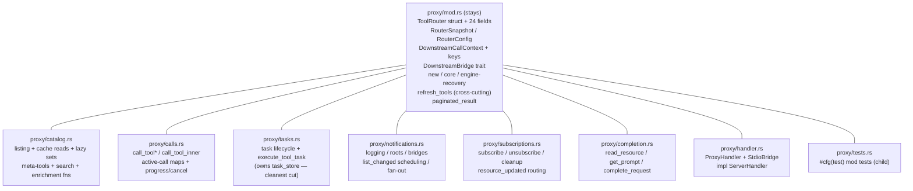
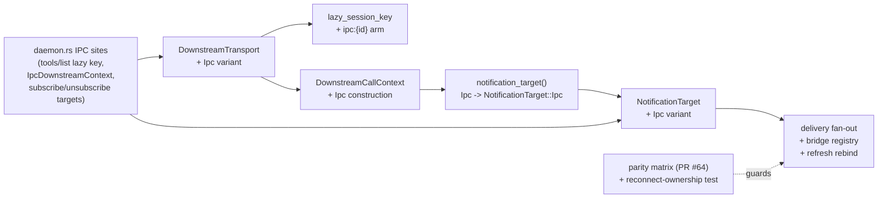
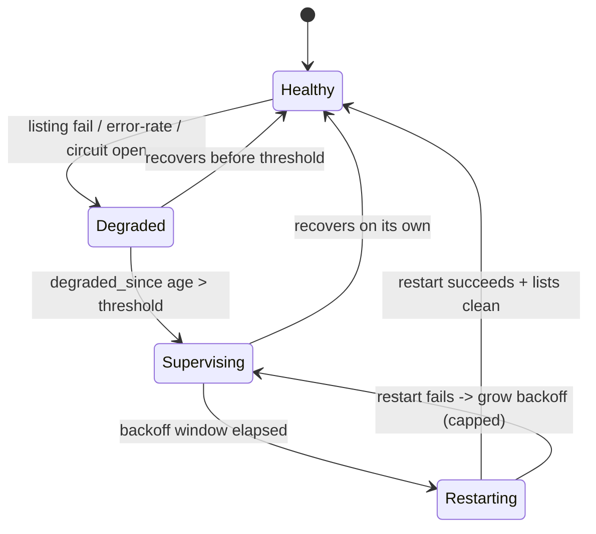

# refactor: ToolRouter God-Object Decomposition + IPC Identity Split + Active Upstream Supervision

## Summary

This finishes **all remaining work of the 2026-06-10 operability/hardening program** (origin: `docs/plans/2026-06-10-002-feat-operability-hardening-program-plan.md`). After PRs #60–#64, three deferred items remain — and they are delivered here as **three sequenced PRs**, each landed and merged before the next begins:

- **PR 1 — `ToolRouter` god-object decomposition** (completes item 1 / R8's structural goal). `plug-core/src/proxy/mod.rs` is a 6,586-line file dominated by one ~3,180-line `impl ToolRouter` block plus a ~1,983-line test module. Decompose it along the catalog / routing-calls / tasks / notifications / subscriptions / completion seams into sibling files inside the `proxy` module, keeping the struct, shared types, and the cross-cutting `refresh_tools` in `mod.rs`. **Behavior-preserving** — guarded by the full workspace suite and the cross-transport parity matrix (PR #64).
- **PR 2 — `DownstreamTransport::Ipc` identity split** (the last dispatcher-deferred item, KTD3 from PR #63/#64). Give IPC a first-class transport identity (its own `ipc:{id}` lazy-session-key namespace and `NotificationTarget::Ipc`) instead of masquerading as `Stdio`. **Behavior-affecting** — guarded by the parity matrix and a new reconnect-ownership test.
- **PR 3 — Active upstream supervision** (item 2b / R10). When an upstream stays `degraded` past a threshold (sustained error rate / open circuit / latency blow-up — e.g. the iMessage continuation leak), supervise a bounded restart (process restart for stdio, reconnect-with-reset for HTTP/SSE) rather than only reconnecting on disconnect, and surface the restart in `plug status`. **New capability**, built on the `degraded` model (PR #61) and the per-upstream metrics (PR #60).

The three are independent and land in order. Each is its own branch, merged to `main` with a post-merge truth pass and branch cleanup before the next starts. PR 1 is the prerequisite "decompose along seams" that item 1 always implied; PR 2 and PR 3 do not depend on PR 1 but are sequenced after it to land against the decomposed structure.

---

## Problem Frame

**Roadmap (origin R8, R10):** item 1's dispatcher shipped (PRs #63/#64) but its corollary — "forces `ToolRouter` to decompose along seams (catalog / tasks / notifications / subscriptions)" — was deferred as "a larger refactor." The IPC identity split (KTD3) was deferred from PR #64 after its blast radius was scoped. Item 2b (R10) was always sequenced last.

**Why each matters:**

- **God object.** `proxy/mod.rs` at 6,586 lines is the single hardest file to navigate, review, and change safely in the repo. Every prior operability PR had to thread it. Decomposing it into cohesive seam-files makes future method-family work, the IPC split, and supervision changes locally reviewable. The risk of *not* decomposing is compounding: the file only grows.
- **IPC identity masquerade.** IPC reuses `DownstreamTransport::Stdio` for its lazy-session-key namespace and `NotificationTarget::Stdio` for delivery. It works today only because ids don't collide; it obscures intent and is a latent correctness trap (a stdio and an IPC client could share a `stdio:{id}` lazy bucket). The parity matrix now de-risks fixing it.
- **No active supervision.** A "runs for days" daemon with a leaking upstream (iMessage) has observability (PR #60 metrics, PR #61 `degraded` state) but no action: an operator must manually restart. Item 2b closes the loop — the daemon supervises a bounded restart when an upstream stays degraded.

**Behavioral contract:**
- PR 1 changes **no behavior** — pure structural extraction; the full suite + parity matrix prove it.
- PR 2 changes only the **internal IPC session-key namespace + notification target variant** (no wire-format change); the parity matrix proves user-visible method results are unchanged and a reconnect test proves ownership survives.
- PR 3 **adds** supervised-restart behavior, off by default-safe thresholds, bounded by backoff, observable in status.

---

## Requirements

- **R8-decompose (PR 1):** `proxy/mod.rs` is decomposed into seam-scoped sibling files within the `proxy` module; the `ToolRouter` struct, shared types, and cross-cutting `refresh_tools` stay in `mod.rs`; no behavior changes; the full workspace suite and parity matrix stay green.
- **R8-ipc-identity (PR 2):** IPC gets `DownstreamTransport::Ipc` with an `ipc:{id}` lazy-session-key namespace and `NotificationTarget::Ipc`, replacing the `Stdio` masquerade across all IPC sites; notification delivery and reverse-requests for IPC clients continue to work; reconnect-stable ownership preserved; parity matrix stays green.
- **R10 (PR 3):** an upstream that stays `degraded` past a configurable threshold is supervised through a bounded restart (process restart for stdio, reconnect-with-reset for HTTP/SSE); restarts are backoff-bounded and emit an event surfaced in `plug status --output json`; no restart storms.
- **R-preserve (all):** no regression in client-aware filtering, pagination, task lifecycle, subscribe/unsubscribe, reverse-request forwarding, the `healthy | degraded | absent` availability model, or the cross-transport parity gate.

Out of scope: any change to the routing-engine *semantics* (`call_tool_inner`), wire formats, the `plug status` JSON schema beyond additive supervision fields, or new MCP protocol surface.

---

## Key Technical Decisions

### KTD1 — Decompose by moving `impl ToolRouter` blocks into child modules; change no visibility

Rust lets inherent `impl ToolRouter { … }` blocks live in any module of the defining crate, and child modules of `proxy` retain access to `ToolRouter`'s private fields and methods. So each seam file (`proxy/tasks.rs`, `proxy/catalog.rs`, …) is a `#[path]`-free child module declared in `mod.rs` containing `impl super::ToolRouter` blocks, with `use super::*;` at the top. **No `pub`/`pub(crate)` changes are needed** — every file stays in the `proxy` module tree. This is the safest decomposition: the compiler enforces that nothing moved changed signature or visibility.

### KTD2 — `refresh_tools` and the central shared state stay in `mod.rs`

`refresh_tools` (~539 lines) is genuinely cross-cutting — it rebuilds the catalog cache, prunes/rebinds subscriptions, and fires list-changed notifications simultaneously. Moving it into any one seam file would be dishonest. It stays in `mod.rs` alongside the `ToolRouter` struct, `RouterSnapshot`/`RouterConfig`, `DownstreamCallContext` + routing keys, the `DownstreamBridge` trait, the constructor/core/engine-recovery methods, and the generic `paginated_result`. The hard-coupled read-mostly `Arc` fields (`cache`, `server_manager`) are accessed by every seam — that's unavoidable and harmless (shared immutable reads).

### KTD3 — Keep active-call tracking and progress/cancel routing in one file

`register_active_call` / `attach_upstream_request_id` / `remove_active_call` (routing) and `route_upstream_progress` / `route_upstream_cancelled` / `forward_cancel_from_downstream` (notifications) all mutate the same four private maps (`active_calls`, `active_call_lookup`, `upstream_request_lookup`, `upstream_progress_lookup`). Splitting them across `calls.rs` and `notifications.rs` would scatter that state. They co-locate in `proxy/calls.rs` (the routing-core file). The logging/roots/bridge/list-changed portions go to `proxy/notifications.rs`.

### KTD4 — The existing suite + parity matrix ARE the decomposition's test guard

PR 1 adds no new tests — it is a move-only refactor. Correctness is proven by the unchanged full workspace suite (490 plug-core + 169 plug-mcp + 43 integration) plus the cross-transport parity matrix from PR #64. The test module moves wholesale to `proxy/tests.rs` (a `#[cfg(test)] mod tests` child module) which retains full private-internal access (it directly constructs `RouterSnapshot` and writes the private `cache` field). Each seam extraction is its own commit that keeps the suite green.

### KTD5 — The IPC identity split must rewire delivery, not just rename (PR 2)

`NotificationTarget::Stdio` is the shared bridge/delivery key for both the in-process stdio path AND daemon IPC clients (the daemon registers each IPC session's bridge as `NotificationTarget::Stdio { client_id }`, and `refresh_tools`'s rebind reconstructs `Stdio` targets). A correct split adds `NotificationTarget::Ipc` and routes IPC delivery through it everywhere the variant is matched — fan-out, bridge registry, subscription rebind. A *partial* split (changing only `lazy_session_key`) is forbidden: it creates an inconsistent half-state and risks orphaning IPC working sets on reconnect. PR 2 does the full rewire, guarded by a reconnect-ownership test.

### KTD6 — Supervision is threshold-gated, backoff-bounded, and observable; metrics still carry no behavior elsewhere (PR 3)

Item 2b is the *one* place metrics drive action. A dedicated supervisor (an `engine`-owned task) reads the existing per-upstream degradation signals (sustained error rate / open circuit / `degraded_since` age) and, past a configurable threshold, triggers a bounded restart through the `ServerManager` lifecycle. Restarts are backoff-bounded (exponential, capped) to prevent storms, gated so a healthy-after-restart server resets its backoff, and each restart emits an event recorded in the per-upstream metrics surfaced by `plug status --output json`. Default thresholds are conservative; supervision is opt-out-safe (a never-degraded server is never touched).

---

## High-Level Technical Design

PR 1 — target file layout for the `proxy` module (struct + cross-cutting stay; seams move):

PR 2 — the IPC identity split touch graph (Stdio masquerade → first-class Ipc):

PR 3 — supervision state machine per upstream:

---

## Implementation Units

### Phase 1 — God-object decomposition (PR 1)

Each unit moves one seam's methods into a new child-module file with `use super::*;`, deletes them from `mod.rs`, declares the `mod` in `mod.rs`, and keeps the full suite green. Behavior-preserving; no new tests. Order runs cleanest-cut first to establish the pattern, largest/cross-coupled later.

### U1. Extract `proxy/tasks.rs`

**Goal:** Move the task-lifecycle methods (the cleanest seam — they own `task_store` and otherwise only read `cache`/`server_manager`/`config`) into a new child module, proving the cross-file `impl` pattern.

**Requirements:** R8-decompose.

**Dependencies:** none.

**Files:**
- `plug-core/src/proxy/tasks.rs` (create) — `impl super::ToolRouter` block with `task_owner_for_ipc_client`, `enqueue_tool_task`, `list_tasks_for_owner`, `get_task_info_for_owner`, `get_task_result_for_owner`, `cleanup_tasks_for_owner`, `cancel_task_for_owner`, `execute_tool_task`, `active_call_count`; `use super::*;`.
- `plug-core/src/proxy/mod.rs` (modify) — delete the moved methods; add `mod tasks;`.

**Approach:** Pure move. Confirm every symbol the moved methods reference (`TaskOwner`, `CreateTaskResult`, artifact store, etc.) is reachable via `super::*` or an explicit `use`. No signature or visibility change.

**Patterns to follow:** the seam map in this plan; existing child-module declarations in `plug-core/src/{session,http,config}/`.

**Execution note:** Characterization-first is automatic — the existing task tests are the guard. Run the full suite after the move; it must be byte-for-result identical.

**Test scenarios:** Test expectation: none (move-only) — coverage is the existing task lifecycle tests (`plug-core` + `plug-mcp` IPC task tests) staying green.

**Verification:** `cargo build -p plug-core` clean; `cargo test --workspace` green; `proxy/mod.rs` no longer contains the task methods; clippy + fmt clean.

---

### U2. Extract `proxy/completion.rs`

**Goal:** Move `read_resource`, `get_prompt`, `complete_request` (a clean ~130-line seam) into a child module.

**Requirements:** R8-decompose.

**Dependencies:** U1 (pattern established).

**Files:**
- `plug-core/src/proxy/completion.rs` (create) — `impl super::ToolRouter` with the three methods; `use super::*;`.
- `plug-core/src/proxy/mod.rs` (modify) — delete moved methods; add `mod completion;`.

**Approach:** Pure move.

**Test scenarios:** Test expectation: none (move-only) — guarded by existing completion/prompt/resource tests + the parity matrix's completion/prompts/read rows.

**Verification:** suite green; methods gone from `mod.rs`; clippy/fmt clean.

---

### U3. Extract `proxy/subscriptions.rs`

**Goal:** Move `subscribe_resource`, `unsubscribe_resource`, `cleanup_subscriptions_for_target`, `active_subscription_count`, and `route_upstream_resource_updated` into a child module. Accepts that `resource_subscriptions` stays shared with `refresh_tools` (KTD2).

**Requirements:** R8-decompose.

**Dependencies:** U1.

**Files:**
- `plug-core/src/proxy/subscriptions.rs` (create) — the subscription methods; `use super::*;`.
- `plug-core/src/proxy/mod.rs` (modify) — delete moved methods; add `mod subscriptions;`.

**Approach:** Pure move. `refresh_tools`'s rebind/prune logic stays in `mod.rs` and still reads `self.resource_subscriptions` — no change there.

**Test scenarios:** Test expectation: none (move-only) — guarded by subscribe/unsubscribe lifecycle tests + the parity subscribe/unsubscribe rows (PR #64) + the degraded-carry-forward subscription test (PR #61).

**Verification:** suite green; methods gone from `mod.rs`; clippy/fmt clean.

---

### U4. Extract `proxy/calls.rs` (routing core + active-call/progress/cancel)

**Goal:** Move the tool-call routing core and the active-call tracking + progress/cancel routing into one file (KTD3), since they share the four `*_lookup` maps.

**Requirements:** R8-decompose.

**Dependencies:** U1.

**Files:**
- `plug-core/src/proxy/calls.rs` (create) — `call_tool`, `call_tool_with_context`, `call_tool_inner`, `handle_invoke_tool`, `register_active_call`, `attach_upstream_request_id`, `remove_active_call`, `forward_cancel_from_downstream`, `route_upstream_progress`, `route_upstream_cancelled`, `active_call_for_upstream_request`, `resolve_unique_downstream_target_for_upstream`, and the `is_session_error` free fn; `use super::*;`.
- `plug-core/src/proxy/mod.rs` (modify) — delete moved items; add `mod calls;`.

**Approach:** Pure move. `call_tool_inner` (~427 lines) is the largest single method — move it intact, do not refactor its body (KTD: no engine-semantics change).

**Test scenarios:** Test expectation: none (move-only) — guarded by the full tools/call test set + the entire parity matrix + progress/cancellation tests across transports.

**Verification:** suite green; routing methods gone from `mod.rs`; clippy/fmt clean.

---

### U5. Extract `proxy/notifications.rs`

**Goal:** Move the logging, roots, downstream-bridge registry, reverse-request, and list-changed-scheduling methods into a child module (the active-call-coupled progress/cancel routing already went to `calls.rs`).

**Requirements:** R8-decompose.

**Dependencies:** U1, U4 (so the progress/cancel split is already settled).

**Files:**
- `plug-core/src/proxy/notifications.rs` (create) — `subscribe_notifications`, `publish_protocol_notification`, logging methods (`subscribe_logging`, `level_severity`, `route_upstream_logging_message`, `log_level`/`set_client_log_level`/`remove_client_log_level`, `recalculate_effective_level`, `forward_set_level_to_upstreams`), roots (`set_roots_for_target`/`clear_roots_for_target`/`list_roots_union`/`forward_roots_list_changed_to_upstreams`), `register_downstream_bridge`/`unregister_downstream_bridge`, `create_elicitation_from_upstream`/`create_message_from_upstream`, `schedule_list_changed_refresh` + the three `schedule_*_list_changed_refresh`; `use super::*;`.
- `plug-core/src/proxy/mod.rs` (modify) — delete moved methods; add `mod notifications;`.

**Approach:** Pure move. `schedule_list_changed_refresh` (~120 lines) touches the `pending_*_list_changed` / `notification_refresh_*` fields, all notification-owned — clean.

**Test scenarios:** Test expectation: none (move-only) — guarded by logging-forward, roots-union, elicitation/sampling, and list_changed tests across transports.

**Verification:** suite green; methods gone from `mod.rs`; clippy/fmt clean.

---

### U6. Extract `proxy/catalog.rs` (largest seam)

**Goal:** Move the catalog/listing/cache-read methods, lazy working sets, meta-tool handlers/builders, client-aware filtering, and the enrichment/search free functions into a child module.

**Requirements:** R8-decompose.

**Dependencies:** U1.

**Files:**
- `plug-core/src/proxy/catalog.rs` (create) — `clear_lazy_session`, `lazy_session_key`, `replace_snapshot`, all `list_tools*` / `list_resources*` / `list_resource_templates*` / `list_prompts*` methods, `tool_count`, `get_tool_definition`, `supports_tasks*`, `synthesized_capabilities*`, `list_tools_for_client*`, `bridge_visible_tools`, `filter_meta_tools`, `filtered_legacy_meta_tools`, `meta_tool_visible_for_call`, `handle_list_servers`, `handle_list_tools`, `handle_search_tools`, `lazy_session_key_from_context`, `json_tool_result`, `ensure_lazy_tool_loaded_for_direct_call`; the enrichment/search/meta-tool free functions (`apply_canonical_tool_title`, `normalized_icons_with_fallback`, `sanitize_description`, `priority_sort`, `is_disabled_tool`, `wildcard_match`, `detect_tool_definition_drift`, `fingerprint_tool_definition`, `tokenize_search_query`, `normalize_search_text`, `score_tool_match`, `build_*_meta_tool*`, `canonical_plug_meta_tool_name`, `legacy_meta_tool_names`, `strip_optional_fields`, `https_only_icons`); `LazyToolSurface` and `RouterConfig`'s lazy-policy impl; `use super::*;`.
- `plug-core/src/proxy/mod.rs` (modify) — delete moved items; add `mod catalog;`.

**Approach:** Pure move — the largest, but mechanical. **Caveat (KTD1):** any free fn still called from `refresh_tools` (which stays in `mod.rs`) must be reachable — if `refresh_tools` uses a moved fn (e.g. `fingerprint_tool_definition`, `priority_sort`), keep that fn `pub(super)`/`pub(crate)` or leave it in `mod.rs`. Resolve per-fn by sole-caller during execution. `paginated_result` is generic and shared → stays in `mod.rs`.

**Execution note:** This is the highest-churn move; run the suite immediately after and watch for any free-fn visibility gap the compiler flags.

**Test scenarios:** Test expectation: none (move-only) — guarded by the large catalog/lazy/meta-tool/search test set (the bulk of `proxy`'s 68 tests) + tools/list + filtering parity rows.

**Verification:** suite green; catalog methods gone from `mod.rs`; clippy/fmt clean.

---

### U7. Extract `proxy/handler.rs` (ProxyHandler + ServerHandler)

**Goal:** Move the stdio handler wrapper and its rmcp `ServerHandler` impl out of `mod.rs`.

**Requirements:** R8-decompose.

**Dependencies:** U1–U6 (so `mod.rs` is down to the struct + core + refresh by now).

**Files:**
- `plug-core/src/proxy/handler.rs` (create) — `StdioDownstreamContext` + its `DownstreamContext` impl, `StdioBridge` + its `DownstreamBridge` impl, `ProxyHandler` + `Drop` + inherent impl, and `impl ServerHandler for ProxyHandler` (~540 lines); `use super::*;`. Re-export `ProxyHandler` from `mod.rs` so its public path (`plug_core::proxy::ProxyHandler`) is unchanged.
- `plug-core/src/proxy/mod.rs` (modify) — delete moved items; add `mod handler;` + `pub use handler::ProxyHandler;`.

**Approach:** Pure move. Verify the `plug_core::proxy::ProxyHandler` public path is preserved via re-export (it's used across `plug` and tests).

**Test scenarios:** Test expectation: none (move-only) — guarded by all stdio end-to-end tests + the stdio parity leg.

**Verification:** suite green; `ProxyHandler` still importable at `plug_core::proxy::ProxyHandler`; clippy/fmt clean.

---

### U8. Move the test module to `proxy/tests.rs`

**Goal:** Relocate the ~1,983-line `#[cfg(test)] mod tests` to its own file, retaining full private-internal access.

**Requirements:** R8-decompose.

**Dependencies:** U1–U7.

**Files:**
- `plug-core/src/proxy/tests.rs` (create) — the entire test module body with `use super::*;`.
- `plug-core/src/proxy/mod.rs` (modify) — replace the inline `#[cfg(test)] mod tests { … }` with `#[cfg(test)] mod tests;`.

**Approach:** Pure move. The tests construct the `pub(crate) RouterSnapshot` and write the private `cache` field — as a `proxy` child module they keep that access unchanged.

**Test scenarios:** Test expectation: none (move-only) — the moved tests are themselves the suite; all must still run and pass.

**Verification:** `cargo test -p plug-core` runs the same test count, all green; `mod.rs` is now the struct + shared types + core + `refresh_tools` only; clippy/fmt clean. **PR 1 ships here** — full workspace suite + parity matrix green; post-merge truth pass.

---

### Phase 2 — IPC identity split (PR 2)

### U9. Add `DownstreamTransport::Ipc` + namespace + context construction

**Goal:** Introduce the `Ipc` transport variant and thread it through `lazy_session_key` and `DownstreamCallContext`.

**Requirements:** R8-ipc-identity.

**Dependencies:** U8 (lands against the decomposed structure).

**Files:**
- `plug-core/src/proxy/mod.rs` (modify) — add `DownstreamTransport::Ipc`; add the `Ipc => format!("ipc:{id}")` arm to `lazy_session_key`; add an `Ipc`-constructing path to `DownstreamCallContext` (e.g. an `ipc_for_client` constructor) and the `Ipc => NotificationTarget::Ipc { … }` arm to `notification_target()`.
- `plug-core/src/session/mod.rs` (modify if it matches on `DownstreamTransport`) — add the `Ipc` arm.

**Approach:** The compiler enumerates every non-exhaustive `match DownstreamTransport` site — fix each. `notification_target()` depends on U10's `NotificationTarget::Ipc`, so U9 and U10 land together.

**Test scenarios:**
- Behavior: an `Ipc`-transport `DownstreamCallContext` yields `lazy_session_key == "ipc:{id}"` and `notification_target() == NotificationTarget::Ipc`.
- Edge: existing `Stdio`/`Http` keys and targets are unchanged.

**Verification:** all `DownstreamTransport` matches exhaustive; unit assertions pass.

---

### U10. Add `NotificationTarget::Ipc` + rewire delivery

**Goal:** Give IPC its own notification target and route IPC delivery through it everywhere `NotificationTarget` is constructed or matched — fan-out, bridge registry, `refresh_tools` rebind — replacing the daemon's `Stdio` masquerade.

**Requirements:** R8-ipc-identity, R-preserve.

**Dependencies:** U9.

**Files:**
- `plug-core/src/notifications.rs` (modify) — add `NotificationTarget::Ipc { client_id }`.
- `plug-core/src/proxy/mod.rs` + `proxy/notifications.rs` + `proxy/subscriptions.rs` (modify) — add the `Ipc` arm to every `match NotificationTarget` (delivery fan-out, bridge registry lookup, subscription rebind in `refresh_tools`); ensure IPC delivery uses the IPC bridge path.
- `plug/src/daemon.rs` (modify) — replace the hard-coded `DownstreamTransport::Stdio` in the `tools/list` lazy-key path and `IpcDownstreamContext::downstream_call_context`, and the `NotificationTarget::Stdio` constructions in the subscribe/unsubscribe arms, with the new `Ipc` identity.
- `plug/src/ipc_proxy.rs` (modify if it constructs/matches `NotificationTarget`) — `Ipc` arm.

**Approach:** The compiler enumerates every `NotificationTarget` match (exhaustiveness) — fix each, routing `Ipc` to the same delivery channel the daemon currently reaches via `Stdio`. The in-process stdio path stays on `NotificationTarget::Stdio`. This is the behavior-affecting core (KTD5).

**Test scenarios:**
- Integration: subscribe over IPC → upstream resource update → IPC push delivered to the client (the `Ipc` target reaches the same socket the `Stdio` masquerade did).
- Edge: list_changed / progress / cancelled push to an IPC client still arrives.
- Regression: the full cross-transport parity matrix (PR #64) stays green — IPC method results unchanged.

**Verification:** all `NotificationTarget` matches exhaustive; IPC notification delivery tests green; parity matrix green.

---

### U11. Reconnect-ownership + namespace-survival test

**Goal:** Prove the namespace change (`stdio:{id}` → `ipc:{id}`) does not orphan an IPC client's lazy working set or notification target across a daemon-continuity reconnect.

**Requirements:** R8-ipc-identity, R-preserve.

**Dependencies:** U9, U10.

**Files:**
- `plug/src/daemon.rs` (modify, test module) — a reconnect test: register an IPC session, establish a lazy working set + a subscription, simulate disconnect+reconnect (the IPC proxy reconnect path), and assert the same working set / subscription ownership resolves under the `ipc:` namespace (no reset, no orphaned target).

**Approach:** Reuse the `IpcTestHarness`; exercise the reconnect path that daemon continuity uses. If the namespace change reveals an orphaning bug, fix the reconnect lookup (the test is the detector).

**Execution note:** Test-first — write the reconnect assertion before finalizing the namespace wiring, so an orphaning regression is caught immediately.

**Test scenarios:**
- Reconnect: IPC client disconnects and reconnects → same `ipc:{id}` lazy working set resolves; subscription target still `NotificationTarget::Ipc` and still delivers.
- Edge: a stdio client and an IPC client with structurally similar ids no longer share a lazy bucket (namespaces are distinct).

**Verification:** reconnect test green; parity matrix green; full suite green. **PR 2 ships here** — post-merge truth pass.

---

### Phase 3 — Active upstream supervision (PR 3, item 2b / R10)

### U12. Degradation-threshold detection

**Goal:** Add a threshold evaluator that decides when a `degraded` upstream warrants supervision (sustained error rate / open circuit / `degraded_since` age past a configurable bound).

**Requirements:** R10.

**Dependencies:** U11 (lands after the prior phases).

**Files:**
- `plug-core/src/health.rs` (modify) — a `supervision_due(&self, thresholds) -> bool` (or similar) reading the existing degradation signals (circuit state, error rate, `degraded_since`).
- `plug-core/src/config.rs` (modify) — config for supervision thresholds + enable flag (conservative defaults; opt-out-safe).
- `plug-core/src/health.rs` tests (modify) — threshold-boundary unit tests.

**Approach:** Pure decision logic, no side effects — testable in isolation. Reuse the `degraded_since` and circuit/metrics state from PR #60/#61.

**Test scenarios:**
- Happy path: a server degraded longer than the threshold with an open circuit → `supervision_due` true.
- Edge: degraded but within the threshold window → false; healthy → false; flapping (degraded→healthy→degraded) resets the window.
- Error path: missing/zero metrics → does not spuriously fire.

**Verification:** threshold unit tests green; no behavior wired yet.

---

### U13. Supervised restart (bounded)

**Goal:** A supervisor task, owned by the engine, that restarts an upstream when `supervision_due` fires — process restart for stdio, reconnect-with-reset for HTTP/SSE — bounded by exponential backoff with a cap, resetting backoff on recovery.

**Requirements:** R10, R-preserve.

**Dependencies:** U12.

**Files:**
- `plug-core/src/server/mod.rs` (modify) — a supervised restart entry point on the `ServerManager` lifecycle (reuse existing reconnect/spawn machinery; add the stdio process-restart path distinct from reconnect-on-disconnect).
- `plug-core/src/engine.rs` (modify) — spawn a supervised-restart task (alongside the existing health-monitoring loop) that polls `supervision_due` and triggers a bounded restart; backoff state per server.
- `plug-core/src/engine.rs` / `server/mod.rs` tests (modify) — restart + backoff tests.

**Approach:** Build on the existing health loop and reconnect path; do not duplicate scheduling. Backoff state lives with the supervisor. A server that becomes healthy after restart resets its backoff. Guard against concurrent restarts of the same server (single-flight).

**Test scenarios:**
- Happy path: a server stays degraded past threshold → supervisor restarts it once → on recovery, backoff resets.
- Edge: repeated failure grows backoff exponentially up to the cap (no restart storm); a healthy server is never restarted.
- Error path: a restart that itself fails re-enters supervision with grown backoff, not an immediate retry loop.
- Integration: restarting a stdio upstream re-spawns the process and re-lists its catalog; an HTTP/SSE upstream reconnects-with-reset.

**Verification:** restart/backoff tests green; no storms under sustained-degradation simulation; full suite green.

---

### U14. Supervision observability

**Goal:** Surface supervision in `plug status --output json` — restart count, last-restart timestamp, and a supervision-state label per upstream — additively (schema-stable).

**Requirements:** R10.

**Dependencies:** U13.

**Files:**
- `plug-core/src/proxy/mod.rs` or the metrics surface (modify) — record restart events in the per-upstream metrics (extend the PR #60 metrics struct additively).
- the `plug status` JSON assembly (modify) — include the additive supervision fields.
- status JSON contract tests (modify) — assert the new fields are always present (zero-filled for never-restarted servers).

**Approach:** Additive only — never remove or rename existing metrics fields. A never-supervised server reports zeroed/`null` supervision fields. Mirror the existing always-present metrics schema discipline from PR #60.

**Test scenarios:**
- Happy path: after a supervised restart, `plug status --output json` shows restart count 1 + a last-restart timestamp + supervision-state label.
- Edge: a never-degraded server shows zeroed supervision fields (schema always present).
- Integration: the JSON contract test asserts field presence and types.

**Verification:** status JSON contract tests green; full suite green; `plug status` shows supervision state. **PR 3 ships here** — post-merge truth pass; program complete.

---

## Scope Boundaries

**In scope:** the three sequenced PRs above — god-object decomposition (move-only), IPC identity split (behavior-affecting, guarded), and active upstream supervision (new, threshold-gated/bounded/observable).

### Deferred to Follow-Up Work

- **Further sub-splitting of `refresh_tools`** — it stays cross-cutting in `mod.rs` (KTD2); a future pass could decompose it into a catalog-rebuild + subscription-rebind + notify pipeline, but that is a behavior-sensitive refactor out of this decomposition's move-only scope.
- **Trait-extraction of `ToolRouter` seams into separate types** — this plan splits *files*, not *types*. Promoting a seam to its own struct with a borrowed handle is a deeper change deferred unless a concrete need arises.
- **Supervision policy tuning beyond conservative defaults** — adaptive thresholds, per-server overrides beyond the basic config, and restart-cause analytics are future polish.

### Non-Goals (not a future PR)

- No change to `call_tool_inner` routing semantics, wire formats, the availability model, circuit breakers, or health states (beyond reading them for supervision).
- No change to the `plug status` JSON schema except additive supervision fields.
- No new MCP protocol surface.

---

## Open Questions (Deferred to Implementation)

- **Free-function ownership at the catalog cut (U6):** which moved free fns are still called by `refresh_tools` in `mod.rs` and therefore need `pub(super)`/`pub(crate)` or must stay — resolve per-fn by sole-caller when the compiler flags it.
- **`refresh_tools` home (U6/U8):** keep it inline in `mod.rs`, or give it a dedicated `proxy/refresh.rs` child module (still cross-cutting, still reads shared fields). Default: inline in `mod.rs`; split only if `mod.rs` is still unwieldy after U8.
- **IPC delivery channel for `NotificationTarget::Ipc` (U10):** confirm the exact daemon delivery path the `Stdio` masquerade currently uses for IPC clients so `Ipc` routes to the identical channel — resolve by tracing the bridge registry during U10.
- **Supervision threshold defaults (U12):** concrete default values (degraded-age seconds, error-rate, backoff base/cap) — pick conservative starting values during U12; they are config-overridable.
- **stdio process-restart mechanics (U13):** whether the existing spawn path can be reused directly for a supervised restart or needs a distinct teardown-then-respawn — resolve against `server/mod.rs` during U13.

---

## Risks & Mitigations

- **Decomposition silently changes behavior** (PR 1). Mitigation: move-only, no signature/visibility change (KTD1); the full suite + parity matrix are the guard (KTD4); each seam is its own green commit; `refresh_tools` and shared state stay put (KTD2).
- **A free-fn visibility gap breaks the build mid-extraction** (U6). Mitigation: the compiler flags it immediately; resolve per-fn by sole-caller; this is a build error, not a silent regression.
- **IPC identity split orphans working sets / breaks notification delivery on reconnect** (PR 2). Mitigation: the parity matrix proves method results unchanged; U11's reconnect-ownership test is the gate; the full delivery rewire (not a partial rename) per KTD5.
- **Supervision restart storms** (PR 3). Mitigation: exponential backoff with a cap, single-flight per server, recovery resets backoff (U13); conservative opt-out-safe defaults (U12); restarts are observable (U14) so a misbehaving supervisor is visible.
- **Process-lifecycle bugs in stdio restart** (PR 3). Mitigation: reuse the existing spawn/reconnect machinery; restart is distinct from reconnect-on-disconnect but built on the same primitives; integration test re-spawns and re-lists.
- **Scope/PR-size creep.** Mitigation: three independent PRs landed in sequence with merges + cleanup between them (per the user's instruction); each is independently green and reviewable.

---

## Verification

- `cargo fmt --check`, `cargo clippy --workspace --all-targets -- -D warnings`, `cargo test --workspace` (parallel) green after **every** unit, and as the ship gate for each PR.
- PR 1: `proxy/mod.rs` reduced to the struct + shared types + core + `refresh_tools`; seams live in sibling files; identical test count, all green; parity matrix green; zero behavior change.
- PR 2: IPC has a first-class `Ipc` transport identity + `NotificationTarget::Ipc`; reconnect-ownership test green; parity matrix green; no wire-format change.
- PR 3: a sustained-degraded upstream is restarted (bounded), restarts are visible in `plug status --output json`, no storms; conservative defaults.
- Each PR: branch → commits → push → CI green → merge → delete branch → post-merge truth pass (`docs/PROJECT-STATE-SNAPSHOT.md` + `docs/PLAN.md`) before the next PR starts. The program is complete when item 2b is on `main` and the snapshot records the decomposition, the IPC identity split, and supervision.
